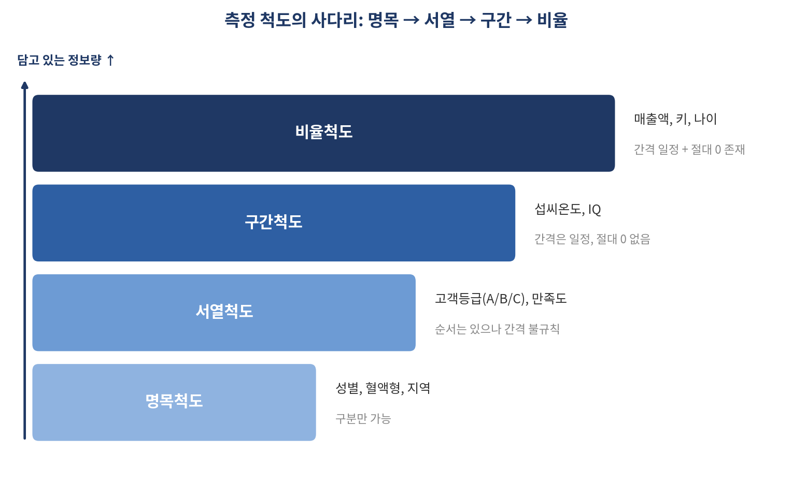

# 통계를 모르면 속고, 알면 보인다 — 데이터를 읽기 전에 알아야 할 것들

*[데이터와 AI, 제대로 읽는 법] 시리즈 1/10*

"딸만 셋 낳았으니 이번엔 아들일 차례다." "주사위에서 6이 나왔으니 다음엔 안 나올 거다." "과거 데이터를 보면 주식시장은 오른 다음엔 반드시 떨어진다."

셋 다 그럴듯하게 들리지만 전부 틀렸습니다. 동전이나 주사위, 그리고 많은 경우 주가의 등락은 이전 결과와 무관하게 매번 새로 결정되는 독립시행이기 때문입니다. 그런데도 우리는 이런 착각에 꽤 자주 빠집니다. 이유는 간단합니다. 통계를 모르기 때문입니다.

## 통계는 세상을 읽는 언어다

통계학은 경제, 경영, 의학, 공학 할 것 없이 거의 모든 분야가 공유하는 하나의 언어입니다. 문제는 이 언어가 가장 쉽게 오용되는 언어이기도 하다는 점입니다. "이번 여름 아이스크림 매출 사상 최대"라는 기사는 표본의 함정을 숨기고 있을 수 있고, "아동학대 가해자의 80%가 친부모"라는 보도는 분모를 밝히지 않아 오해를 부를 수 있습니다.

통계학을 한 문장으로 정의하면 이렇습니다. **"자료로 가득 찬 세상에서, 자료를 정리하고 분석해 유용한 정보를 얻기 위한 도구."** 신약의 효과를 검증하려 해도 전 인구를 대상으로 실험할 수는 없습니다. 우리는 항상 일부(표본)만 들여다보고 전체(모집단)를 추정해야 하고, 통계학은 이 과정에서 생기는 불확실성을 다루는 방법론입니다.

## "평균을 내도 되는 데이터"와 "내면 안 되는 데이터"

여기서 의외로 자주 놓치는 지점이 하나 있습니다. 좋은 분석은 데이터를 이해하는 데서 시작한다는 것입니다. "성별의 평균"은 계산은 되지만 의미가 없고, "매출액의 평균"은 의미가 있습니다. 이 차이를 가르는 것이 변수의 **척도** 입니다.

| 척도 | 특징 | 예시 | 쓸 수 있는 통계 |
|---|---|---|---|
| 명목척도 | 순서 없음, 구분만 가능 | 성별, 혈액형, 지역 | 빈도, 최빈값 |
| 서열척도 | 순서는 있지만 간격은 불규칙 | 고객등급(A/B/C), 만족도 점수 | 중앙값, 순위비교 |
| 구간척도 | 간격은 일정, 절대 0은 없음 | 섭씨온도, IQ | 평균, 분산, 회귀분석 |
| 비율척도 | 간격도 일정, 절대 0도 있음 | 매출액, 키, 나이 | 평균, 분산, 비율비교 |

척도가 명목 → 서열 → 구간 → 비율로 올라갈수록 담을 수 있는 정보가 많아집니다. 여기에 데이터는 성별처럼 그룹을 나타내는 **범주형** 과, 판매건수처럼 셀 수 있는 **이산형**·매출액처럼 측정하는 **연속형** 으로도 나뉘고, 분석에서 맡는 역할에 따라 결과인 **종속변수**, 원인인 **독립변수**, 그리고 결과 해석 시 함께 고려해야 할 **통제변수** 로도 구분됩니다.

예를 들어보죠. "공부시간이 시험점수에 영향을 준다"는 걸 보이고 싶다면, 수면시간이나 IQ 같은 통제변수를 함께 살피지 않으면 안 됩니다. 공부시간 6시간에 95점을 받은 학생과, 공부시간 2시간에 95점을 받은 학생을 그냥 비교하면 "공부는 효과가 없다"는 엉뚱한 결론에 이를 수도 있습니다. 후자가 원래 IQ가 높거나 이미 사교육을 받았을 가능성을 빼놓고 봤기 때문입니다.

## 같은 변수도 관점에 따라 다르게 보인다

같은 변수라도 척도·데이터 형태·역할이라는 세 기준으로 동시에 설명할 수 있다는 점도 기억해둘 만합니다. "광고비가 매출에 미치는 영향"을 분석한다면, 광고비는 비율척도·수치형·독립변수이고, 지역은 명목척도·범주형·통제변수입니다.

이렇게 변수의 성격을 먼저 파악해두면 분석 방법을 고르는 일이 한결 쉬워집니다. "성별에 따라 급여가 다른가?"에는 t검정을, "광고비와 매출의 관계는?"에는 상관·회귀분석을, "혈액형과 질병의 관계는?"에는 카이제곱검정을 쓰면 됩니다. 반대로 말하면, 변수 성격을 무시하고 아무 통계나 갖다 붙이면 숫자는 나오지만 의미는 없는 결과를 얻게 됩니다.

## 핵심 정리

- 통계는 표본으로 모집단을 추정하는 도구이며, 잘 모르면 속거나 속이기 쉽다.
- 데이터를 분석하기 전에 변수의 척도(명목/서열/구간/비율)부터 확인해야 한다.
- 데이터는 범주형·이산형·연속형으로, 역할은 종속·독립·통제변수로 나뉜다.
- 변수의 성격을 알아야 올바른 분석 기법(t검정/상관·회귀/카이제곱검정 등)을 고를 수 있다.

다음 편에서는 이렇게 정리한 데이터를 "한눈에 요약하는 법", 즉 평균·표준편차·분포 모양 같은 기술통계를 다룹니다. 평균만 믿었다가 낭패 보는 이유, 궁금하지 않으신가요?
