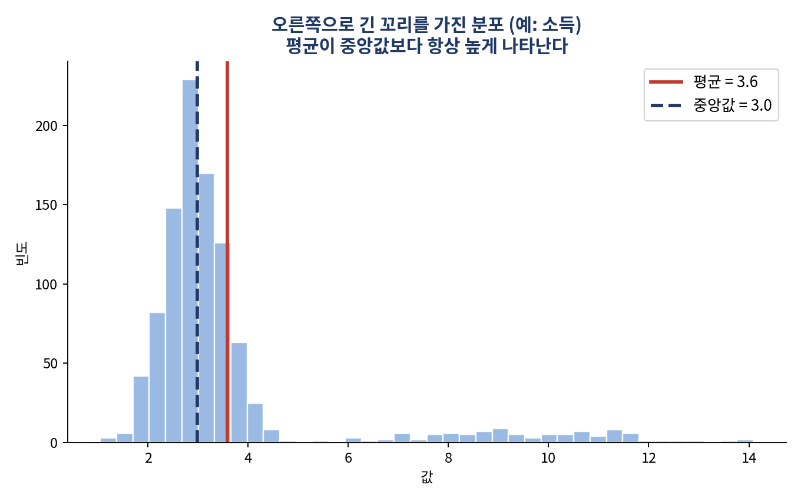
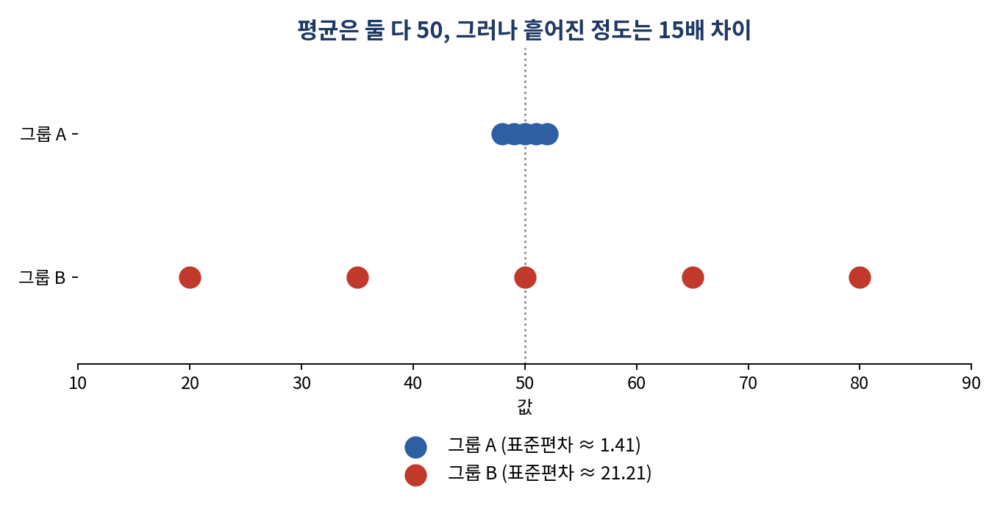

# 평균만 믿으면 안 되는 이유 — 데이터를 한눈에 요약하는 법

*[데이터와 AI, 제대로 읽는 법] 시리즈 2/10*

"우리 동네 평균 자산이 5억이라던데?" 이 말을 듣고 "다들 꽤 사는구나" 싶었다면, 잠깐 멈춰야 합니다. 실제 통계청 2024년 가계금융복지조사를 보면, 50대 가구의 평균 순자산은 5억 1,131만 원이지만 **중앙값은 3억 454만 원** 에 그칩니다. 소수의 고자산 가구가 평균을 크게 끌어올린 결과입니다. "SNS엔 10억 자산가가 넘쳐나지만, 현실적인 자산 수준은 중앙값에 더 가깝다"는 것이 이 숫자가 말해주는 진실입니다.

기술통계는 바로 이런 착시를 피하기 위한 도구입니다. 수집한 자료를 요약해 파악하기 쉽게 만드는 작업으로, 크게 세 갈래로 나뉩니다. 데이터가 어디에 몰려 있는지(중심화), 얼마나 흩어져 있는지(퍼짐), 어떤 모양으로 분포하는지(분포 형태)입니다.

## 중심화: 평균, 중앙값, 최빈값 중 뭘 믿어야 할까

평균(mean)은 가장 널리 쓰이지만 이상치에 매우 취약합니다. {10, 12, 13, 15, 16}의 평균은 13.2입니다. 그런데 마지막 값을 100으로만 바꿔도 평균은 30으로 뛰어오릅니다. 반면 같은 상황에서 중앙값(median)은 13에서 거의 움직이지 않습니다.

이 차이가 실제로 왜 중요한지는 소득 분포를 보면 분명해집니다. 소득처럼 오른쪽으로 긴 꼬리를 가진 자료에서는 평균이 중앙값보다 항상 높게 나타납니다. 그러니 "평균 소득이 올랐다"는 뉴스를 볼 때는 늘 "중앙값은 어떨까"를 함께 물어야 합니다. 이상치가 있는 데이터라면 평균과 중앙값을 나란히 놓고 봐야 진짜 그림이 보입니다.

## 퍼짐: 평균이 같아도 완전히 다른 두 그룹

여기 두 그룹이 있습니다. {48, 49, 50, 51, 52}와 {20, 35, 50, 65, 80}. 둘 다 평균은 50으로 똑같습니다. 하지만 표준편차는 각각 약 1.41과 21.21로, 무려 15배 차이가 납니다. 평균만 보고 "두 그룹이 비슷하다"고 판단했다가는 완전히 다른 실체를 놓치게 됩니다.

**분산** 은 각 값이 평균에서 얼마나 떨어져 있는지를 제곱해서 평균 낸 값이고, **표준편차** 는 여기에 제곱근을 씌워 원래 단위로 되돌린 값입니다. 이상치의 영향을 덜 받는 지표를 원한다면 **사분위범위(IQR = Q3 - Q1)** 를 쓰면 되고, 흔히 보는 박스플롯은 바로 이 IQR을 시각화한 것입니다.

한 가지 실무 팁을 더하자면, 평균이 서로 다른 두 집단의 변동성을 비교할 때는 표준편차를 그대로 비교하면 안 됩니다. 표준편차 2인 공정(평균 10)과 표준편차 5인 공정(평균 100) 중 어느 쪽이 더 불안정할까요? 표준편차만 보면 후자 같지만, 평균으로 나눈 **변이계수(CV = 표준편차/평균 × 100%)** 로 보면 전자가 20%, 후자가 5%로 실제론 전자가 훨씬 불안정합니다.

## 분포의 모양: 왜도와 첨도

**왜도(skewness)** 는 분포가 좌우로 얼마나 치우쳤는지를 나타냅니다. 0이면 대칭, 양수면 오른쪽 꼬리가 길고(소수의 큰 값 존재), 음수면 왼쪽 꼬리가 깁니다. **첨도(kurtosis)** 는 분포가 얼마나 뾰족하고 꼬리가 두꺼운지를 나타내며, 첨도가 높을수록 극단값(이상치)이 나타날 가능성이 커집니다.

이 두 지표는 회귀분석이나 머신러닝 모델에 데이터를 넣기 전, 정규분포 가정이 얼마나 위배되어 있는지를 사전 점검하는 용도로 실무에서 자주 쓰입니다. 관행적으로는 절대값 기준 왜도가 ±2, 첨도가 ±7을 넘으면 정규성 위반이 심하다고 봅니다.

## 핵심 정리

- 이상치가 있는 데이터는 평균과 중앙값을 함께 봐야 한다. 평균만 믿으면 착시에 빠진다.
- 평균이 같아도 흩어진 정도(분산·표준편차)는 전혀 다를 수 있다.
- 평균이 다른 두 집단의 변동성을 비교할 땐 변이계수(CV)를 쓴다.
- 왜도·첨도로 분포의 모양(치우침, 꼬리 두께)을 점검하면 이후 분석의 함정을 미리 피할 수 있다.

다음 편에서는 "표본만 보고 전체를 어떻게 추정하는가"를 다룹니다. 여론조사가 딱 1,000명만 물어보고도 그럴듯한 결론을 내는 원리, 그 뒤에 숨은 이야기를 풀어보겠습니다.
