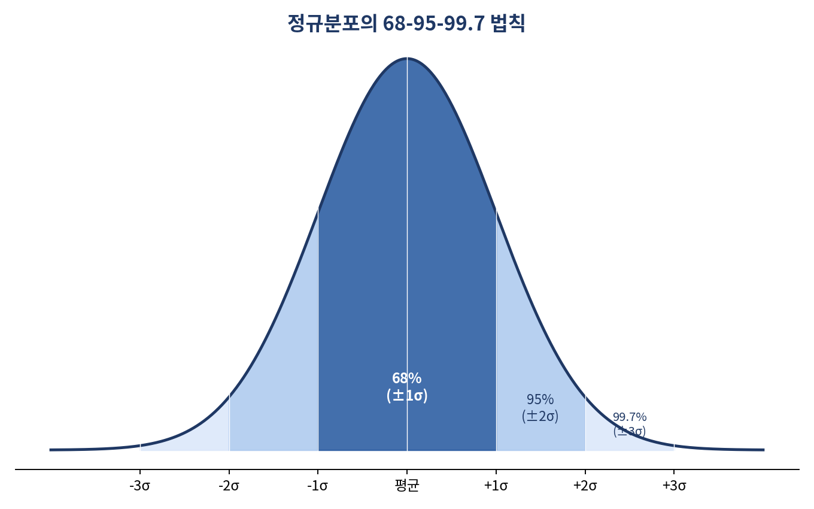
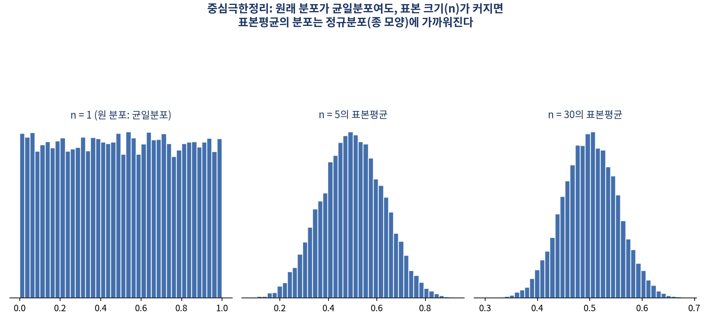

# 겨우 1,000명 물어보고 어떻게 전체를 안다는 걸까 — 표본에서 모집단으로

*[데이터와 AI, 제대로 읽는 법] 시리즈 3/10*

여론조사는 보통 1,000명 안팎을 조사합니다. 대한민국 성인이 4천만 명이 넘는데, 그 0.0025%도 안 되는 사람들의 답으로 "국민 여론"을 이야기하는 게 말이 될까요? 결론부터 말하면, 제대로 뽑은 표본이라면 말이 됩니다. 다만 "제대로"라는 전제가 생각보다 훨씬 중요합니다.

## 표본이 배신한 순간: 1936년 미국 대선

1936년 미국 대선, 당대 최대 여론조사기관이었던 리터러리 다이제스트는 프랭클린 루스벨트의 득표율을 43%로 예측했습니다. 실제 결과는 완전히 딴판이었죠. 무려 44%포인트나 어긋난, 여론조사 역사상 가장 유명한 오류로 남았습니다.

원인은 표본 자체에 있었습니다. 다이제스트는 자동차 등록부와 전화번호부로 표본을 뽑았는데, 대공황 시기 자동차와 전화를 가진 사람들은 이미 부유층에 편중돼 있었습니다. 표본이 아무리 많아도(다이제스트는 무려 240만 명을 조사했습니다!) 대표성이 없으면 소용없다는 걸 보여준 사건입니다. 표본을 다룰 때 가장 먼저 물어야 할 질문은 "몇 명을 조사했나"가 아니라 "이 표본이 정말 전체를 대표하는가"입니다.

이와 비슷한 함정이 몇 가지 더 있습니다. 특정 집단이 과대·과소 대표되는 **선택 편향**, 현재 살아남은 대상만으로 과거를 판단하는 **생존 편향**(지금 존재하는 기업만으로 20년 전 특정 업종의 성과를 평가하면, 이미 사라진 기업은 애초에 빠지게 됩니다), 그리고 전체를 합친 결과와 집단별로 나눈 결과가 뒤바뀌는 **심슨의 역설** 입니다.

## 데이터가 종 모양을 그리는 이유

표본이 대표성을 갖췄다면, 그다음 궁금한 건 "그 데이터가 어떤 모양으로 흩어져 있는가"입니다. 여기서 등장하는 것이 통계학에서 가장 유명한 곡선, **정규분포** 입니다. 평균을 중심으로 좌우 대칭인 종 모양 분포로, 평균 ±1표준편차 안에 약 68%, ±2표준편차 안에 약 95%, ±3표준편차 안에 약 99.7%가 위치합니다.

이 68-95-99.7 법칙 덕분에 서로 다른 척도의 값도 비교할 수 있습니다. 수학 80점(평균 75, 표준편차 10)과 영어 80점(평균 70, 표준편차 8) 중 어느 쪽이 더 잘 본 걸까요? 각 값을 (관측값-평균)÷표준편차로 표준화(Z-score)하면 각각 0.5와 1.25가 나와, 상대적으로 영어 성적이 더 우수했다고 해석할 수 있습니다.

## 왜 표본이 클수록 안정적일까: 대수의 법칙과 중심극한정리

동전을 10번 던진 결과보다 10,000번 던진 결과가 앞면 확률 0.5에 더 가깝습니다. 이걸 **대수의 법칙** 이라 부릅니다. 시행 횟수가 늘어날수록 관측된 평균이 이론적 평균에 가까워진다는 원리입니다.

여기서 한 걸음 더 나아간 정리가 있습니다. 바로 **중심극한정리(CLT)** 입니다. 모집단의 원래 분포가 균일분포든 지수분포든 무엇이든 상관없이, **표본 크기가 충분히 커지면 표본평균의 분포는 정규분포에 가까워진다** 는 것입니다. 이 정리 덕분에 우리는 모집단 분포를 몰라도 표본평균에 대해 정규분포 이론을 적용할 수 있고, 이는 다음 편에서 다룰 가설검정 전체의 이론적 토대가 됩니다.

## 표본이 커져도 오차가 그만큼 줄지는 않는다

표본을 뽑을 때마다 계산되는 통계량은 조금씩 달라집니다. 이 변동성을 나타내는 지표가 **표준오차(SE)** 입니다. 흥미로운 점은, 표본 크기를 2배로 늘려도 표준오차가 절반으로 줄지 않는다는 것입니다. **제곱근의 법칙** 에 따라 SE = s/√n 이므로, 표준오차를 절반으로 줄이려면 표본을 무려 **4배** 로 늘려야 합니다.

**더 알아보기: 신뢰구간이란?** 원자료는 "구간을 잡으면 신뢰할 수 있지 않을까"라는 문제의식만 던졌지만, 표준적인 정의는 이렇습니다. 모평균에 대한 95% 신뢰구간은 **표본평균 ± 1.96 × 표준오차** 로 계산됩니다. 여기서 "95% 신뢰구간"이라는 말은 같은 방식으로 표본을 100번 뽑아 매번 구간을 계산했을 때 그중 약 95개의 구간이 실제 모평균을 포함한다는 뜻이지, "모평균이 이 구간에 있을 확률이 95%"라는 뜻은 아닙니다. 신뢰구간 해석에서 가장 흔히 하는 오해이니 기억해두면 좋습니다.

## 핵심 정리

- 표본은 크기보다 대표성이 중요하다. 대표성 없는 표본은 아무리 커도 틀린 결론을 낳는다.
- 표본이 충분히 크면 표본평균의 분포는 (모집단 분포와 무관하게) 정규분포에 가까워진다(중심극한정리).
- 표본오차는 표본 크기의 제곱근에 반비례해서 줄어든다. 오차를 절반으로 줄이려면 표본을 4배로 늘려야 한다.
- 모집단의 참값은 하나의 숫자가 아니라 신뢰구간이라는 범위로 추정하는 것이 합리적이다.

다음 편에서는 "이 차이가 우연인지, 진짜인지"를 판단하는 절차, 가설검정을 다룹니다. p-value를 "귀무가설이 맞을 확률"이라고 이해하고 계셨다면, 다음 글에서 그 오해를 풀어드리겠습니다.
