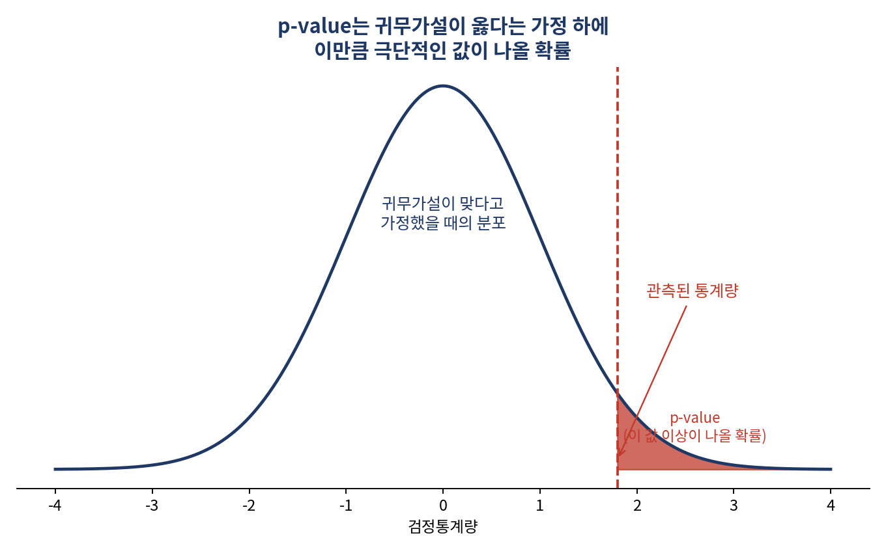
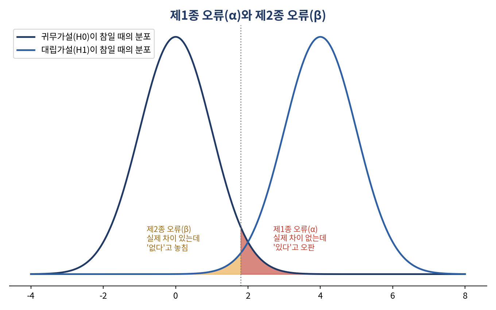

# p-value 0.03이 나왔다고 좋아하기 전에 — 우연과 진짜 차이를 구별하는 법

*[데이터와 AI, 제대로 읽는 법] 시리즈 4/10*

"p-value가 0.03이니까 귀무가설이 맞을 확률은 3%네요." 이 문장, 어디선가 들어보셨을 겁니다. 그런데 사실 이건 통계학에서 가장 흔하게 반복되는 오해입니다. p-value는 "귀무가설이 맞을 확률"이 아닙니다. 정확한 정의는 "귀무가설이 옳다고 가정했을 때, 지금 얻은 데이터(또는 더 극단적인 데이터)가 관측될 확률"입니다. 미묘한 차이 같지만, 이 둘을 혼동하면 결과를 완전히 잘못 해석하게 됩니다.

## 통계학은 "모순"으로 증명한다

통계학에서 어떤 주장을 증명할 때는 수학의 연역법이나 귀납법이 아니라 **귀류법** 을 씁니다. 절차는 이렇습니다.

1. 증명하려는 주장의 반대(차이가 없다, 우연이다)가 참이라고 일단 가정한다.
2. 실제 데이터를 관찰한다.
3. 그 가정이 맞다고 보기엔 데이터가 너무 이상하다는 모순을 찾는다.
4. 그러므로 원래 가정(차이가 없다)은 틀렸다고 결론짓는다.

다만 통계학의 "모순"은 수학처럼 "절대 불가능"이 아니라 "일어날 확률이 매우 낮다"는 확률적 의미입니다. 이게 통계학과 수학의 결정적 차이입니다.

## 가설검정 5단계, 그리고 흔한 오해

절차를 조금 더 구체적으로 풀면 이렇습니다. ① 우연이라는 주장을 **귀무가설(H₀)**, 실질적 차이가 있다는 주장을 **대립가설(H₁)** 로 세운다 → ② 관측된 통계량이 귀무가설 하의 기대값으로부터 표준오차 몇 배만큼 떨어져 있는지 계산한다 → ③ 그 결과로 **p-value** 를 산출한다 → ④ 판단 기준선인 **유의수준(α)** 을 정한다(관행적으로 5%) → ⑤ p-value가 유의수준보다 작으면 귀무가설을 기각하고 "통계적으로 유의하다"고 말한다.

**더 알아보기: 제1종 오류와 제2종 오류.** 유의수준(α)만 이야기하고 끝나는 경우가 많은데, 가설검정을 온전히 이해하려면 반드시 알아야 할 짝 개념이 있습니다. **제1종 오류**(α)는 실제로는 차이가 없는데 "차이가 있다"고 잘못 판단하는 오류이고, **제2종 오류**(β)는 실제로 차이가 있는데 "차이가 없다"고 놓치는 오류입니다. 유의수준을 너무 낮게 잡으면(예: α=0.01) 제1종 오류는 줄지만 그만큼 제2종 오류 위험은 커지는 상충 관계가 있습니다. 검정력(1-β)은 실제 차이를 정확히 감지해낼 확률로, 표본 크기를 늘리면 함께 커집니다.

## 단측검정으로 갈아타는 순간, 그건 반칙입니다

방향까지 미리 정해진 가설(예: "새 공정이 불량률을 낮추는가")에는 단측검정을, 방향을 특정할 수 없는 대부분의 연구에는 양측검정을 씁니다. 문제는 이렇습니다. 데이터를 이미 본 뒤에 "p-value가 더 작게 나오니 단측검정으로 바꾸자"는 식으로 검정 방법을 사후에 바꾸는 것, 이건 **p-hacking** 이라는 명백한 연구부정 행위입니다. 검정 방향은 반드시 데이터를 보기 전, 이론적 근거에 따라 미리 정해야 합니다. 결과가 마음에 든다고 규칙을 바꾸는 순간, 그 결과는 더 이상 신뢰할 수 없습니다.

## 데이터 형태가 다르면 검정 도구도 달라진다

| 검정 기법 | 변수 A | 변수 B | 검정통계량 | 예시 질문 |
|---|---|---|---|---|
| 카이제곱 검정 | 범주형 | 범주형 | χ² (관측빈도-기대빈도 차이) | 학력과 결혼유무는 관련 있는가? |
| 독립표본 t검정 | 범주형(2그룹) | 연속형 | t (두 그룹 평균 차이) | 성별에 따라 급여가 다른가? |
| 대응표본 t검정 | 범주형(2그룹, 짝) | 연속형 | t | 특강 전후로 성적이 올랐는가? |
| 분산분석(ANOVA) | 범주형(3그룹 이상) | 연속형 | F (집단간 분산 ÷ 집단내 분산) | 거주지역별 평균 자산액이 다른가? |

**t분포** 는 표본 크기가 작을 때(대략 n<30) 정규분포보다 꼬리가 두꺼운, 좀 더 보수적인 분포입니다. 1908년 기네스 맥주 양조장의 통계학자 윌리엄 고셋이 "Student"라는 필명으로 발표해 "Student's t-distribution"이라 불리며, 표본 크기가 커질수록 정규분포에 수렴합니다.

**더 알아보기: 자유도(degrees of freedom).** 숫자 3개의 평균이 5로 고정되면, 자유롭게 정할 수 있는 값은 2개뿐입니다. 이게 자유도가 3-1=2인 이유입니다. 표준편차·분산을 계산할 때 n이 아니라 n-1로 나누는 이유도 여기 있습니다. 표본평균을 이미 사용해 편차를 계산했기 때문에 마지막 관측값은 나머지 값들에 의해 자동으로 결정되고, 이 "잃어버린 자유도 1"을 보정하지 않으면 표본분산이 모분산을 체계적으로 과소추정하게 됩니다. t분포, 카이제곱분포, F분포는 모두 이 자유도 값에 따라 모양이 달라지는 분포족입니다.

## 핵심 정리

- p-value는 "귀무가설이 맞을 확률"이 아니라 "귀무가설이 맞다고 가정했을 때 지금 데이터가 나올 확률"이다.
- 유의수준을 낮추면 제1종 오류는 줄지만 제2종 오류(진짜 차이를 놓치는 위험)는 커진다.
- 단측검정은 데이터를 보기 전에 정해야 한다. 사후에 바꾸면 p-hacking이다.
- 데이터 형태(범주형/연속형, 그룹 수)에 따라 카이제곱·t검정·ANOVA 중 맞는 도구를 골라야 한다.

여기까지가 "데이터를 요약하고, 추정하고, 검정하는" 통계의 기본기입니다. 다음 편부터는 이 기초 위에서 "두 변수 사이의 관계"를 파헤칩니다. 상관관계와 인과관계, 둘을 헷갈리면 어떤 일이 벌어지는지부터 시작하겠습니다.
