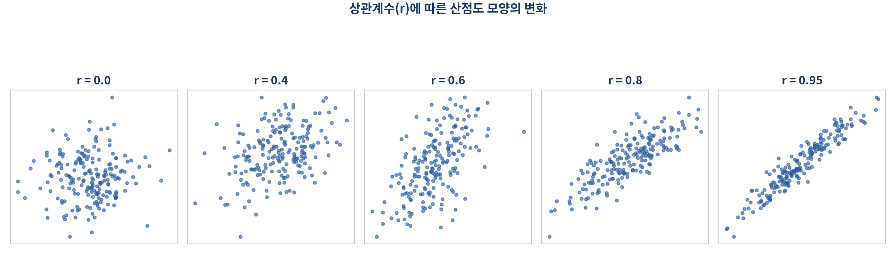
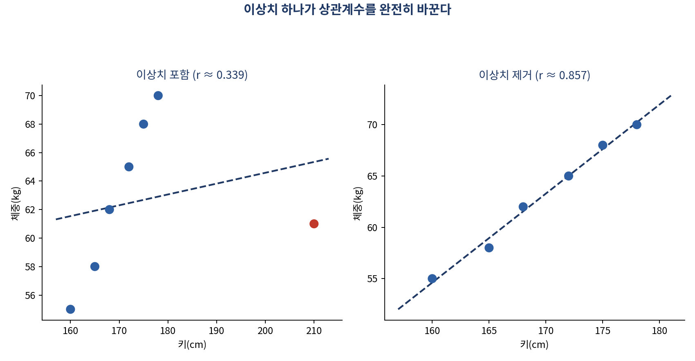

# 다우존스 지수와 제니퍼 로렌스의 상관계수가 0.86이라고요? — 관계와 인과의 함정

*[데이터와 AI, 제대로 읽는 법] 시리즈 5/10*

다우존스 지수와 한 할리우드 배우의 언론 언급 횟수 사이 상관계수가 0.86에 이른다는 유명한 사례가 있습니다. 이 배우가 새 영화를 홍보할 때마다 주식에 투자해야 할까요? 당연히 아닙니다. 그런데도 숫자만 보면 "강한 상관관계"라는 그럴듯한 착각에 빠지기 쉽습니다. 상관분석을 배워야 하는 이유가 여기 있습니다. 관계를 읽는 법을 알아야, 가짜 관계에 속지 않을 수 있습니다.

## 상관계수, -1부터 1까지의 숫자

두 연속형 변수 사이의 **선형관계** 를 -1에서 1 사이의 숫자로 나타낸 것이 **상관계수(r)** 입니다. 1에 가까울수록 강한 양의 관계(한쪽이 오르면 다른 쪽도 오름), -1에 가까울수록 강한 음의 관계, 0에 가까우면 선형관계가 거의 없다는 뜻입니다.

| 상관계수(절대값) | 해석 |
|---|---|
| 0.0 ~ 0.2 | 거의 상관 없음 |
| 0.2 ~ 0.4 | 약한 상관 |
| 0.4 ~ 0.6 | 중간 정도 상관 |
| 0.6 ~ 0.8 | 강한 상관 |
| 0.8 ~ 1.0 | 매우 강한 상관 |

숫자로만 보면 간단해 보이지만, 이 숫자를 읽을 때는 꼭 조심해야 할 함정이 네 가지 있습니다.

## 함정 1: 이상치 하나가 결과를 뒤집는다

키-체중 데이터 7개 중 이상값 하나(키 210cm, 체중 61kg)를 포함하면 상관계수가 0.339에 그칩니다. 그런데 이 값 하나만 빼면 상관계수가 0.857로 훌쩍 뛰어오릅니다. 산점도를 직접 그려보지 않고 숫자만 믿으면 이런 왜곡을 그대로 놓치게 됩니다.

## 함정 2: 곡선 관계는 상관계수가 못 잡는다

상관계수는 오직 직선 관계만 포착합니다. 포물선처럼 휘어진 관계는 실제로는 강한 관계임에도 상관계수가 낮게 나올 수 있습니다. 숫자 하나만 보고 "관계가 없다"고 단정하기 전에, 반드시 산점도를 눈으로 확인해야 하는 이유입니다.

## 함정 3: 평균 낸 데이터는 관계를 과장한다

개인 단위 데이터(교육수준-소득)의 상관계수가 0.34였던 것이, 지역 단위로 평균을 낸 자료에서는 0.94까지 치솟는 경우가 있습니다. 평균을 내는 과정에서 개인차라는 잡음(noise)이 사라지기 때문입니다. 뉴스나 보고서에서 "지역별 평균"이나 "그룹별 평균"으로 계산된 상관계수를 볼 때는, 이게 과장된 숫자일 수 있다는 점을 기억해야 합니다.

## 함정 4: 허위상관, 세상엔 우연히 닮은 그래프가 너무 많다

이 글 첫머리의 다우존스-배우 사례가 바로 **허위상관(Spurious Correlation)** 입니다. 변수가 많아질수록 우연히 높은 상관관계가 나타날 가능성도 함께 커집니다. 데이터가 넘쳐나는 시대일수록 "숫자가 높으니 진짜 관계겠지"라는 함정에 빠지기 더 쉬워졌습니다.

## "상관은 인과를 의미하지 않는다"

통계학에서 가장 유명한 문장 중 하나입니다. 인과관계가 성립하려면 세 조건이 필요합니다.

- **시간적 선행성**: 원인이 결과보다 먼저 발생해야 한다.
- **공변성**: 원인이 변하면 결과도 함께 변해야 한다.
- **교란변수의 배제**: 두 변수를 동시에 설명하는 숨은 제3의 변수가 없어야 한다.

상관분석은 "두 변수가 함께 변하는가"만 알려줄 뿐, "왜 변하는가"는 알려주지 않습니다. 이 사실을 잊으면, 상관관계 하나만 보고 정책을 만들거나 투자를 결정하는 위험한 실수를 하게 됩니다.

**더 알아보기: 그럼 인과관계는 어떻게 확인하나?** 교란변수를 통제하고 진짜 인과관계에 가까이 다가가기 위해 통계학과 계량경제학에서는 무작위 대조실험(RCT), 이중차분법, 도구변수법, 회귀불연속설계 같은 기법을 사용합니다. 상관관계만으로 확신하기보다, "이 관계가 정말 원인-결과 구조인지" 검증하는 절차가 하나 더 필요하다는 뜻입니다.

## 핵심 정리

- 상관계수는 -1~1 사이의 값으로, 두 변수의 선형관계 강도와 방향을 나타낸다.
- 이상치, 비선형 관계, 집계(평균) 데이터, 허위상관은 상관계수를 왜곡하거나 오해하게 만든다.
- 숫자만 믿지 말고 반드시 산점도를 함께 확인해야 한다.
- 상관은 인과가 아니다. 인과를 주장하려면 시간적 선행성, 공변성, 교란변수 배제라는 세 조건이 필요하다.

다음 편에서는 이 관계를 "예측"으로 바꾸는 회귀분석을 다룹니다. "쿠폰을 몇 장 더 뿌리면 손님이 얼마나 늘까?" 같은 질문에 숫자로 답하는 법, 그리고 그 답을 함부로 믿어선 안 되는 이유까지 함께 살펴보겠습니다.
