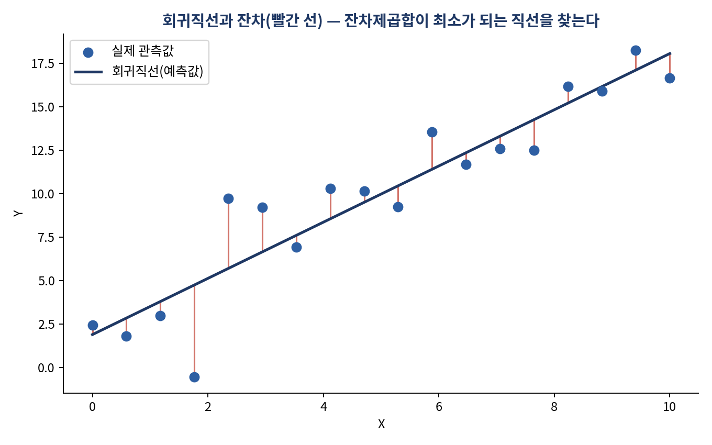
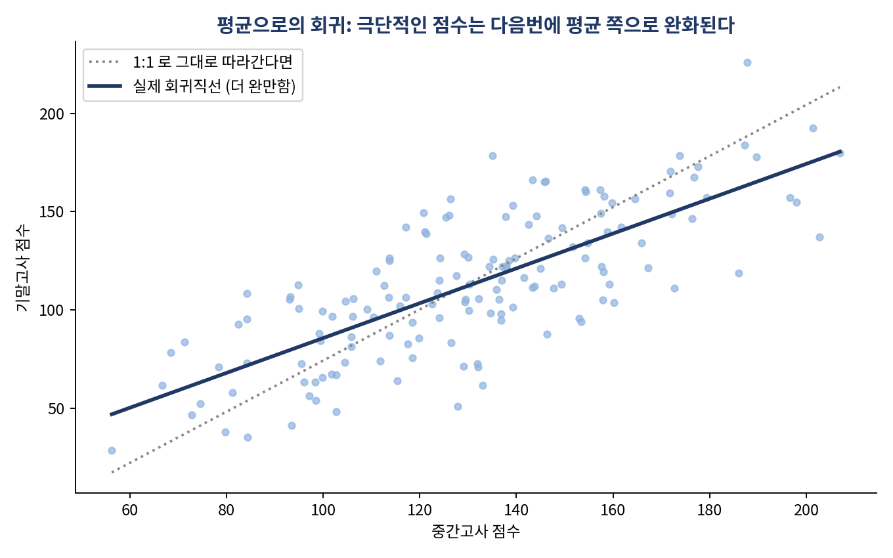

# 회귀식이 나왔다고 믿어도 될까? — 예측 모델을 만들고 검증하는 법

*[데이터와 AI, 제대로 읽는 법] 시리즈 6/10*

쿠폰을 3,000장 뿌리면 손님이 몇 명 늘어날까요? 실제 어느 기업의 데이터를 회귀분석한 결과, 답은 "약 607명"이었습니다. 그런데 이 숫자, 그냥 믿어도 되는 걸까요? 회귀분석은 이렇게 명쾌한 답을 내놓지만, 그 답을 신뢰하려면 몇 가지 전제가 충족돼야 합니다. 오늘은 회귀식을 만드는 법과, 그 식을 함부로 믿으면 안 되는 이유를 함께 다룹니다.

## 최소제곱법: 가장 좋은 직선을 찾는 방법

회귀분석은 x값에 따른 y의 평균적인 변화를 하나의 직선으로 근사하는 작업입니다. "좋은 직선"이란 실제 관측값과 직선 사이의 거리(잔차)가 최대한 작은 직선입니다. 잔차를 그냥 더하면 양수와 음수가 상쇄돼 버리기 때문에, 잔차를 제곱한 값의 합을 최소화하는 **최소제곱법(OLS)** 을 씁니다. 세 점 A(1,1), B(2,2), C(3,3)에 대해 y=2x, y=x+2, y=x라는 세 후보 직선의 잔차제곱합을 계산하면 각각 14, 12, 0이 나옵니다. y=x가 잔차제곱합을 0으로 만드는 최적의 직선입니다.

## 흥미로운 현상: 평균으로의 회귀

x가 1표준편차만큼 증가할 때 y는 그대로 1표준편차만큼 따라가지 않습니다. 상관계수 r만큼만 반응합니다. 여기서 나오는 재미있는 현상이 **평균으로의 회귀(Regression to the mean)** 입니다. 중간고사에서 유난히 높은 점수(+2표준편차)를 받은 학생들은 기말고사에서 평균적으로 그보다 완화된 점수(+1표준편차 정도)를 받는 경향이 있습니다. 극단적인 관측값은 일시적 요인(운, 컨디션)의 영향을 받았을 가능성이 크고, 다시 측정하면 그 요인이 사라지며 평균에 가까워지기 때문입니다.

이 현상은 스포츠 신인왕의 2년차 부진("소포모어 징크스"), 정치인의 지지율 급등 후 조정 등 일상에서도 자주 관찰됩니다. 어떤 값이 유난히 튀었다면, 다음번엔 다시 평범해질 가능성이 높다는 뜻입니다.

## 회귀모형을 평가하는 지표

- **RMSE(평균제곱근오차)**: 예측이 평균적으로 얼마나 틀리는지를 원래 단위로 알려줍니다.
- **결정계수 R²**: 독립변수가 종속변수의 변동을 얼마나 설명하는지를 0~1로 나타냅니다. R²=0.6이라면 결과 변수 변동의 60%를 모형이 설명한다는 뜻입니다. 변수를 추가할수록 R²는 기계적으로 늘어나는 경향이 있어, 변수가 여러 개인 다중회귀에서는 이를 보정한 **조정된 R²** 를 함께 봐야 합니다.

실제 사례를 하나 보죠. "쿠폰 배포 매수와 판매가격이 구매고객수에 미치는 영향"을 다중회귀로 분석했더니, 판매가격의 유의확률(p-value)이 0.813으로 나와 통계적으로 유의하지 않다고 판단돼 모형에서 제외됐습니다. 쿠폰 배포 매수만 남긴 재적합 모형(y = 0.108×쿠폰매수 + 282.892)은 구매고객수 변동의 약 73%를 설명했고, 쿠폰을 10장 더 배포할 때마다 구매고객수가 평균 약 1.08명 늘어난다고 해석할 수 있었습니다. 앞서 말한 "3,000장에 607명"이라는 예측도 이 회귀식에서 나온 값입니다.

회귀분석 결과를 볼 때는 다음 다섯 가지를 항상 함께 확인해야 합니다. **R²**(설명력), **p-value**(변수의 유의성), **계수**(방향과 크기), **RMSE**(평균 오차), **F-검정**(모형 전체의 유의성)입니다.

## 회귀식을 믿기 전에 반드시 확인해야 할 4가지 가정

여기가 가장 중요한 대목입니다. 회귀식과 p-value가 계산됐다고 해서 곧바로 신뢰할 수 있는 건 아닙니다. 아래 네 가지 가정이 충족되는지 확인해야 합니다.

1. **선형성**: X와 Y의 관계가 직선으로 설명될 수 있어야 한다.
2. **독립성**: 한 관측치의 오차가 다른 관측치의 오차에 영향을 주지 않아야 한다. 시계열 데이터(주가, 매출)나 공간 데이터(인접 지역 집값)에서 자주 위배된다.
3. **등분산성**: 예측값의 크기와 관계없이 잔차의 퍼짐이 일정해야 한다. 위배되면(이분산성) 표준오차와 p-value가 왜곡된다.
4. **정규성**: 오차(잔차)가 평균 0인 정규분포를 따라야 한다. 흔한 오해는 "원자료 자체가 정규분포여야 한다"는 것인데, 정규성 가정은 원자료가 아니라 **잔차** 에 대한 것이다.

이 네 가지는 대부분 잔차를 살펴보는 것만으로 점검할 수 있습니다. 잔차가 무작위로 흩어져 있으면 선형성이 양호하고, 예측값이 커질수록 잔차의 폭이 부채꼴로 넓어지면 등분산성 위반을 의심할 수 있습니다.

추가로 확인해야 할 것이 **다중공선성** 입니다. 독립변수와 종속변수의 상관이 높은 것은 바람직하지만, 독립변수들끼리 상관이 높으면 각 변수의 개별 영향력을 구분하기 어려워지고 계수가 불안정해집니다.

**더 알아보기: 다중공선성 진단과 이분산성 대응.** 실무에서는 분산팽창계수(VIF, 통상 10 이상이면 문제로 간주)로 다중공선성을 정량 진단하고, 상관이 높은 변수 중 하나를 제거하거나 주성분분석(PCA)·능형회귀(Ridge Regression)로 대응합니다. 등분산성이 깨졌을 때는 가중최소제곱법(WLS)이나 로버스트 표준오차를 써서 왜곡된 p-value를 보정하는 것이 표준적인 방법입니다.

## 핵심 정리

- 회귀분석은 최소제곱법으로 잔차제곱합이 가장 작은 직선을 찾는 작업이다.
- 극단적으로 높거나 낮은 값은 다음번에 평균에 가까워지는 경향이 있다("평균으로의 회귀").
- 회귀 결과는 R², p-value, 계수, RMSE, F-검정을 함께 봐야 제대로 해석된다.
- 선형성·독립성·등분산성·정규성, 이 4대 가정이 깨지면 회귀식의 계수와 p-value를 믿을 수 없다.

여기까지가 데이터 분석의 기초 체력입니다. 다음 편부터는 본격적으로 생성형 AI로 넘어갑니다. ChatGPT는 왜 그렇게 빨리 확산됐고, 지금은 어디까지 와 있을까요?
