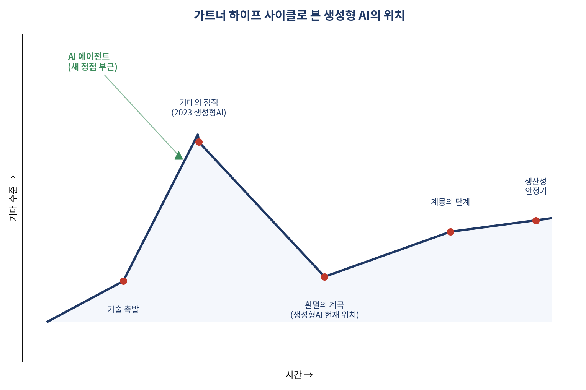
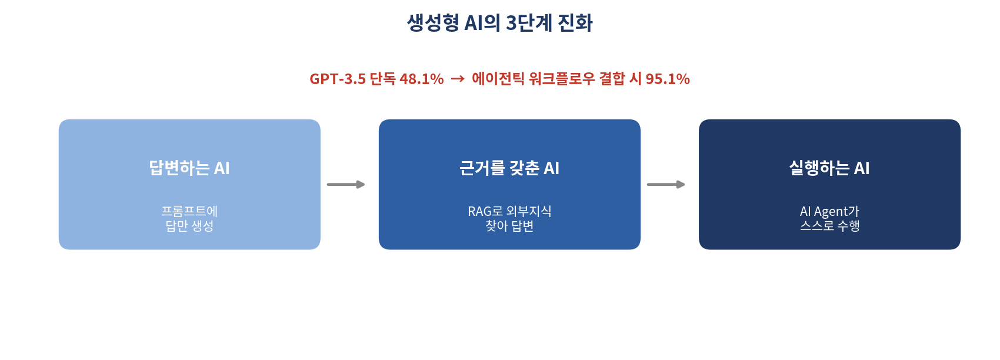

# 답하는 AI에서 실행하는 AI로 — 생성형 AI, 지금 어디까지 왔나

*[데이터와 AI, 제대로 읽는 법] 시리즈 7/10*

ChatGPT는 출시 5일 만에 사용자 100만 명을 돌파했습니다. 넷플릭스는 같은 숫자에 도달하는 데 3.5년, 인스타그램은 75일이 걸렸습니다. 역대 가장 빠르게 확산한 소비자 서비스로 꼽히는 이유입니다. 그런데 그로부터 몇 년이 지난 지금, 생성형 AI는 정확히 어느 단계에 와 있을까요?

## 하이프 사이클로 본 생성형 AI의 위치

가트너의 하이프 사이클은 새로운 기술이 "기술 촉발 → 기대의 정점 → 환멸의 계곡 → 계몽의 단계 → 생산성 안정기"를 거친다고 설명합니다. 2016년 알파고-이세돌 대국을 계기로 딥러닝이 기대의 정점에 올랐던 것처럼, 2023년에는 생성형 AI가 정점을 찍었습니다. 그리고 이후의 하이프 사이클 흐름을 보면, 생성형 AI 자체는 환멸의 계곡에 진입하고 **AI 에이전트** 가 새로운 정점 부근에 위치한 것으로 나타납니다.

"환상에서 깨어난 뒤 냉정하게 옥석을 가리는 구간에 들어섰다"는 해석입니다. 처음엔 뭐든 다 해줄 것 같았던 기대가 가라앉고, 이제는 "실제로 무엇에 잘 쓰이는가"를 검증하는 시기로 넘어간 셈입니다.

## 3단계 진화: 답변하는 AI → 근거를 갖춘 AI → 실행하는 AI

생성형 AI의 진화는 대략 세 단계로 요약됩니다. 그저 **답변하는 AI**(초기 프롬프트 엔지니어링 시기) → 외부 지식을 찾아 **근거를 갖춰 답하는 AI**(RAG 결합) → 스스로 판단하고 **실행하는 AI**(AI 에이전트).

이 흐름을 뒷받침하는 인상적인 수치가 하나 있습니다. 코딩 벤치마크에서 GPT-3.5는 단독으로 48.1%의 정확도를 보였습니다. 그런데 여기에 에이전틱 워크플로우(계획-실행-검증을 반복하는 구조)를 결합하자 정확도가 **95.1%** 까지 치솟았습니다. 모델 자체의 성능보다 "어떤 구조로 모델을 활용하는가"가 결과를 좌우할 수 있다는 걸 보여주는 사례입니다. 최신 모델을 쓰는 것 못지않게, 그 모델을 어떻게 조직화해서 쓰느냐가 중요해진 시대라는 뜻이죠.

## 생성형 AI가 진짜 잘하는 일

생성형 AI가 강점을 보이는 영역은 크게 네 가지로 요약됩니다. 텍스트·코드·아이디어를 만들어내는 **생성**, 방대한 정보에서 필요한 지식을 찾는 **검색**, 긴 정보를 압축하는 **요약**, 맥락을 이해해 논리적으로 판단하는 **추론** 입니다.

패러다임이 바뀐 지점도 흥미롭습니다. 지도학습 시대에는 "문제를 정의하고, 데이터를 모으고, 모델을 설계·학습시키는" 과정이 필요했습니다. LLM 시대에는 "문제를 자연어로 설명하기만 하면" 사전학습된 모델이 바로 대응합니다. 이 변화가 뜻하는 바는 분명합니다. 앞으로 중요한 역량은 "문제를 푸는 법"이 아니라 **"문제를 명확히 설명하는 법"** 입니다.

## 기업이 도입할 때 마주치는 현실적인 벽

다만 기업이 실제로 LLM을 도입할 때는 몇 가지 벽에 부딪힙니다. 사내 폐쇄 데이터를 LLM이 학습하지 못했다는 점, 정보의 최신성을 담보하기 어렵다는 점, 그리고 가장 널리 알려진 문제인 **환각(hallucination)** 입니다.

환각은 왜 생길까요? LLM은 정답 여부를 확인하는 모델이 아니라, 학습한 데이터의 통계적 패턴에 따라 "다음에 올 가능성이 가장 높은 단어"를 순차적으로 예측하는 모델입니다. 사실관계를 실시간으로 검증하는 장치가 내장돼 있지 않기 때문에, 그럴듯하지만 틀린 문장도 유창하게 만들어낼 수 있습니다. 이를 줄이기 위한 대표적 방법이 외부 지식을 실시간으로 참조하게 하는 RAG(검색증강생성)와, 답변의 출처를 다시 검증하게 하는 Chain-of-Verification 같은 기법입니다.

## 그래서 지금, 다들 얼마나 쓰고 있을까

국내 조사(엠브레인, 2023)에 따르면 국내 직장인의 73.9%가 생성형 AI 사용 경험이 있고, 도입 후 "긍정적"이라는 응답이 84%에 달했습니다. 가트너는 기업의 AI 활용 사례를 리스크와 차별화 정도에 따라 세 갈래로 나눠 접근할 것을 권합니다. 빠르게 성과를 낼 수 있는 **Quick Wins**, 내부 데이터로 맞춤 개발하는 **Differentiating Use Cases**, 리스크는 높지만 혁신적인 **Transformational Initiatives** 입니다. 처음부터 혁신을 노리기보다, 작고 확실한 성과부터 쌓아가는 순서가 현실적인 접근이라는 뜻입니다.

## 핵심 정리

- 생성형 AI는 현재 하이프 사이클의 환멸 단계, AI 에이전트가 새로운 기대의 정점 부근에 있다.
- AI는 "답하는 존재 → 근거를 갖춰 답하는 존재 → 실행하는 존재"로 진화 중이다.
- 모델 성능 자체보다 "어떤 워크플로우 구조로 쓰는가"가 결과를 크게 좌우할 수 있다.
- 환각은 LLM이 확률적으로 다음 단어를 예측하는 구조적 특성에서 비롯되며, RAG 등으로 완화한다.

다음 편에서는 이 AI를 실제로 잘 부려먹는 법, 프롬프트 엔지니어링으로 들어갑니다. 같은 질문도 어떻게 물어보느냐에 따라 답이 완전히 달라지는 이유를 살펴보겠습니다.
