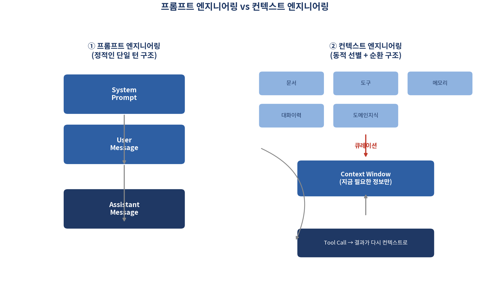

# 프롬프트만 잘 쓰면 될 줄 알았는데 — 컨텍스트 엔지니어링과 하네스 엔지니어링

*[데이터와 AI, 제대로 읽는 법] 시리즈 9/10*

2023년, "프롬프트 엔지니어"라는 직업이 화제였습니다. 연봉 최대 3억 원이 넘는다는 기사까지 나올 정도였죠. 그런데 그 열기는 빠르게 식었습니다. 이유는 단순합니다. 프롬프트 하나만 잘 쓰는 것으로는 부족한 상황이 왔기 때문입니다. AI가 여러 단계를 거쳐 스스로 작업을 수행하는 "에이전트"가 되면서, 게임의 규칙이 바뀌었습니다.

## 왜 프롬프트만으로는 부족해졌을까

초기 LLM 활용은 대부분 한 번 묻고 한 번 답하는 단일 턴(single-turn) 상호작용이었습니다. 필요한 정보를 프롬프트 하나에 다 담으면 충분했죠. 그런데 AI 에이전트가 여러 턴에 걸쳐 도구를 호출하고 정보를 쌓아가며 작업을 수행하는 시대가 되면서, 시스템 프롬프트·도구 목록·외부 데이터·대화 이력 등 관리해야 할 정보의 총량이 폭발적으로 늘어났습니다. 이 복잡성은 프롬프트를 "잘 쓰는" 것만으로는 해결되지 않습니다.

이런 배경에서 2025년 중반, 프롬프트 엔지니어링의 자연스러운 진화형으로 등장한 개념이 **컨텍스트 엔지니어링** 입니다. Anthropic은 공식 엔지니어링 블로그(2025년 9월 게재)에서 이를 "LLM 추론 과정에 들어가는 모든 정보, 즉 최적의 토큰 집합을 큐레이션하고 유지하는 전략들의 집합"으로 정의합니다. 한마디로, 프롬프트 엔지니어링이 "무슨 말을 할까"를 다듬는 작업이라면, 컨텍스트 엔지니어링은 **"무엇을 알려줄까"** 를 설계하는 작업입니다.

단일 턴 프롬프트가 시스템 프롬프트와 사용자 메시지로 이루어진 정적인 구조였다면, 에이전트를 위한 컨텍스트는 문서·도구·메모리·대화 이력이라는 다양한 정보 후보군 중에서 지금 이 순간 꼭 필요한 것만 골라 담고, 도구 실행 결과를 다시 컨텍스트에 반영하는 순환 구조를 가집니다. 정적인 설계에서 동적인 순환 설계로 바뀐 셈입니다.

컨텍스트 엔지니어링이 다루는 네 가지 축은 다음과 같습니다.

- AI의 역할과 제약을 정의하는 **시스템 프롬프트 설계**
- 대화 맥락을 얼마나 어떻게 유지할지 결정하는 **메모리와 히스토리 관리** (중요 정보는 요약·압축)
- 검색·API 결과를 선택적으로 주입하는 **도구와 외부 지식 연동**
- 일관된 응답을 위한 **예시와 출력 포맷 설계**

**더 알아보기: 컨텍스트 부패(Context Rot).** 컨텍스트가 길어질수록 모델이 중요한 정보를 놓치거나 불필요한 정보에 흐트러져 추론 품질이 떨어지는 현상을 가리키는 표현입니다. 이는 Transformer 구조가 토큰 n개에 대해 n²에 비례하는 연산을 수행하는 근본적 특성과 맞닿아 있습니다. Anthropic의 공식 가이드는 이 문제에 대응하는 방법으로, 정보를 계속 쌓기보다 주기적으로 요약·정리(compaction)하고, 불필요해진 도구 결과는 컨텍스트에서 제거하며, 정말 필요한 정보만 그때그때 검색해 불러오는 방식을 권합니다.

## 하네스 엔지니어링: 말을 길들이는 마구

컨텍스트 엔지니어링이 "무엇을 보여줄까"를 다룬다면, 아직 풀리지 않는 질문이 남습니다. 도구는 어떻게 호출·실행되어야 하는지, 실패는 어떻게 처리해야 하는지, 같은 실수가 다음 세션에도 반복되지 않게 하려면 어떻게 해야 하는지, 누가 어떤 권한을 가져야 하는지 같은 문제들입니다.

인프라 자동화 도구 Terraform의 창업자 미첼 하시모토가 2026년 초 제시한 개념이 **하네스 엔지니어링** 입니다. "하네스(harness)"란 말에 채우는 마구(고삐, 재갈, 안장)를 뜻합니다. 강력하지만 예측 불가능한 말(=LLM)의 힘을 올바른 방향으로 전달하고 폭주를 막는 장치에 비유한 것이죠. 하시모토는 이 개념을 "에이전트가 실수를 저지를 때마다, 그 실수를 다시는 반복하지 않도록 시스템 자체를 고쳐나가는 작업"이라고 설명합니다.

하네스 엔지니어링의 핵심 원칙은 세 가지입니다.

1. **Application Legibility(가독성)**: 에이전트가 자신의 결과물을 스스로 검사할 수 있게 만드는 것. "코드를 잘 짰어?"라고 모호하게 묻는 대신, "이 서비스의 응답 시간을 직접 측정해 500ms 미만이면 통과"처럼 숫자로 검증 가능한 기준을 줍니다.
2. **Mechanical Hierarchy(강제된 계층 구조)**: 예컨대 코드 작성 작업이라면 자료형 정의 → 설정 → 저장소 → 서비스 → 실행환경 → UI처럼 의존성 방향을 물리적으로 강제해, 이 흐름을 어기는 변경은 시스템이 사람보다 먼저 자동으로 거부하게 만드는 것입니다.
3. **Progressive Disclosure(점진적 공개)**: 모든 규칙을 하나의 거대한 지침 문서에 욱여넣으면 정작 중요한 부분을 모델이 놓칩니다. 핵심 지침은 짧은 "지도" 역할만 하도록 간결하게 유지하고, 세부 규칙은 여러 문서에 나눠 필요할 때만 찾아보게 하는 게 효과적입니다.

## 세 층위를 한 문장씩으로 정리하면

프롬프트 엔지니어링이 "잘 말하는 법"을, 컨텍스트 엔지니어링이 "무엇을 알려줄지"를, 하네스 엔지니어링이 "AI가 실수하지 않는 시스템을 만드는 법"을 다룬다고 볼 수 있습니다. 세 개념은 서로 배타적이지 않고, AI 에이전트가 복잡한 실무에 투입될수록 함께 필요해지는 층위입니다. 프롬프트 하나 잘 쓰는 시대에서, 시스템 전체를 설계하는 시대로 넘어가고 있다는 뜻입니다.

## 핵심 정리

- 컨텍스트 엔지니어링은 프롬프트 엔지니어링의 진화형으로, "무엇을 알려줄까"를 동적으로 설계하는 작업이다.
- 컨텍스트가 길어질수록 오히려 성능이 떨어지는 "컨텍스트 부패"를 막기 위해 요약·정리·선택적 검색이 필요하다.
- 하네스 엔지니어링은 에이전트의 실수가 반복되지 않도록 검증 기준·계층 구조·정보 공개 방식을 설계하는 작업이다.
- 프롬프트 → 컨텍스트 → 하네스, 이 세 층위는 AI 에이전트가 복잡해질수록 함께 필요해진다.

마지막 편에서는 이 모든 걸 가능하게 한 기술의 뿌리, Transformer로 들어갑니다. GPT는 어떻게 다음 단어를 예측하는 걸까요? 그리고 지금 이 순간 가장 강력한 LLM은 무엇일까요?
