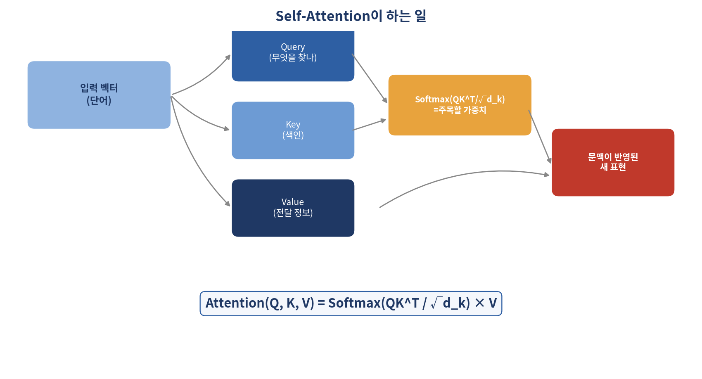
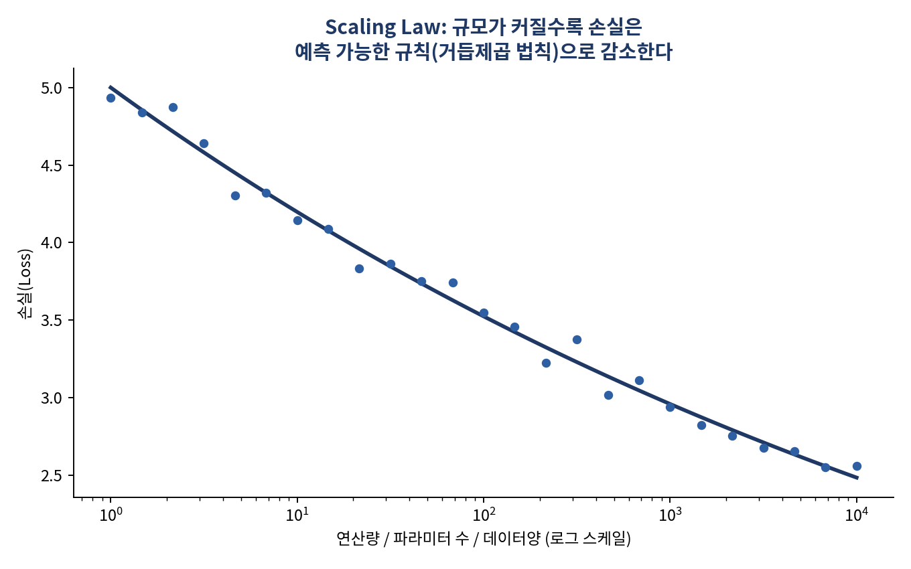

# GPT는 어떻게 다음 단어를 알아맞힐까 — Transformer와 현대 LLM 심화

*[데이터와 AI, 제대로 읽는 법] 시리즈 10/10 (완결)*

시리즈의 마지막 편입니다. 지금까지 데이터를 읽는 법과 AI를 다루는 법을 이야기했다면, 이번엔 그 AI 안에서 실제로 무슨 일이 벌어지고 있는지 들여다볼 차례입니다. 2017년 발표된 논문 한 편이 이 모든 것의 출발점이었습니다.

## 소프트웨어의 세 시대

소프트웨어 개발 방식은 크게 세 단계로 진화해왔습니다. 사람이 규칙을 코드로 직접 작성하는 **소프트웨어 1.0**, 사람이 데이터를 주고 신경망이 규칙을 스스로 학습하는 **소프트웨어 2.0**(다만 문제마다 별도의 모델을 새로 만들어야 하는 한계가 있었습니다), 그리고 사람이 목표를 자연어로 정의하면 AI 에이전트가 스스로 사고하고 행동하는 **소프트웨어 3.0** 입니다. 이 전환의 핵심은 "이제 소프트웨어의 인터페이스는 API가 아니라 언어(language)"라는 것이며, 이걸 가능케 한 결정적 기술이 바로 **Transformer** 입니다.

## 단어를 숫자로 바꾸는 여정

기계가 언어를 이해하려면 먼저 단어를 숫자(벡터)로 바꿔야 합니다. 초기 방식(원-핫 벡터, 단어 빈도 기반 표현)은 구현은 간단하지만 단어 사이의 의미 관계를 전혀 담지 못했습니다. "사과"와 "오렌지"가 "사과"와 "가방"보다 더 가깝다는 사실을 표현할 수 없었죠.

이 한계를 해결한 게 언어학자 젤리그 해리스의 **분포가설**("비슷한 문맥에서 쓰이는 단어는 의미도 비슷하다")을 딥러닝으로 구현한 **Word2Vec** 같은 워드 임베딩입니다. 임베딩 공간에서는 "King - Man + Woman ≈ Queen"처럼 단어 간 의미 관계가 벡터 연산으로 나타나는 신기한 성질이 관찰됩니다.

다만 초기 워드 임베딩엔 치명적 한계가 있었습니다. 한 단어에 고정된 벡터 하나만 부여하다 보니, "배"(과일/선박/신체)처럼 동음이의어나 "cold beer"와 "cold weather"처럼 문맥에 따라 뉘앙스가 달라지는 경우를 구분하지 못했습니다. 이 문제를 해결한 것이 문맥에 따라 같은 단어도 다른 벡터로 표현하는 **문맥적 임베딩** 이고, 이를 가능케 한 구조가 바로 Transformer의 핵심, **어텐션(Attention)** 입니다.

## 2017년, 세상을 바꾼 논문 한 편

Transformer 이전에는 문장을 순서대로 한 단어씩 처리하는 RNN 계열 모델이 주로 쓰였습니다. 하지만 RNN은 문장이 길어지면 앞부분의 정보가 뒤로 갈수록 희미해지는 **장기 의존성 문제** 를 겪었고, 순서대로만 처리할 수 있어 병렬 연산이 어려웠습니다.

2017년 구글 브레인 연구진이 발표한 논문 "Attention Is All You Need"는 RNN이나 CNN 없이 **어텐션만으로** 시퀀스를 처리하자는 제안이었습니다. 그리고 당대 최고 권위의 기계번역 대회(WMT 2014)에서 훨씬 적은 연산량으로 최고 성능(BLEU 28.4/41.8)을 달성했습니다. 이 논문은 이후 BERT, GPT를 포함한 거의 모든 현대 언어모델의 기반이 됐습니다.

## Self-Attention이 실제로 하는 일

핵심 아이디어는 각 단어가 문장 속 다른 모든 단어를 "얼마나 참고해야 하는지"를 계산하는 것입니다. 이를 위해 입력 벡터마다 세 가지 벡터를 만듭니다. **Query**(내가 무엇을 찾고 있는가), **Key**(다른 단어들이 제공하는 색인), **Value**(실제로 전달되는 정보)입니다.

Query와 Key를 내적해 두 단어가 얼마나 관련 있는지 점수를 매기고, 이 점수를 안정화한 뒤 Softmax로 확률 형태로 바꾸고, 마지막으로 Value 벡터에 곱해 각 단어가 문맥 정보를 반영한 새로운 표현으로 거듭납니다. 이 전 과정을 한 문장으로 압축한 게 다음 공식입니다.

**Attention(Q, K, V) = Softmax(QKᵀ / √d_k) × V**

Multi-head Attention은 이 과정을 여러 개(원논문 기준 8개)의 "머리(head)"가 독립적으로 수행하게 한 뒤 결과를 합치는 방식입니다. 어떤 head는 문법적 관계에, 다른 head는 의미적 유사성에 주목하는 식으로 서로 다른 관점을 동시에 포착할 수 있습니다.

**더 알아보기: Transformer의 나머지 조각들.** 원논문을 기준으로 보완하면 이렇습니다. Self-Attention은 모든 단어를 동시에 보기 때문에 순서 정보가 사라집니다("나는 밥을 먹었다"와 "밥이 나를 먹었다"를 구분 못함). 이를 보완하는 게 위치마다 다른 사인·코사인 값을 더해주는 **Positional Encoding** 입니다. 또, 입력을 어텐션 결과에 그대로 더해주는 **잔차 연결** 은 원래 정보가 손실되지 않게 하고 학습을 안정시킵니다. 인코더는 입력 문장 전체를 벡터로 요약하고, 디코더는 이미 생성한 단어만 참고하도록 미래 토큰을 가리는 **Masked Self-Attention** 을 수행한 뒤 인코더 출력을 참고하는 **교차 어텐션** 을 거쳐 다음 단어를 예측합니다. GPT 계열은 이 중 디코더 구조만 사용하고, BERT는 인코더 구조만 사용합니다.

## 규모의 시대: GPT와 Scaling Law

Transformer가 RNN 대비 갖는 결정적 이점은 분산 병렬 연산이 가능하다는 점이었고, 이는 곧 모델을 훨씬 크게 키울 수 있다는 뜻이었습니다. GPT-3는 약 5,000억 토큰을 학습했고, 파라미터 수는 GPT-2(15억 개)의 100배가 넘는 1,750억 개에 달했습니다.

이 무렵 관찰된 현상이 **Scaling Law(규모의 법칙)** 입니다. 모델 크기, 데이터 양, 연산량을 늘리면 성능이 불규칙하지 않고 예측 가능한 규칙적인 패턴으로 향상된다는 경험 법칙입니다. 이 발견 이후 AI 개발의 중심은 "더 나은 알고리즘을 찾는 경쟁"에서 "더 크게, 더 많은 데이터로 학습시키는 인프라 경쟁"으로 옮겨갔습니다.

다만 무조건 크게 만든다고 최선은 아닙니다. 2022년 구글 딥마인드가 제시한 **친칠라 법칙** 은 모델 크기와 데이터 양 사이에 최적의 비율이 있다는 걸 보여줬습니다. 파라미터 1,750억 개에 약 3,000억 토큰을 학습한 GPT-3보다, 파라미터는 700억 개로 더 작지만 약 1조 4,000억 토큰을 학습한 Chinchilla가 더 우수한 성능을 보였습니다.

## 사람의 선호를 학습시키다: RLHF

사전학습만 마친 LLM은 지식은 풍부하지만, "다음 단어를 그럴듯하게 예측하도록" 학습됐을 뿐 사람이 좋아하는 답변 방식을 배운 건 아닙니다. **RLHF(인간 피드백 기반 강화학습)** 는 이 간극을 메우는 기법으로, 모범 답변으로 지도학습 → 사람이 답변에 순위를 매긴 데이터로 보상모델 학습 → 보상모델의 점수를 최대화하도록 강화학습, 이 세 단계로 진행됩니다. ChatGPT를 비롯한 대화형 AI가 자연스럽고 예의 바른 톤을 갖게 된 배경에 이 과정이 있습니다.

다만 부작용도 있습니다. 모델이 "보상을 잘 받는 말투"에만 치우쳐 다양성을 잃는 **보상 해킹**, 그리고 사용자를 만족시키려다 잘못된 행동에도 과도하게 공감하고 칭찬하는 **아첨(sycophancy)** 문제입니다. 실제로 2025년 OpenAI CEO 샘 올트먼은 GPT-4o 업데이트가 모델을 지나치게 아첨하도록 만들었다며 공개적으로 인정하고 수정에 나선 바 있습니다.

## 효율을 높이는 최신 기술: 지식 증류와 MoE

거대 모델을 그대로 서비스에 쓰기엔 비용과 속도 부담이 큽니다. **지식 증류(Knowledge Distillation)** 는 크고 성능 좋은 "교사" 모델이 만든 추론 과정과 답변을 "학생" 모델이 함께 학습하는 방식입니다. DeepSeek-R1이 자신이 만든 추론 데이터로 1.5B~32B 규모의 경량 모델들을 증류해 배포한 것이 최근의 대표적 사례입니다.

**MoE(전문가 혼합)** 는 "모든 파라미터를 매번 다 쓸 필요가 있는가"라는 질문에서 출발합니다. 입력 토큰이 들어오면 라우터가 여러 전문가 서브네트워크 중 일부만 선택적으로 활성화시키고 나머지는 쉬게 둡니다. 전체 파라미터 수는 매우 크게 유지하면서도, 실제 연산에 쓰이는 파라미터 수는 훨씬 적게 가져가 효율을 높이는 방식입니다.

## 지금 이 순간의 LLM 지형도

2026년 8월 현재, 주요 빅테크의 최신 LLM 세대는 대략 이렇게 정리됩니다(모델 세계는 몇 달 단위로 갱신되니, 하나의 스냅샷으로 봐주세요).

- **OpenAI**: GPT-5 계열이 지속적으로 개선되어 GPT-5.5(2026년 4월), GPT-5.6(2026년 6월, 일부 파트너 대상 제한 공개)까지 이어지고 있습니다.
- **Anthropic**: Claude Sonnet 5(2026년 6월), Claude Opus 5(2026년 7월)가 주력 모델로 자리 잡았고, Claude Fable 5가 최상위 공개 모델로, Claude Mythos 5는 제한된 파트너에게만 공개되는 실험적 모델로 운영되고 있습니다.
- **Google**: Gemini 3 계열이 멀티모달과 Workspace 연동을 앞세워 경쟁하고 있습니다.

이 글에서 다룬 RLHF·Scaling Law·지식 증류·MoE 같은 기술 요소들은 이 모델들 대부분에 공통으로 깔린 토대 기술입니다. 다만 특정 시점의 순위나 벤치마크 수치는 몇 달 안에 바뀌는 게 이 분야의 특징이니, 실무에서 모델을 고를 땐 각 회사의 공식 발표와 공개 리더보드를 그때그때 다시 확인하는 습관이 필요합니다.

## 핵심 정리

- Transformer의 핵심은 Self-Attention, 즉 각 단어가 다른 모든 단어를 얼마나 참고할지 계산하는 구조다.
- GPT는 디코더만, BERT는 인코더만 사용하는 Transformer 변형이다.
- Scaling Law는 "크게 만들수록 좋아진다"를, Chinchilla 법칙은 "크기와 데이터의 균형이 중요하다"를 보여줬다.
- RLHF는 LLM에 사람의 선호를 학습시키지만 아첨 같은 부작용도 낳는다. 지식 증류와 MoE는 효율을 높이는 최신 기법이다.

여기까지 10편에 걸쳐 데이터를 읽는 법(통계·회귀)과 AI를 다루고 이해하는 법(프롬프트·Transformer)을 함께 훑어봤습니다. 두 흐름을 관통하는 질문은 결국 하나였습니다. "불확실한 데이터로부터 어떻게 신뢰할 수 있는 결론을 이끌어낼 것인가." 시리즈를 끝까지 읽어주셔서 감사합니다.
