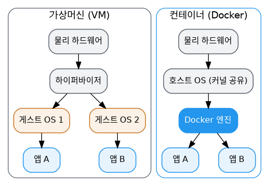

# [Docker 개념 1편] 컨테이너, 그리고 왜 가상머신이 아닌가

새 프로젝트를 시작할 때마다 겪는 고민이 있습니다. React 프론트엔드, Python API, PostgreSQL 데이터베이스로 이루어진 앱을 개발한다고 해봅시다. Node, Python, PostgreSQL을 전부 로컬에 설치해야 하고, 팀원마다 버전이 미묘하게 다르고, CI 서버와 운영 서버의 버전도 또 다릅니다. 내 컴퓨터에 이미 깔려 있는 다른 버전과 충돌은 안 나는지도 늘 신경 쓰입니다.

Docker 공식 문서는 이 문제를 컨테이너라는 개념으로 풀어냅니다.

## 컨테이너란 무엇인가

컨테이너는 앱을 구성하는 각 요소를 위한 격리된 프로세스입니다. React 프론트엔드, Python API, 데이터베이스가 각각 자신만의 격리된 환경에서 실행되고, 내 컴퓨터의 다른 무엇과도 간섭하지 않습니다.

Docker 공식 문서는 컨테이너의 특징을 이렇게 정리합니다.

- 독립적(Self-contained): 실행에 필요한 모든 것을 컨테이너 자체가 가지고 있어서, 호스트에 미리 설치된 것에 의존하지 않습니다.
- 격리됨(Isolated): 격리된 상태로 실행되기 때문에 호스트나 다른 컨테이너에 미치는 영향이 최소화되고, 보안성이 높아집니다.
- 독립적으로 관리됨(Independent): 컨테이너 하나를 지워도 다른 컨테이너에는 영향이 없습니다.
- 이식 가능(Portable): 개발 환경에서 돌아가던 컨테이너는 데이터센터에서도, 클라우드 어디서든 똑같이 동작합니다.

## 컨테이너와 가상머신(VM), 뭐가 다를까

가상머신(VM)은 커널, 하드웨어 드라이버, 프로그램까지 전부 갖춘 하나의 완전한 운영체제입니다. 앱 하나를 격리하려고 VM을 하나 띄우는 건 배보다 배꼽이 큰 일이죠.

반면 컨테이너는 실행에 필요한 파일들을 담은, 그냥 격리된 프로세스일 뿐입니다. 여러 컨테이너를 띄워도 이들은 모두 같은 커널을 공유하기 때문에, 같은 인프라에서 훨씬 많은 애플리케이션을 돌릴 수 있습니다.



> **VM과 컨테이너를 함께 쓰는 경우도 많습니다.** 클라우드 환경에서 제공되는 서버는 대부분 VM인데, 그 VM 안에 컨테이너 런타임을 올려서 여러 컨테이너화된 앱을 돌리는 방식입니다. VM 하나로 여러 앱을 효율적으로 운영하는 셈입니다.

## 조금 더 깊이: 컨테이너는 어떻게 격리될까

공식 문서는 이 격리의 기반 기술로 리눅스 커널의 namespaces를 꼽습니다. 컨테이너를 실행하면 Docker는 그 컨테이너를 위한 네임스페이스 집합을 만드는데, 컨테이너의 프로세스 목록, 네트워크, 파일 시스템 마운트 지점 같은 것들이 각각 별도의 네임스페이스 안에서만 보이고 접근됩니다. 즉 컨테이너 안에서 `ps`를 쳐보면 오직 그 컨테이너의 프로세스만 보이는데, 이게 바로 네임스페이스가 하는 일입니다. 여기에 더해 cgroups라는 커널 기능이 컨테이너가 쓸 수 있는 CPU·메모리 등의 자원 양을 제한합니다. (이 부분은 10편에서 자세히 다룹니다.)

## 첫 컨테이너 실행해보기

Docker를 설치했다면 다음 명령 한 줄로 웹 서버 컨테이너를 띄울 수 있습니다.

```console
$ docker run -d -p 8080:80 docker/welcome-to-docker
```

- `-d`: 백그라운드에서 실행 (detached)
- `-p 8080:80`: 호스트의 8080번 포트를 컨테이너의 80번 포트로 연결

실행 중인 컨테이너 목록은 `docker ps`로 확인하고, 멈추고 싶다면 `docker stop <컨테이너ID>`를 사용합니다.

## 명령어 빠른 참고표

| 명령어 | 역할 |
|---|---|
| `docker run` | 이미지를 기반으로 새 컨테이너를 생성하고 실행 |
| `docker ps` | 실행 중인 컨테이너 목록 확인 (`-a`로 전체 확인) |
| `docker stop <id>` | 컨테이너를 정상적으로 중지 |
| `docker rm <id>` | 중지된 컨테이너 삭제 |

*다음 편에서는 컨테이너가 실행되기 위해 필요한 재료, 이미지(Image)와 그걸 저장하는 레지스트리(Registry)를 다룹니다.*

---
참고: [What is Docker?](https://docs.docker.com/get-started/docker-overview/), [What is a container?](https://docs.docker.com/get-started/docker-concepts/the-basics/what-is-a-container/)
