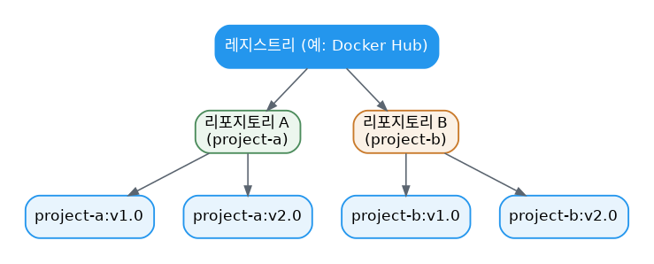

# [Docker 개념 2편] 컨테이너의 재료, 이미지와 그걸 담아두는 레지스트리

1편에서 컨테이너는 격리된 프로세스라고 했습니다. 그렇다면 이 프로세스는 실행에 필요한 파일과 설정을 대체 어디서 가져오는 걸까요? 그 답이 바로 이미지(Image)입니다.

## 이미지란 무엇인가

컨테이너 이미지는 컨테이너를 실행하는 데 필요한 모든 파일, 바이너리, 라이브러리, 설정을 담은 표준화된 패키지입니다. PostgreSQL 이미지라면 데이터베이스 바이너리와 설정 파일이, Python 웹 앱 이미지라면 Python 런타임과 앱 코드, 그 의존성들이 함께 들어 있습니다.

Docker 공식 문서는 이미지의 두 가지 핵심 원칙을 강조합니다.

1. **이미지는 불변(immutable)입니다.** 한 번 만들어진 이미지는 수정할 수 없습니다. 새 이미지를 만들거나, 그 위에 변경 사항을 쌓아 올릴 수만 있습니다.
2. **이미지는 레이어로 구성됩니다.** 각 레이어는 파일 시스템의 추가·삭제·수정 내역을 담고 있습니다. (레이어 구조는 3편에서 자세히 다룹니다.)

이 두 원칙 덕분에 기존 이미지를 확장해서 새 이미지를 만들 수 있습니다. Python 앱을 만든다면 공식 Python 이미지를 베이스로 삼고, 그 위에 앱의 의존성과 코드를 레이어로 얹으면 됩니다. Python 자체를 처음부터 구성할 필요가 없는 거죠.

## 이미지는 어디서 찾을까

Docker Hub는 이미지를 저장하고 배포하는 기본 글로벌 마켓플레이스로, 10만 개가 넘는 이미지가 올라와 있습니다. 그중에서도 신뢰도가 검증된 이미지들을 Docker Trusted Content라고 부르는데, 공식 문서는 다음 네 종류를 소개합니다.

- **Docker Official Images**: 대부분의 사용자에게 출발점이 되는, 가장 안전하게 관리되는 이미지 모음
- **Docker Hardened Images**: CVE(보안 취약점)가 거의 없는 최소한의 프로덕션용 이미지
- **Docker Verified Publishers**: Docker가 검증한 상업 퍼블리셔의 고품질 이미지
- **Docker-Sponsored Open Source**: Docker의 오픈소스 후원 프로그램을 통해 유지되는 이미지

## 레지스트리와 리포지토리, 헷갈리기 쉬운 두 용어

이미지를 로컬에만 두면 다른 사람과 공유하거나 다른 서버에서 쓸 수가 없습니다. 그래서 필요한 게 레지스트리(registry), 즉 이미지를 저장하고 공유하는 중앙 저장소입니다. Docker Hub가 대표적인 공개 레지스트리이고, Amazon ECR·Azure ACR·Google GCR 같은 클라우드 서비스나 Harbor 같은 사내 전용 레지스트리도 있습니다.

여기서 레지스트리와 리포지토리를 같은 말처럼 쓰는 경우가 많은데, 정확히는 다릅니다. **레지스트리** 는 이미지를 저장·관리하는 중앙 위치 전체를 가리키고, **리포지토리** 는 그 레지스트리 안에서 관련된 이미지들을 모아둔 하나의 묶음입니다. 프로젝트별로 정리해둔 폴더라고 생각하면 됩니다.



## 이미지 빌드하고 푸시하기

```console
$ docker build -t <내_도커계정>/docker-quickstart .
$ docker tag <내_도커계정>/docker-quickstart <내_도커계정>/docker-quickstart:1.0
$ docker push <내_도커계정>/docker-quickstart:1.0
```

`docker build`의 마지막에 붙는 점(`.`)은 Dockerfile을 어디서 찾을지 알려주는 빌드 컨텍스트입니다. `docker tag`로 버전을 명시적으로 표시해두면 나중에 어떤 버전이 배포됐는지 추적하기 쉬워집니다.

## 조금 더 깊이: 이미지 크기와 다운로드는 다른 개념

`docker image ls`로 보이는 이미지 크기는 레이어들이 압축 해제된 상태의 크기이지, 실제로 내려받을 때 전송되는 압축 크기가 아닙니다. `docker pull` 실행 중에 여러 줄의 레이어 다운로드 로그가 보이는데, 그 한 줄 한 줄이 각각 다른 레이어를 내려받는 과정입니다. 이미 로컬에 있는 레이어는 다시 받지 않기 때문에, 같은 베이스 이미지를 쓰는 이미지들을 여러 개 받아도 실제 전송량은 생각보다 적습니다.

## 참고표

| 명령어 | 역할 |
|---|---|
| `docker search <이름>` | Docker Hub에서 이미지 검색 |
| `docker pull <이미지>` | 레지스트리에서 이미지 다운로드 |
| `docker image ls` | 로컬에 있는 이미지 목록 확인 |
| `docker tag` | 이미지에 새 이름/버전 태그 부여 |
| `docker push` | 레지스트리로 이미지 업로드 |

*다음 편에서는 이미지가 왜 레이어로 쪼개져 있는지, 그 구조를 더 깊이 들여다봅니다.*

---
참고: [What is an image?](https://docs.docker.com/get-started/docker-concepts/the-basics/what-is-an-image/), [What is a registry?](https://docs.docker.com/get-started/docker-concepts/the-basics/what-is-a-registry/)
