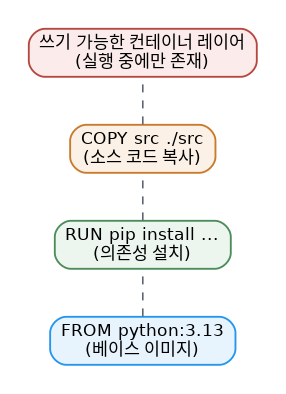

# [Docker 개념 3편] 이미지는 왜 레이어로 쌓여 있을까

2편에서 이미지는 레이어로 구성되고 각 레이어는 불변이라고 했습니다. 이번 편에서는 이게 실제로 무슨 뜻인지, 그리고 이 레이어들이 어떻게 하나의 컨테이너 파일 시스템으로 합쳐지는지 살펴봅니다.

## 레이어 하나하나는 파일 시스템 변경 내역

이미지의 각 레이어는 파일의 추가·삭제·수정 같은 파일 시스템 변경 사항 묶음입니다. 예를 들어 어떤 이미지가 다음과 같은 레이어들로 구성되어 있다고 해봅시다.

1. 첫 번째 레이어: 기본 명령어와 `apt` 같은 패키지 매니저 추가
2. 두 번째 레이어: Python 런타임과 `pip` 설치
3. 세 번째 레이어: 앱의 `requirements.txt` 복사
4. 네 번째 레이어: 그 의존성들 설치
5. 다섯 번째 레이어: 앱 소스 코드 복사



이렇게 레이어로 나뉘어 있으면 여러 이미지 사이에서 레이어를 재사용할 수 있다는 게 핵심 장점입니다. 새로운 Python 앱을 또 만든다면, 이미 로컬에 있는 같은 Python 베이스 레이어를 그대로 활용할 수 있죠. 빌드가 빨라지고, 이미지를 저장·배포하는 데 필요한 용량과 대역폭도 줄어듭니다.

## 레이어가 실제로 쌓이는 방식

여기서부터는 다소 기술적인 내용이지만, 원리를 알아두면 이미지 동작 방식이 훨씬 명확해집니다.

1. 각 레이어는 다운로드된 후 호스트 파일 시스템의 자기 디렉토리에 압축 해제됩니다.
2. 이미지로부터 컨테이너를 실행하면, 이 레이어들이 차곡차곡 쌓여 하나의 통합된 뷰를 만드는 유니온 파일 시스템(union filesystem)이 생성됩니다.
3. 컨테이너가 시작되면 이 통합 디렉토리를 `chroot`를 이용해 자신의 루트 디렉토리로 삼습니다.

이때 이미지 레이어들과 별개로, 실행 중인 컨테이너만을 위한 디렉토리도 하나 추가됩니다. 컨테이너가 파일을 만들거나 수정할 때 이 컨테이너 전용 레이어에만 기록되고, 원본 이미지 레이어는 전혀 손상되지 않습니다. 그래서 같은 이미지로 컨테이너를 몇 개를 띄우든 서로 간섭하지 않는 겁니다.

## 레이어를 직접 눈으로 확인하기

`docker image history` 명령으로 이미지의 레이어 목록을 볼 수 있습니다.

```console
$ docker image history docker/welcome-to-docker
IMAGE          CREATED        CREATED BY                                      SIZE
648f93a1ba7d   4 months ago   COPY /app/build /usr/share/nginx/html # buil…   1.6MB
<missing>      5 months ago   /bin/sh -c #(nop)  CMD ["nginx" "-g" "daemon…   0B
<missing>      5 months ago   /bin/sh -c #(nop)  EXPOSE 80                    0B
...
```

각 줄이 하나의 레이어이고, 그 레이어를 만든 명령과 크기가 함께 표시됩니다. 실제로는 대부분 Dockerfile로 이미지를 만들지만(4편에서 다룹니다), 원리를 이해하기에는 `docker container commit` 명령으로 컨테이너의 변경 사항을 직접 레이어로 저장해보는 실습이 도움이 됩니다. 컨테이너 안에서 뭔가를 설치한 뒤 `docker container commit -m "Add node" base-container node-base`처럼 실행하면, 그 변경 사항이 새로운 레이어로 저장된 이미지가 만들어집니다.

## 조금 더 깊이: 레이어 재사용이 만드는 효율

동일한 베이스 이미지(`node:22-alpine` 같은)를 쓰는 이미지가 여러 개 있다면, 그 베이스 레이어는 로컬 디스크에 딱 한 번만 저장됩니다. 서로 다른 프로젝트의 이미지 10개를 받아도, 공통 베이스 레이어를 다시 받거나 다시 저장하지 않는다는 뜻입니다. 이게 컨테이너 이미지가 전통적인 가상머신 이미지보다 훨씬 가볍고 빠른 이유 중 하나입니다.

## 참고표

| 명령어 | 역할 |
|---|---|
| `docker image history <이미지>` | 이미지의 레이어와 각 레이어의 생성 명령 확인 |
| `docker container commit` | 실행 중인 컨테이너의 변경 사항을 새 이미지 레이어로 저장 |
| `docker image ls` | 로컬 이미지와 크기 확인 |

*다음 편에서는 이 레이어들을 자동으로 만들어주는 설계도, Dockerfile 작성법을 다룹니다.*

---
참고: [Understanding the image layers](https://docs.docker.com/get-started/docker-concepts/building-images/understanding-image-layers/)
