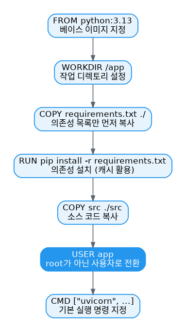

# [Docker 개념 4편] 이미지의 설계도, Dockerfile 작성하기

3편에서 이미지가 레이어로 이루어져 있다는 걸 배웠습니다. 그런데 매번 컨테이너에 접속해서 손으로 설치하고 `docker container commit`으로 저장하는 건 너무 번거롭습니다. 이 과정을 자동화하는 설계도가 바로 Dockerfile입니다.

## Dockerfile이란

Dockerfile은 이미지를 만들기 위한 지침이 담긴 텍스트 문서입니다. 어떤 명령을 실행할지, 어떤 파일을 복사할지, 시작 명령이 무엇인지 등을 빌더에게 알려줍니다. 공식 문서가 제시하는 예시는 다음과 같습니다.

```dockerfile
FROM python:3.13
WORKDIR /usr/local/app

# 의존성 설치
COPY requirements.txt ./
RUN pip install --no-cache-dir -r requirements.txt

# 소스 코드 복사
COPY src ./src
EXPOSE 8080

# root가 아닌 앱 전용 사용자 생성
RUN useradd app
USER app

CMD ["uvicorn", "app.main:app", "--host", "0.0.0.0", "--port", "8080"]
```

## 자주 쓰는 명령어

| 명령어 | 역할 |
|---|---|
| `FROM <이미지>` | 빌드가 확장할 베이스 이미지를 지정 |
| `WORKDIR <경로>` | 이후 파일 복사와 명령 실행의 기준이 될 작업 디렉토리 지정 |
| `COPY <호스트경로> <이미지경로>` | 호스트의 파일을 이미지 안으로 복사 |
| `RUN <명령>` | 지정한 명령을 빌드 중에 실행 |
| `ENV <이름> <값>` | 실행 중인 컨테이너가 사용할 환경 변수 설정 |
| `EXPOSE <포트번호>` | 이미지가 사용하려는 포트를 명시 (실제 퍼블리싱은 별개) |
| `USER <사용자>` | 이후 명령들을 실행할 기본 사용자 지정 |
| `CMD [...]` | 컨테이너가 시작될 때 실행할 기본 명령 지정 |



## 실제로 작성해보면

Node.js 앱을 예로 들면, 기본적인 Dockerfile은 다음처럼 짧습니다.

```dockerfile
FROM node:22-alpine
WORKDIR /app
COPY . .
RUN yarn install --production
CMD ["node", "./src/index.js"]
```

여기서 주의할 점은, `Dockerfile`이라는 파일명에는 확장자가 붙지 않는다는 것입니다. 일부 편집기가 자동으로 확장자를 붙이려 하니 확인이 필요합니다. 그리고 이 버전은 아직 프로덕션에 쓰기엔 최적화가 덜 된 상태입니다. 빌드 캐시를 최대한 활용하지 못하고 있고, root 사용자로 실행되고 있기 때문입니다. 이 두 가지는 각각 5편(빌드 캐시)과 10편(보안)에서 개선합니다.

## 조금 더 깊이: Dockerfile 작성의 기본 순서

공식 문서는 Dockerfile을 작성하는 전형적인 흐름을 이렇게 정리합니다.

1. 베이스 이미지를 결정한다
2. 애플리케이션 의존성을 설치한다
3. 관련 소스 코드나 바이너리를 복사한다
4. 최종 이미지를 설정한다 (포트, 사용자, 실행 명령 등)

이 순서를 지키는 이유는 단순한 스타일 문제가 아니라 빌드 캐시와 직결됩니다. 자주 바뀌지 않는 것(베이스 이미지, 의존성 설치)을 앞쪽에, 자주 바뀌는 것(소스 코드)을 뒤쪽에 배치해야 매번 처음부터 다시 빌드하지 않아도 됩니다. 이 원리는 다음 편에서 자세히 다룹니다.

## 참고표

| 명령어 | 역할 |
|---|---|
| `docker build -t <이름> .` | 현재 디렉토리의 Dockerfile로 이미지 빌드 |
| `docker build -t <이름> -f <경로>` | Dockerfile 경로를 명시적으로 지정 |

*다음 편에서는 같은 Dockerfile이라도 어떻게 쓰느냐에 따라 빌드 속도가 크게 달라지는 빌드 캐시 최적화를 다룹니다.*

---
참고: [Writing a Dockerfile](https://docs.docker.com/get-started/docker-concepts/building-images/writing-a-dockerfile/), [Dockerfile reference](https://docs.docker.com/reference/dockerfile/)
