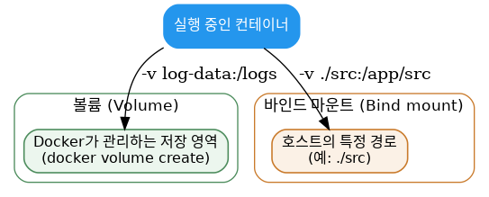

# [Docker 개념 8편] 컨테이너를 지워도 데이터는 남아야 한다면, 볼륨과 바인드 마운트

컨테이너가 시작되면 이미지가 제공한 파일과 설정을 기반으로 동작합니다. 컨테이너 안에서 파일을 만들거나 지워도 다른 컨테이너에는 영향을 주지 않는데, 문제는 컨테이너가 삭제되면 그 안의 파일 변경 사항도 함께 사라진다는 점입니다. 데이터베이스 컨테이너를 재시작할 때마다 데이터가 텅 비어버린다면 곤란하겠죠. 이 문제를 해결하는 두 가지 방법이 볼륨과 바인드 마운트입니다.

## 볼륨: Docker가 관리하는 저장 공간

볼륨은 개별 컨테이너의 생명주기를 넘어서 데이터를 지속시키는 저장 메커니즘입니다. 컨테이너 안에서 밖으로 나가는 일종의 지름길(심볼릭 링크)이라고 생각하면 이해가 쉽습니다.

```console
$ docker volume create log-data
$ docker run -d -p 80:80 -v log-data:/logs docker/welcome-to-docker
```

컨테이너가 `/logs`에 쓰는 모든 파일은 컨테이너 밖의 이 볼륨에 저장됩니다. 컨테이너를 지우고 같은 볼륨으로 새 컨테이너를 시작해도 파일은 그대로 남아 있습니다. 볼륨이 존재하지 않으면 Docker가 자동으로 만들어줍니다.

같은 볼륨을 여러 컨테이너에 동시에 연결할 수도 있는데, 로그 수집이나 데이터 파이프라인처럼 컨테이너 간 파일 공유가 필요한 상황에 유용합니다.

## 바인드 마운트: 호스트의 특정 경로를 직접 공유

호스트에 있는 특정 파일이나 디렉토리(설정 파일, 개발 중인 코드 등)를 컨테이너와 직접 공유하고 싶다면 바인드 마운트를 씁니다. 호스트와 컨테이너 사이에 직통 통로를 뚫는 것과 비슷합니다. 실시간으로 파일 변경 사항을 반영해야 하는 개발 환경에 특히 적합합니다.

```console
$ docker run -v /HOST/PATH:/CONTAINER/PATH -it nginx
```



## `-v`와 `--mount`, 뭘 써야 할까

두 플래그 모두 호스트와 컨테이너 사이에 파일을 공유하지만 동작 방식이 다릅니다. `-v`는 간단한 상황에 편리하고, 호스트 경로가 없으면 자동으로 디렉토리를 만들어줍니다. `--mount`는 더 세밀한 제어가 가능해서 복잡한 마운트나 프로덕션 배포에 적합하고, 대상 경로가 없으면 자동 생성 대신 에러를 냅니다.

```console
$ docker run --mount type=bind,source=/HOST/PATH,target=/CONTAINER/PATH,readonly nginx
```

공식 문서는 마운트 과정을 더 명확하게 제어할 수 있고 디렉토리 누락 문제를 방지할 수 있다는 이유로 `--mount` 문법을 권장합니다.

## 읽기 전용으로 마운트하기

바인드 마운트에 `:ro`(읽기 전용)를 붙이면 컨테이너가 호스트의 파일을 읽을 수만 있고 수정하거나 삭제할 수는 없습니다. 반대로 `:rw`(읽기·쓰기)를 지정하면 컨테이너에서 변경한 내용이 호스트에도 그대로 반영됩니다. 민감한 설정 파일을 공유할 때는 읽기 전용으로 마운트해서 컨테이너가 실수로든 악의적으로든 수정하지 못하게 막는 것이 안전합니다.

## 볼륨은 언제 정리해야 할까

볼륨은 컨테이너와 별개의 생명주기를 가지기 때문에, 사용하는 데이터 종류에 따라 크기가 계속 커질 수 있습니다.

```console
$ docker volume ls              # 전체 볼륨 목록
$ docker volume rm <이름>       # 특정 볼륨 삭제 (연결된 컨테이너가 없어야 함)
$ docker volume prune           # 어디에도 연결되지 않은 볼륨 전부 삭제
```

## 조금 더 깊이: 왜 볼륨을 기본으로 권장할까

바인드 마운트는 호스트 파일 시스템의 구조에 직접 의존하기 때문에, 다른 운영체제나 다른 서버로 옮겼을 때 경로가 달라 깨지기 쉽습니다. 반면 볼륨은 Docker가 관리하는 추상화된 저장 공간이라 호스트 환경에 덜 종속적이고, `docker volume` 명령으로 일관되게 관리할 수 있습니다. 그래서 데이터베이스처럼 장기적으로 유지해야 하는 데이터는 볼륨을, 코드 변경을 실시간으로 반영해야 하는 개발 환경은 바인드 마운트를 쓰는 식으로 구분하는 것이 일반적입니다.

## 참고표

| 상황 | 추천 방식 |
|---|---|
| 데이터베이스처럼 장기 보관이 필요한 데이터 | 볼륨 |
| 개발 중인 소스 코드를 실시간 반영 | 바인드 마운트 |
| 민감한 설정 파일 공유 | 바인드 마운트 + `:ro` |
| 여러 컨테이너 간 파일 공유 | 볼륨 |

*다음 편에서는 여러 컨테이너로 이루어진 애플리케이션을 한 번에 관리하는 Docker Compose를 다룹니다.*

---
참고: [Persisting container data](https://docs.docker.com/get-started/docker-concepts/running-containers/persisting-container-data/), [Sharing local files with containers](https://docs.docker.com/get-started/docker-concepts/running-containers/sharing-local-files/)
