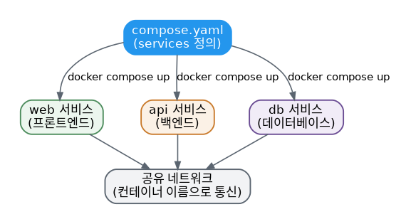

# [Docker 개념 9편] `docker run`을 여러 번 치는 대신, Docker Compose

지금까지는 컨테이너 하나짜리 애플리케이션을 다뤘습니다. 그런데 실제 서비스는 프론트엔드, 백엔드 API, 데이터베이스, 캐시처럼 여러 컴포넌트로 이루어진 경우가 대부분입니다. 컨테이너 하나에 이 모든 걸 욱여넣어야 할까요? 공식 문서는 명확히 아니라고 답합니다. **컨테이너 하나는 한 가지 일만 잘하는 게 좋은 관례** 입니다.

## `docker run`만으로는 한계가 있다

여러 컨테이너를 `docker run` 명령 여러 개로 띄우고 관리하려면 다음과 같은 문제에 부딪힙니다.

- 개발·테스트·프로덕션 환경마다 다른 설정으로 프론트엔드·백엔드·DB를 각각 실행해야 해서 오류가 나기 쉽고 시간이 오래 걸립니다.
- 애플리케이션들이 서로 의존하는 경우, 특정 순서로 컨테이너를 띄우고 네트워크를 연결하는 일이 애플리케이션 규모가 커질수록 어려워집니다.
- 서비스마다 별도의 `docker run` 명령이 필요해서, 특정 서비스만 확장(scale)하기가 번거롭습니다.
- 컨테이너마다 볼륨을 따로 설정해야 해서 데이터 관리가 흩어집니다.
- 환경 변수도 매번 명령마다 따로 설정해야 해서 실수하기 쉽습니다.

## Docker Compose가 하는 일

Docker Compose는 여러 컨테이너로 이루어진 애플리케이션 전체를 `compose.yaml`이라는 하나의 YAML 파일로 정의합니다. 이 파일을 코드 저장소에 포함시켜두면, 저장소를 클론한 누구나 명령 하나로 전체 애플리케이션을 띄울 수 있습니다.

```yaml
services:
  app:
    build: .
    ports:
      - 3000:3000
  mysql:
    image: mysql:8.0
    environment:
      MYSQL_ROOT_PASSWORD: secret
    volumes:
      - todo-mysql-data:/var/lib/mysql

volumes:
  todo-mysql-data:
```

```console
$ docker compose up -d --build
```

이 명령 한 줄로 이미지가 다운로드되고, 네트워크가 생성되고, 볼륨이 만들어지고, 정의된 모든 컨테이너가 필요한 설정과 함께 시작됩니다.

> **Dockerfile과 Compose 파일의 차이**: Dockerfile은 이미지를 만드는 방법을 정의하고, Compose 파일은 실행되는 컨테이너들을 정의합니다. 실무에서는 Compose 파일이 Dockerfile을 참조해서 특정 서비스용 이미지를 빌드하는 경우가 많습니다.

## 선언적(declarative)이라는 것의 의미

Compose는 선언적 도구입니다. 정의만 해두면 그걸로 끝입니다. 매번 모든 걸 처음부터 다시 만들 필요가 없습니다. 파일을 수정하고 `docker compose up`을 다시 실행하면, Compose가 변경 사항을 스스로 파악해서 필요한 부분만 지능적으로 반영합니다.

## 정리도 명령 한 줄

```console
$ docker compose down
```

이 명령은 정의된 컨테이너와 네트워크를 한 번에 제거합니다. 단, **볼륨은 기본적으로 자동 삭제되지 않습니다.** 스택을 다시 띄웠을 때 데이터가 남아 있길 바라는 경우가 많기 때문입니다. 볼륨까지 함께 지우고 싶다면 `--volumes` 플래그를 추가합니다.

```console
$ docker compose down --volumes
```

## 여러 컨테이너가 서로를 찾는 방법

Compose로 띄운 컨테이너들은 자동으로 공유 네트워크에 연결되고, 서비스 이름을 그대로 호스트 이름처럼 사용해 서로 통신할 수 있습니다. `docker run`을 여러 번 써서 이런 구조를 직접 만들려면 `docker network create`로 네트워크를 만들고 `--network-alias`로 별칭을 지정해야 하지만, Compose는 `services` 아래 이름만 정의하면 이 과정이 자동으로 처리됩니다.



## 조금 더 깊이: Compose는 Docker의 또 다른 클라이언트

Docker 아키텍처에서 `docker` CLI가 Docker 데몬과 통신하는 클라이언트인 것처럼, Docker Compose도 여러 컨테이너로 구성된 애플리케이션을 다루는 또 다른 클라이언트입니다. 내부적으로는 결국 이미지 빌드, 네트워크 생성, 컨테이너 실행 같은 동일한 Docker API를 호출하지만, 이 모든 과정을 하나의 선언적 파일과 명령으로 추상화해준다는 점이 다릅니다.

## 참고표

| 명령어 | 역할 |
|---|---|
| `docker compose up -d --build` | 이미지를 빌드하고 전체 스택을 백그라운드로 실행 |
| `docker compose down` | 컨테이너와 네트워크 제거 (볼륨은 유지) |
| `docker compose down --volumes` | 볼륨까지 포함해 전부 제거 |
| `docker compose ps` | Compose로 실행 중인 컨테이너 목록 확인 |
| `docker compose logs` | 서비스들의 로그 확인 |

*다음 편에서는 컨테이너가 자원을 무제한으로 쓰지 않도록 제한하고, 안전하게 운영하기 위한 보안 기본기를 다룹니다.*

---
참고: [What is Docker Compose?](https://docs.docker.com/get-started/docker-concepts/the-basics/what-is-docker-compose/), [Multi-container applications](https://docs.docker.com/get-started/docker-concepts/running-containers/multi-container-applications/)
