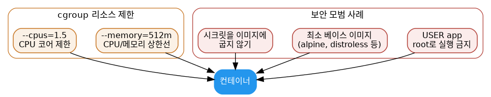

# [Docker 개념 10편] 컨테이너 하나가 서버 전체를 먹통으로 만들지 않으려면

1편에서 컨테이너가 namespaces로 격리된다고 했습니다. 하지만 격리만으로는 부족합니다. 컨테이너 하나가 CPU나 메모리를 무제한으로 써버리면 같은 호스트에서 도는 다른 컨테이너, 심지어 호스트 자체가 영향을 받을 수 있습니다. 이 문제를 막는 게 리소스 제한이고, 여기에 더해 몇 가지 보안 습관을 들이면 훨씬 안전하게 컨테이너를 운영할 수 있습니다.

## 메모리 제한하기

`-m`(또는 `--memory`) 플래그로 컨테이너가 쓸 수 있는 최대 메모리를 지정합니다. 최소값은 6MB입니다.

```console
$ docker run -m 512m nginx
```

메모리 관련 옵션은 이 외에도 몇 가지가 더 있습니다.

- `--memory-swap`: 디스크로 스왑할 수 있는 메모리 양. `--memory`와 함께 지정하면 "일반 메모리 + 스왑"의 총량을 의미합니다.
- `--memory-reservation`: `--memory`보다 낮게 설정하는 소프트 리밋으로, 호스트에 메모리 경합이 생겼을 때 활성화됩니다. 소프트 리밋이라 절대적으로 그 값을 넘지 않는다는 보장은 없습니다.
- `--oom-kill-disable`: 메모리가 부족(OOM)할 때 커널이 컨테이너 프로세스를 강제 종료하는 기본 동작을 끄는 옵션입니다. 이 옵션은 반드시 `-m`과 함께 써야 합니다. 그러지 않으면 호스트 전체가 메모리 부족에 빠질 수 있습니다.

## CPU 제한하기

CPU는 `--cpus`로 가장 직관적으로 제한할 수 있습니다.

```console
$ docker run --cpus="1.5" ubuntu
```

호스트에 CPU가 2개 있고 `--cpus="1.5"`로 지정하면, 컨테이너는 최대 1.5개 코어만큼만 보장받습니다. 내부적으로는 `--cpu-period`(기본 100000마이크로초)와 `--cpu-quota`를 조합해 구현되지만, 대부분의 경우 `--cpus` 하나로 충분합니다. 특정 코어만 지정해서 쓰고 싶다면 `--cpuset-cpus="0-3"`처럼 코어 번호를 직접 지정할 수도 있습니다.



## 보안 기본기 1: root로 실행하지 않기

4편의 Dockerfile 예시에서 `RUN useradd app`과 `USER app`이 등장했던 걸 기억할 겁니다. 컨테이너 기본 사용자를 명시하지 않으면 기본적으로 root로 실행되는데, 만약 컨테이너가 뚫리면 공격자가 root 권한을 그대로 얻게 됩니다. 애플리케이션 실행에 필요한 최소한의 권한만 가진 별도 사용자를 만들어 `USER` 명령으로 전환해두는 것이 기본적인 방어선입니다.

## 보안 기본기 2: 최소한의 베이스 이미지 쓰기

이미지에 포함된 패키지가 많을수록 잠재적인 취약점(CVE)도 늘어납니다. `alpine`처럼 가벼운 베이스 이미지나, 2편에서 소개한 Docker Hardened Images처럼 불필요한 구성 요소를 뺀 이미지를 쓰면 공격 표면을 줄일 수 있습니다. 6편에서 다룬 멀티스테이지 빌드도 결국 이 원칙의 연장선입니다. 빌드 도구를 최종 이미지에서 빼는 것 자체가 보안 개선입니다.

## 보안 기본기 3: 시크릿을 이미지에 굽지 않기

데이터베이스 비밀번호나 API 키를 `ENV`나 `COPY`로 이미지 안에 직접 넣으면, 그 이미지를 받은 누구나 레이어 히스토리에서 시크릿을 꺼내볼 수 있습니다. 시크릿은 이미지 빌드 시점이 아니라 컨테이너 실행 시점에 환경 변수나 별도의 시크릿 관리 도구를 통해 주입하는 것이 안전합니다. 8편에서 다룬 바인드 마운트를 읽기 전용으로 활용해 설정 파일을 외부에서 주입하는 것도 한 방법입니다.

## 조금 더 깊이: 이 모든 게 결국 cgroups

1편에서 언급했듯, 컨테이너의 리소스 제한은 리눅스 커널의 cgroups(control groups) 기능 위에서 동작합니다. `-m`, `--cpus` 같은 Docker 옵션은 결국 호스트의 `/sys/fs/cgroup` 아래에 있는 커널 설정을 편하게 다루도록 감싸놓은 인터페이스입니다. namespaces가 "무엇이 보이는지"를 격리한다면, cgroups는 "얼마나 쓸 수 있는지"를 제한하는 역할을 나눠 맡고 있는 셈입니다.

## 참고표

| 옵션 | 역할 |
|---|---|
| `-m`, `--memory` | 최대 메모리 사용량 제한 |
| `--memory-reservation` | 메모리 경합 시 활성화되는 소프트 리밋 |
| `--cpus` | 사용 가능한 CPU 코어 수 제한 |
| `--cpuset-cpus` | 특정 CPU 코어만 지정해서 사용 |
| `USER` (Dockerfile) | root가 아닌 사용자로 컨테이너 실행 |

이렇게 10편에 걸쳐 Docker의 핵심 개념을 컨테이너와 이미지의 기본 원리부터 Dockerfile 작성, 빌드 최적화, 데이터 영속성, 멀티 컨테이너 관리, 리소스·보안까지 살펴봤습니다. 각 개념은 공식 문서의 실습을 따라가다 보면 훨씬 몸에 잘 붙습니다. 텍스트로 읽는 것보다 직접 `docker run`, `docker build` 명령을 쳐보면서 익히는 걸 추천합니다.

---
참고: [Resource constraints](https://docs.docker.com/engine/containers/resource_constraints/), [Writing a Dockerfile](https://docs.docker.com/get-started/docker-concepts/building-images/writing-a-dockerfile/)
