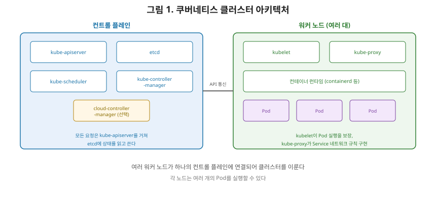
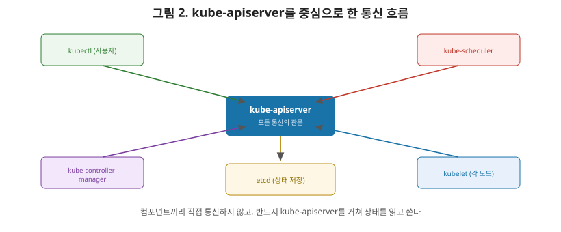

# [쿠버네티스 1편] 클러스터 아키텍처 개요 — 컨트롤 플레인과 노드

운영체제 시리즈 9편에서 컨테이너는 네임스페이스와 cgroup으로 격리된, 호스트 커널을 공유하는 가벼운 프로세스라고 정리했습니다. 이 정의를 잠깐 다시 떠올려 보겠습니다. 그런데 실제 서비스는 컨테이너 하나로 끝나지 않습니다. 수십, 수백 개의 컨테이너를 여러 대의 서버에 걸쳐 배포하고, 그중 하나가 죽으면 자동으로 다시 띄우고, 트래픽을 알맞게 분산해야 합니다. 이 일을 사람이 서버마다 일일이 `docker run`으로 처리할 수는 없겠죠. 이 문제를 해결하는 오케스트레이션 도구가 **쿠버네티스(Kubernetes)**입니다. 이번 시리즈는 쿠버네티스 공식 문서를 기준으로, 특히 네트워킹 내부 동작(Service, Endpoint, Ingress 등)을 깊이 있게 다루는 것을 목표로 합니다. 1편은 그 출발점으로, 클러스터를 이루는 컴포넌트들이 각각 무슨 역할을 하는지 정리하겠습니다.

## 1. 클러스터는 컨트롤 플레인과 노드로 나뉜다

쿠버네티스 클러스터는 크게 두 부류의 머신으로 구성됩니다. 클러스터 전체의 상태를 관리하고 의사결정을 내리는 **컨트롤 플레인(Control Plane)**과, 실제로 컨테이너(Pod)가 실행되는 **워커 노드(Worker Node)**입니다. 공식 문서는 컨트롤 플레인의 역할을 "클러스터에 대한 전역적인 결정을 내리고(예: 스케줄링), 클러스터 이벤트를 감지하고 대응하는 것(예: Deployment의 replicas 필드가 충족되지 않았을 때 새 Pod를 시작하는 것)"이라고 설명합니다.

## 2. 컨트롤 플레인 컴포넌트

| 컴포넌트 | 역할 |
|---|---|
| **kube-apiserver** | 쿠버네티스 API를 노출하는 컨트롤 플레인의 프론트엔드. 수평 확장이 가능하도록 설계돼 있다 |
| **etcd** | API 서버의 모든 데이터를 저장하는, 일관성과 고가용성을 갖춘 키-값 저장소 |
| **kube-scheduler** | 아직 어떤 노드에도 배정되지 않은 Pod를 찾아, 적합한 노드에 할당한다 |
| **kube-controller-manager** | 쿠버네티스 API의 동작을 구현하는 여러 컨트롤러를 실행한다 |
| **cloud-controller-manager**(선택) | 클라우드 제공업체(AWS, GCP 등)의 인프라와 연동한다 |

이 중 **kube-apiserver**가 특히 중요합니다. 쿠버네티스의 거의 모든 컴포넌트는 서로 직접 통신하지 않고, 반드시 kube-apiserver를 거쳐 상태를 읽고 씁니다. kubectl 명령어를 실행하는 것도, 스케줄러가 Pod를 배정하는 것도, 컨트롤러가 상태를 조정하는 것도 전부 API 서버에 대한 HTTP 요청입니다. **etcd**는 이 모든 상태(현재 몇 개의 Pod가 떠 있는지, 어떤 Service가 존재하는지 등)가 실제로 저장되는 곳이며, API 서버만이 etcd에 직접 접근합니다.

## 3. 노드 컴포넌트

| 컴포넌트 | 역할 |
|---|---|
| **kubelet** | 다양한 방식으로 전달받은 PodSpec 목록을 받아, 그 안에 명시된 컨테이너들이 실제로 실행되고 정상 동작하는지 보장하는 에이전트 |
| **kube-proxy** | 클러스터의 각 노드에서 실행되는 네트워크 프록시로, Service 개념의 일부를 구현한다. 노드에 네트워크 규칙을 유지해 클러스터 안팎에서 Pod로의 네트워크 통신을 가능하게 한다 |
| **컨테이너 런타임** | 공개 또는 비공개 레지스트리에서 이미지를 가져오고, 그 이미지를 기반으로 컨테이너를 실행하는 역할 |

여기서 상급자가 짚어야 할 포인트는 **kubelet은 자신이 만들지 않은 컨테이너는 관리하지 않는다**는 것입니다. kubelet은 오직 쿠버네티스가 생성한 컨테이너만 감시하고 관리 대상으로 삼습니다. 그리고 **kube-proxy**는 이번 시리즈 전체를 관통할 핵심 컴포넌트입니다. 공식 문서에 따르면 kube-proxy는 iptables, IPVS 같은 방식으로 노드의 네트워크 규칙을 직접 조작해서 Service라는 추상 개념을 실제 패킷 라우팅으로 구현합니다. 이 동작 원리는 3편(Service와 kube-proxy)에서 자세히 다룹니다.

## 4. 선언적 관리 — "원하는 상태"를 말하면 알아서 맞춰준다

지금까지 나온 컴포넌트 중 kube-controller-manager가 실행하는 **컨트롤러**들이 쿠버네티스의 핵심 동작 원리를 담당합니다. 사용자는 "Pod가 3개 떠 있어야 한다"처럼 **원하는 상태(Desired State)**를 API 서버에 선언하기만 하면 됩니다. 컨트롤러는 지속적으로 etcd에 저장된 원하는 상태와 클러스터의 **현재 상태(Current State)**를 비교하면서, 차이가 있으면 그 차이를 줄이는 방향으로 계속 조정합니다. 이 반복적인 비교-조정 과정을 **컨트롤 루프(Control Loop)**라고 부르며, 자세한 동작 방식은 9편에서 다룰 예정입니다.

## 5. 정리

- 쿠버네티스 클러스터는 전역 상태를 관리하는 컨트롤 플레인과, 실제 컨테이너가 실행되는 워커 노드로 구성된다.
- 컨트롤 플레인은 kube-apiserver(API 프론트엔드), etcd(상태 저장소), kube-scheduler(Pod 배치), kube-controller-manager(컨트롤러 실행)로 이루어지며, 거의 모든 통신은 kube-apiserver를 거친다.
- 노드는 kubelet(Pod 실행 보장), kube-proxy(Service 네트워크 규칙 구현), 컨테이너 런타임(이미지 실행)으로 구성된다.
- 쿠버네티스는 "원하는 상태"를 선언하면 컨트롤러가 컨트롤 루프를 통해 현재 상태를 계속 그 방향으로 맞춰나가는 선언적 관리 모델로 동작한다.

다음 편에서는 Pod 네트워킹 기초로 넘어가, 쿠버네티스가 각 Pod에 독립된 IP를 부여하는 원리와 CNI(Container Network Interface)가 이를 어떻게 구현하는지 — 운영체제 시리즈 9편에서 다룬 네임스페이스 개념이 실제로 어떻게 쓰이는지를 다룹니다.

---

**참고한 공식 문서**
- [Kubernetes Components](https://kubernetes.io/docs/concepts/overview/components/)
- [Cluster Architecture](https://kubernetes.io/docs/concepts/architecture/)
- [Nodes](https://kubernetes.io/docs/concepts/architecture/nodes/)
