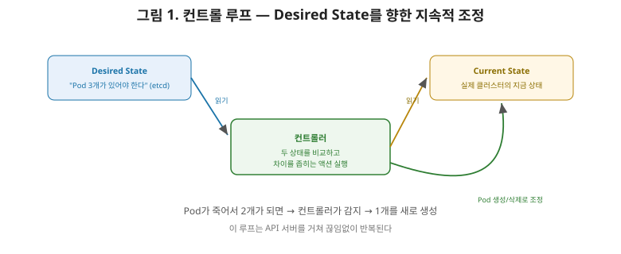
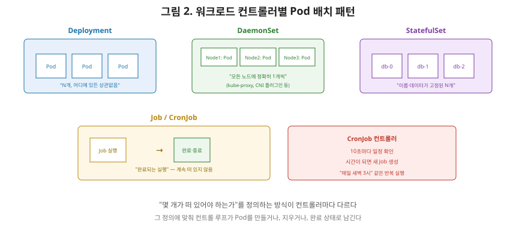

# [쿠버네티스 2편] 워크로드 컨트롤러 — Deployment부터 DaemonSet까지

1편에서 kube-controller-manager가 "쿠버네티스 API의 동작을 구현하는 여러 컨트롤러를 실행한다"고 짧게 언급했습니다. 이번 편에서는 그 컨트롤러들이 실제로 무엇을 관리하는지, 그리고 Pod를 직접 만들지 않고 컨트롤러를 거쳐야 하는 이유를 정리하겠습니다. Deployment, DaemonSet, StatefulSet, Job/CronJob이 각각 어떤 상황을 위해 만들어졌는지가 이번 편의 핵심입니다.

## 1. 컨트롤 루프 — 원하는 상태를 계속 맞춰나가는 원리

공식 문서는 컨트롤러를 "API 서버를 통해 클러스터의 공유 상태를 감시하고, 현재 상태를 원하는 상태로 이동시키기 위한 변경을 시도하는 제어 루프(Control Loop)"라고 정의합니다. 사용자가 "Pod가 3개 있어야 한다"는 **원하는 상태(Desired State)**를 API 서버에 선언하면, 해당 컨트롤러는 지금 실제로 떠 있는 Pod 개수(**현재 상태, Current State**)를 계속 확인하면서 그 차이를 좁혀나갑니다. Pod가 죽어서 2개로 줄면 컨트롤러가 즉시 감지해 1개를 새로 만들고, 실수로 4개가 떠 있다면 1개를 종료시킵니다.

여기서 상급자가 짚어야 할 포인트는, **컨트롤러마다 "원하는 상태"를 표현하는 방식이 다르다**는 것입니다. 이 표현 방식의 차이가 곧 아래에서 다룰 여러 컨트롤러 종류의 차이입니다.

## 2. ReplicaSet — 정해진 개수만큼 Pod를 유지한다

**ReplicaSet**의 목적은 "언제나 안정적으로 지정된 수의 동일한 Pod가 실행 중인 상태를 유지하는 것"입니다. 셀렉터(어떤 Pod를 자신의 관리 대상으로 인식할지), 복제본 수(replicas), Pod 템플릿(부족할 때 새로 만들 Pod의 스펙) 세 가지를 정의하면, ReplicaSet은 필요에 따라 Pod를 만들거나 지워서 그 개수를 맞춥니다.

## 3. Deployment — ReplicaSet을 한 단계 감싼 관리자

**Deployment**는 상태를 유지하지 않는(stateless) 애플리케이션 워크로드를 실행하기 위해 Pod 집합을 관리하는 컨트롤러입니다. Deployment는 ReplicaSet 위에서 동작하는 더 상위 개념으로, Pod와 ReplicaSet에 대한 **선언적 업데이트**를 제공합니다. 예를 들어 이미지 버전을 바꾸는 배포를 하면, Deployment 컨트롤러는 새 ReplicaSet을 만들고, 기존 ReplicaSet의 Pod 수를 서서히 줄이면서 새 ReplicaSet의 Pod 수를 서서히 늘리는 방식(롤링 업데이트)으로 무중단 배포를 구현합니다.

공식 문서는 "커스텀 업데이트 오케스트레이션이 필요하거나 업데이트가 전혀 필요 없는 경우가 아니라면, ReplicaSet을 직접 쓰지 말고 Deployment를 사용하라"고 권장합니다. 실무에서 stateless 애플리케이션을 배포할 때 사실상 기본으로 쓰이는 컨트롤러가 바로 Deployment입니다.

## 4. DaemonSet — 노드마다 하나씩, 빠짐없이

**DaemonSet**은 지금까지와 접근이 다릅니다. "몇 개의 Pod가 떠 있어야 하는가"가 아니라, **"클러스터의 모든(또는 일부) 노드에 Pod가 하나씩 반드시 떠 있어야 한다"**는 것이 DaemonSet의 원하는 상태입니다. 새로운 노드가 클러스터에 합류하면, DaemonSet은 자동으로 그 노드에도 Pod를 하나 실행시킵니다.

공식 문서가 제시하는 대표적인 용도는 로그 수집 에이전트, 모니터링 에이전트, 그리고 **네트워크 관련 컴포넌트**입니다. 그리고 이 지점에서 아주 중요한 연결고리가 생깁니다. 1편에서 다룬 **kube-proxy**와, 3편에서 다룰 **CNI 네트워크 플러그인**은 실제로 대부분 DaemonSet으로 배포됩니다. "모든 노드에서 예외 없이 실행돼야 하는 네트워크 컴포넌트"라는 요구사항과 "모든 노드에 Pod 하나씩"이라는 DaemonSet의 정의가 정확히 맞아떨어지기 때문입니다.

## 5. StatefulSet — 이름과 정체성을 유지해야 하는 워크로드

Deployment가 관리하는 Pod들은 서로 완전히 동일하고 교체 가능합니다. 어떤 Pod가 죽어도 새로 뜬 Pod가 똑같은 역할을 하면 그만입니다. 하지만 데이터베이스처럼 **각 인스턴스가 고유한 정체성과 자기만의 저장 공간을 가져야 하는 애플리케이션**이라면 이야기가 다릅니다. 이런 워크로드를 위한 컨트롤러가 **StatefulSet**입니다.

StatefulSet이 관리하는 Pod들은 같은 스펙으로 만들어지지만 서로 교체 불가능합니다. 각 Pod는 재스케줄링되더라도 유지되는 **영속적인 식별자**(예: `db-0`, `db-1`, `db-2`처럼 순번이 붙은 이름)를 가지며, 그 이름에 대응하는 저장 볼륨도 함께 유지됩니다. Pod가 재시작되거나 다른 노드로 옮겨가도 `db-0`은 계속 `db-0`이라는 이름과 자기 데이터를 유지합니다.

## 6. Job과 CronJob — 끝이 있는 작업, 반복되는 작업

지금까지의 컨트롤러들은 모두 "계속 떠 있어야 하는" 워크로드를 다뤘습니다. 반면 **Job**은 한 번 실행되고 끝나는(정상 종료되면 그걸로 완료인) 작업을 위한 컨트롤러입니다. 배치 처리, 데이터 마이그레이션 같은 일회성 작업에 씁니다.

**CronJob**은 이 Job을 **반복 일정에 따라** 만들어주는 상위 컨트롤러입니다. 공식 문서는 "CronJob 객체 하나는 crontab 파일의 한 줄과 같다"고 설명합니다. kube-controller-manager 안의 CronJob 컨트롤러는 기본적으로 10초마다 모든 CronJob의 일정을 확인하고, 실행할 시점이 된 CronJob을 발견하면 그때마다 새로운 Job 객체를 만들어냅니다. 즉 백업, 리포트 생성 같은 "매일 새벽 3시에 실행"류의 작업에 적합합니다.

## 7. 컨트롤러 한눈에 비교

| 컨트롤러 | 관리 대상 | 원하는 상태의 정의 | 대표 용도 |
|---|---|---|---|
| ReplicaSet | 동일한 Pod 여러 개 | "정확히 N개가 떠 있어야 한다" | (직접 사용은 드묾, Deployment의 하부 구조) |
| Deployment | ReplicaSet(을 통해 Pod) | "N개가 떠 있고, 최신 버전이어야 한다" | 상태 없는(stateless) 애플리케이션 |
| DaemonSet | 노드당 Pod 1개 | "모든/일부 노드에 반드시 하나씩" | 로그 수집, 모니터링, kube-proxy·CNI 같은 네트워크 컴포넌트 |
| StatefulSet | 고유 식별자를 가진 Pod | "이름 붙은 N개가 각자의 상태를 유지해야 한다" | 데이터베이스 등 상태 저장 애플리케이션 |
| Job | 완료되면 끝나는 Pod | "성공적으로 완료된 실행이 있어야 한다" | 일회성 배치 작업 |
| CronJob | 반복 생성되는 Job | "정해진 일정마다 Job이 실행돼야 한다" | 주기적 백업, 리포트 생성 |

## 8. 정리

- 모든 컨트롤러는 원하는 상태와 현재 상태의 차이를 계속 좁혀나가는 컨트롤 루프로 동작하며, 컨트롤러마다 "원하는 상태"를 정의하는 방식이 다르다.
- ReplicaSet은 지정된 개수의 Pod 유지를 담당하고, Deployment는 그 위에서 롤링 업데이트 같은 선언적 배포 기능을 더한 상위 컨트롤러다.
- DaemonSet은 모든(또는 일부) 노드에 Pod를 하나씩 강제하며, kube-proxy와 CNI 플러그인처럼 노드마다 반드시 있어야 하는 네트워크 컴포넌트가 대표적으로 이 방식으로 배포된다.
- StatefulSet은 영속적인 식별자와 저장소가 필요한 워크로드(DB 등)를, Job/CronJob은 일회성 또는 주기적 배치 작업을 담당한다.

다음 편에서는 Pod 네트워킹 기초로 넘어가, 각 Pod가 어떻게 독립된 IP를 할당받는지, 그리고 이번 편에서 언급한 CNI 플러그인(대부분 DaemonSet으로 배포되는)이 실제로 그 네트워크를 어떻게 구성하는지를 다룹니다.

---

**참고한 공식 문서**
- [ReplicaSet](https://kubernetes.io/docs/concepts/workloads/controllers/replicaset/)
- [Deployments](https://kubernetes.io/docs/concepts/workloads/controllers/deployment/)
- [DaemonSet](https://kubernetes.io/docs/concepts/workloads/controllers/daemonset/)
- [StatefulSets](https://kubernetes.io/docs/concepts/workloads/controllers/statefulset/)
- [CronJob](https://kubernetes.io/docs/concepts/workloads/controllers/cron-jobs/)
- [Controllers](https://kubernetes.io/docs/concepts/architecture/controller/)
