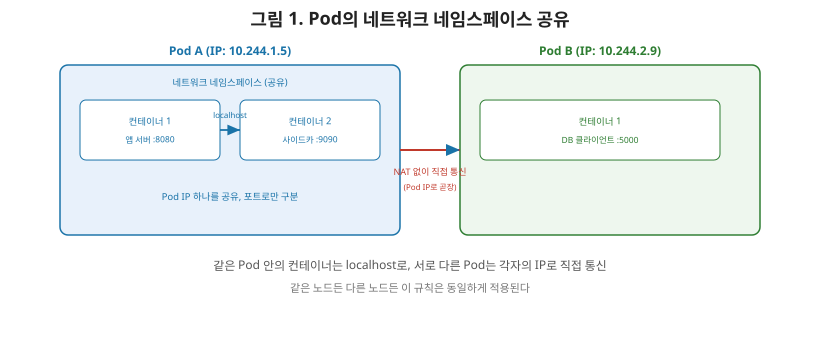
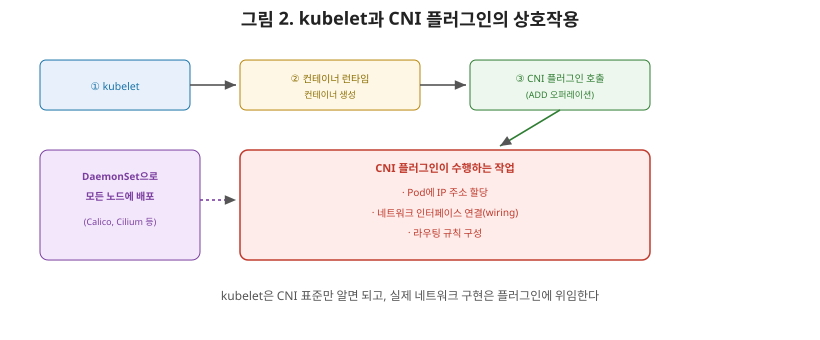

# [쿠버네티스 3편] Pod 네트워킹 기초 — 모든 Pod는 자기만의 IP를 가진다

운영체제 시리즈 9편에서 네임스페이스는 커널 자원이 "어떻게 보이는지"를 프로세스 그룹별로 나눠주는 기능이라고 정리했고, 그중 Network 네임스페이스는 네트워크 인터페이스와 IP 주소를 격리한다고 했습니다. 2편에서는 kube-proxy와 CNI 플러그인이 대부분 DaemonSet으로, 즉 모든 노드에 빠짐없이 배포된다고 예고했습니다. 이번 편에서는 이 두 개념이 실제로 어떻게 맞물려서 "Pod마다 고유한 IP를 갖는" 쿠버네티스 네트워킹 모델을 만들어내는지 정리하겠습니다.

## 1. 쿠버네티스 네트워킹 모델의 기본 요구사항

쿠버네티스 네트워크 모델은 다음 요구사항을 만족해야 합니다.

| 요구사항 | 내용 |
|---|---|
| Pod 간 통신 | 모든 Pod는 같은 노드에 있든 다른 노드에 있든, 프록시나 주소 변환(NAT) 없이 서로 직접 통신할 수 있어야 한다 |
| 노드 에이전트-Pod 통신 | kubelet 같은 노드의 에이전트는 그 노드에 있는 모든 Pod와 통신할 수 있어야 한다 |
| 고유 IP | 클러스터 안의 모든 Pod는 클러스터 전역에서 고유한 IP 주소를 가진다 |

여기서 상급자가 짚어야 할 핵심은 **"NAT 없이"**라는 표현입니다. 네트워크 시리즈 3편에서 다룬 NAT는 사설 IP를 공인 IP로 변환해주는 장치였는데, 쿠버네티스 안에서는 Pod의 IP가 애초에 클러스터 전체에서 유일하기 때문에 이런 변환 자체가 필요 없습니다. Pod A가 Pod B의 IP로 직접 패킷을 보내면, 그 Pod B가 어느 노드에 있든 상관없이 곧바로 도달합니다. 이 "평평한(flat) 네트워크" 구조가 쿠버네티스 네트워킹을 이해하는 첫 번째 열쇠입니다.

## 2. Pod 하나 = 네트워크 네임스페이스 하나

여기서 운영체제 9편의 개념이 그대로 이어집니다. **Pod는 자기만의 사설 네트워크 네임스페이스를 가지며, 그 Pod 안의 모든 컨테이너가 이 네임스페이스를 공유**합니다. 같은 Pod 안의 컨테이너들은 서로 다른 컨테이너이지만, 네트워크 관점에서는 **localhost로 서로 통신**할 수 있습니다. 마치 한 대의 컴퓨터 안에 여러 프로세스가 떠 있는 것과 똑같은 모습입니다.

이 구조 덕분에 "Pod의 IP"라는 개념이 성립합니다. Pod 안의 여러 컨테이너가 제각각 다른 IP를 갖는 게 아니라, **네트워크 네임스페이스를 공유하는 Pod 전체가 하나의 IP를 갖고**, 그 안의 컨테이너들은 포트 번호로만 구분됩니다. 실제 구현에서는 Pod가 생성될 때 이 네트워크 네임스페이스를 먼저 붙잡아두는 인프라용 컨테이너가 하나 만들어지고, 사용자가 정의한 컨테이너들은 나중에 이 네임스페이스에 합류하는 방식으로 동작합니다.

## 3. CNI — 네트워크 설정을 표준화된 방식으로 위임하기

그렇다면 이 Pod 네트워크 네임스페이스에 실제로 IP를 할당하고, 인터페이스를 연결하고, 라우팅 규칙을 설정하는 건 누가 할까요? 쿠버네티스 자체는 이 작업을 직접 하지 않고, **CNI(Container Network Interface)**라는 표준 규격을 통해 외부 플러그인에게 위임합니다.

CNI는 컨테이너의 네트워크 인터페이스를 설정하는 표준화된 프레임워크로, 컨테이너 런타임이 네트워크 플러그인을 어떻게 호출해서 Pod를 네트워크에 연결하고, IP를 할당하고, 라우팅을 구성해야 하는지를 정의합니다. CNI 명세는 ADD, CHECK, DELETE, GC, VERSION이라는 다섯 가지 오퍼레이션으로 이루어져 있으며, 이 중 **ADD**가 Pod 생성 시 네트워크를 붙여주는 핵심 동작입니다.

## 4. kubelet과 CNI의 상호작용 흐름

1. kubelet이 새 Pod를 실행하기로 결정하면, 먼저 컨테이너 런타임에게 컨테이너들을 생성하라고 지시한다.
2. 컨테이너들이 만들어지고 나면, kubelet이 **CNI 플러그인**을 호출해 이 Pod의 네트워크를 설정하게 한다.
3. CNI 플러그인은 Pod에게 IP를 할당하고, 네트워크 인터페이스를 연결(wiring)하고, 라우팅 규칙을 구성한다.
4. 이 과정이 끝나야 비로소 Pod가 클러스터 네트워크 안에서 다른 Pod들과 통신할 수 있는 상태가 된다.

각 노드의 kubelet 서비스는 설정 파일에서 네트워크 플러그인을 CNI로 지정하고, CNI 플러그인과 설정 파일이 위치한 디렉터리 경로를 지정해둡니다. 즉 kubelet은 네트워크 설정의 세부 구현을 전혀 알 필요 없이, "CNI 표준에 맞는 플러그인을 호출한다"는 사실만 알면 됩니다. 이 표준화 덕분에 Calico, Cilium, Flannel처럼 서로 다른 벤더가 만든 다양한 CNI 플러그인을 쿠버네티스가 특별한 코드 수정 없이 그대로 갈아 끼워 쓸 수 있는 것입니다.

## 5. CNI 플러그인은 왜 DaemonSet으로 배포되는가

2편에서 예고했던 연결고리를 여기서 확인할 수 있습니다. CNI 플러그인이 제대로 동작하려면 **클러스터의 모든 노드에서 빠짐없이** 실행되고 있어야 합니다. 한 노드에만 CNI 플러그인이 없어도, 그 노드에서 뜨는 Pod는 네트워크를 전혀 구성받지 못해 클러스터에 참여할 수 없습니다. "모든 노드에 예외 없이 하나씩"이라는 요구사항은 정확히 DaemonSet의 정의와 일치하기 때문에, Calico나 Cilium 같은 CNI 구현체들은 실제로 DaemonSet 형태로 배포됩니다. 새로운 노드가 클러스터에 합류하는 순간 그 노드에도 자동으로 CNI 플러그인 Pod가 뜨고, 그제야 그 노드는 비로소 다른 Pod를 정상적으로 실행할 준비가 됩니다.

## 6. 정리

- 쿠버네티스 네트워킹 모델은 모든 Pod가 NAT 없이 서로 직접 통신할 수 있고, 각 Pod가 클러스터 전역에서 고유한 IP를 갖는다는 원칙 위에 서 있다.
- Pod는 자기만의 네트워크 네임스페이스를 가지며, 같은 Pod 안의 컨테이너들은 이 네임스페이스를 공유해 localhost로 통신한다.
- CNI는 컨테이너 런타임이 네트워크 플러그인을 호출하는 방식을 표준화한 규격이며, kubelet은 컨테이너 생성 이후 CNI 플러그인에게 IP 할당·인터페이스 연결·라우팅 설정을 위임한다.
- CNI 플러그인은 모든 노드에 빠짐없이 있어야 하므로, 대부분 DaemonSet 형태로 배포된다.

다음 편에서는 Service(L4)로 넘어가, Pod가 재시작될 때마다 IP가 바뀌는데도 어떻게 안정적으로 접근할 수 있는지 — kube-proxy가 iptables 또는 IPVS로 이 문제를 해결하는 방식을 다룹니다.

---

**참고한 공식 문서**
- [Cluster Networking](https://kubernetes.io/docs/concepts/cluster-administration/networking/)
- [Network Plugins](https://kubernetes.io/docs/concepts/extend-kubernetes/compute-storage-net/network-plugins/)
- [Services, Load Balancing, and Networking](https://kubernetes.io/docs/concepts/services-networking/)
