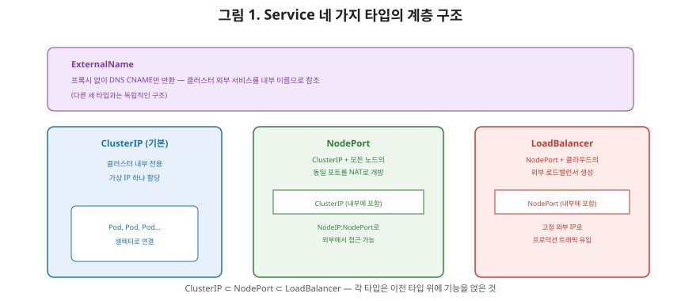
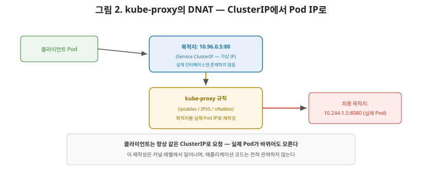

# [쿠버네티스 4편] Service(L4) — 흔들리는 Pod IP를 안정적인 접점으로

3편에서 모든 Pod가 고유한 IP를 갖는다고 정리했지만, 여기엔 함정이 있습니다. Pod는 언제든 죽고 다시 뜰 수 있고, 2편에서 다룬 Deployment의 롤링 업데이트만 해도 기존 Pod가 사라지고 새 Pod가 생성됩니다. 그런데 Pod가 새로 뜰 때마다 IP가 바뀐다면, 그 Pod에 접근하려는 다른 애플리케이션은 매번 바뀌는 IP를 어떻게 알아낼까요? 이 문제를 해결하는 것이 이번 편의 주제인 **Service**입니다.

## 1. Service — Pod 집합을 가리키는 안정적인 이름표

공식 문서는 Service를 "Pod들의 집합에서 실행되는 애플리케이션을 네트워크 서비스로 노출하는 추상적인 방법"이라고 정의합니다. Service는 **셀렉터(selector)**로 자신이 대상으로 삼을 Pod들을 식별하고, 기본적으로 클러스터 내부에서 사용할 수 있는 **안정적인 ClusterIP**를 하나 부여받습니다. 클라이언트는 이 고정된 IP로 요청을 보내면, 그 요청은 Service에 속한 여러 Pod 중 하나로 라우팅됩니다.

여기서 핵심은, **Pod의 IP는 바뀌어도 Service의 IP는 바뀌지 않는다**는 것입니다. Pod가 재시작돼 새 IP를 받아도, Service는 셀렉터 조건에 맞는 Pod를 다시 찾아 라우팅 대상에 포함시킵니다. 클라이언트 입장에서는 Service의 고정 IP 하나만 알면 되고, 그 뒤에서 실제 Pod가 몇 개나 떠 있는지, IP가 무엇인지는 전혀 신경 쓸 필요가 없습니다.

## 2. Service의 네 가지 타입

| 타입 | 동작 | 용도 |
|---|---|---|
| **ClusterIP**(기본값) | 오버레이 네트워크 안에 고유한 가상 IP를 할당, 클러스터 내부에서만 접근 가능 | 클러스터 내부 서비스 간 통신 |
| **NodePort** | ClusterIP를 기본으로 만들고, 추가로 모든 노드의 동일한 포트를 열어 NAT를 통해 외부에서 `NodeIP:NodePort`로 접근 가능하게 함 | 간단한 외부 노출, 개발/테스트 환경 |
| **LoadBalancer** | 클라우드 제공업체의 외부 로드밸런서를 생성하고 고정된 외부 IP를 할당 | 프로덕션 환경의 외부 트래픽 유입점 |
| **ExternalName** | Service를 `externalName` 필드에 지정된 외부 호스트네임으로 매핑, 클러스터 DNS가 그 이름의 CNAME 레코드를 반환하도록 설정 | 클러스터 외부 서비스를 내부 이름으로 참조 |

공식 문서에서 짚어야 할 부분은 **LoadBalancer 타입도 사실 ClusterIP 위에 얹힌 기능**이라는 점입니다. NodePort를 만들면 그 밑에 ClusterIP가 자동으로 함께 만들어지듯, LoadBalancer도 마찬가지입니다. 그리고 쿠버네티스 자체는 로드밸런서 구현체를 직접 제공하지 않습니다. AWS, GCP 같은 클라우드 제공업체와 연동하거나(1편에서 다룬 cloud-controller-manager가 이 역할), MetalLB 같은 별도 솔루션을 붙여야 실제 로드밸런서가 생성됩니다.

## 3. kube-proxy는 이 추상화를 실제로 어떻게 구현하는가

Service의 ClusterIP는 실제로 어느 네트워크 인터페이스에도 할당돼 있지 않은 **가상 IP**입니다. 그런데 클라이언트가 이 IP로 패킷을 보내면 어떻게 실제 Pod에게 전달될까요? 답은 1편에서 소개한 **kube-proxy**입니다.

kube-proxy는 각 노드에서 실행되면서, Service의 ClusterIP로 향하는 패킷을 가로채 그 목적지 주소를 실제 Pod IP 중 하나로 다시 써주는(DNAT) 규칙을 노드마다 심어둡니다. 즉 클라이언트는 여전히 Service의 고정 IP로 패킷을 보냈다고 생각하지만, 커널 레벨에서 목적지가 실제 Pod IP로 바뀐 뒤 라우팅되는 것입니다.

## 4. kube-proxy의 세 가지 프록시 모드

kube-proxy가 이 규칙을 실제로 어떤 기술로 구현하느냐에 따라 모드가 나뉩니다.

| 모드 | 특징 | 2026년 현재 상태 |
|---|---|---|
| **iptables** | 리눅스 커널의 iptables 규칙 목록으로 구현. 단순하고 널리 지원되지만, Service 수가 수만 개로 늘어나면 규칙이 선형적으로 늘어나 성능이 떨어진다 | 여전히 업스트림 기본값 |
| **IPVS** | 리눅스 커널에 내장된 L3/L4 로드밸런서(IPVS)를 사용. 해시 테이블 기반이라 Service가 매우 많아도 성능이 잘 유지된다 | 쿠버네티스 1.35부터 지원 중단(deprecated) 예정 |
| **nftables** | iptables의 후속 커널 API. iptables와 IPVS 두 모드를 대체할 목적으로 설계됐으며, 두 모드보다 나은 성능을 제공 | v1.33부터 정식(GA) 지원, 향후 권장 방향 |

여기서 상급자가 짚어야 할 실무 포인트는, **2026년 현재도 대부분의 클러스터는 여전히 iptables 모드를 기본값으로 쓰고 있다**는 것입니다. nftables가 성능과 확장성 면에서 더 낫다고 공식적으로 권장되고 있지만, 업스트림 기본값 자체는 아직 iptables입니다. Service 수가 매우 많은 대규모 클러스터가 아니라면 iptables 모드로도 충분하다는 것이 현재의 실무 가이드입니다.

## 5. 정리

- Service는 셀렉터로 식별한 Pod 집합에 안정적인 ClusterIP를 부여해, Pod의 IP가 계속 바뀌어도 클라이언트가 고정된 접점 하나만 알면 되게 만드는 추상화다.
- ClusterIP, NodePort, LoadBalancer, ExternalName 네 가지 타입이 있으며, NodePort와 LoadBalancer는 사실 ClusterIP 위에 기능을 얹은 형태다.
- Service의 ClusterIP는 실제 인터페이스에 없는 가상 IP이며, kube-proxy가 각 노드에 DNAT 규칙을 심어 실제 Pod IP로 패킷 목적지를 바꿔준다.
- kube-proxy는 iptables(현재 기본값), IPVS(1.35부터 지원 중단 예정), nftables(신규 권장 방향) 세 가지 모드로 이 규칙을 구현할 수 있다.

다음 편에서는 Endpoints와 EndpointSlice로 넘어가, kube-proxy가 DNAT 규칙을 만들 때 참조하는 "실제 Pod IP 목록"이 어떻게 관리되고 갱신되는지 — Service의 셀렉터가 실제로 어떤 내부 오브젝트를 거쳐 Pod 목록으로 연결되는지를 다룹니다.

---

**참고한 공식 문서**
- [Service](https://kubernetes.io/docs/concepts/services-networking/service/)
- [NFTables mode for kube-proxy](https://kubernetes.io/blog/2025/02/28/nftables-kube-proxy/)
- [Using a Service to Expose Your App](https://kubernetes.io/docs/tutorials/kubernetes-basics/expose/expose-intro/)
