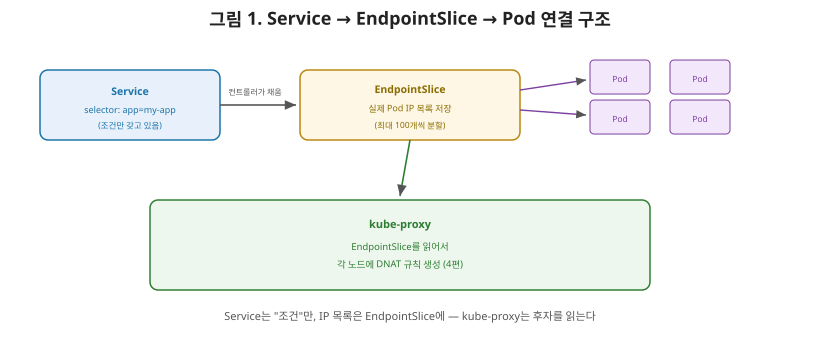
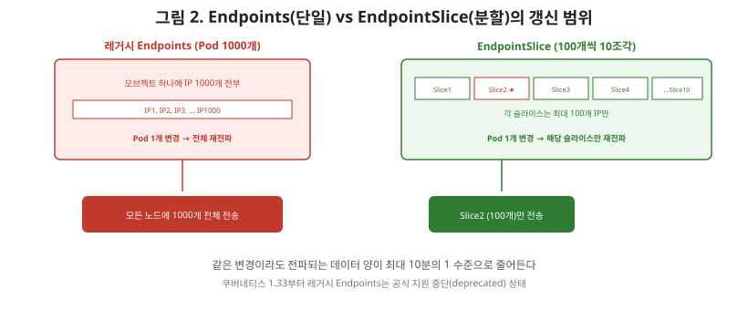

# [쿠버네티스 5편] Endpoints와 EndpointSlice — Service 뒤에 숨은 실제 Pod 목록

4편에서 kube-proxy가 Service의 ClusterIP로 온 패킷을 실제 Pod IP로 DNAT한다고 정리했습니다. 그런데 궁금증이 하나 남습니다. kube-proxy는 "이 Service 뒤에 어떤 Pod들이 있는지" 그 목록을 대체 어디서 가져오는 걸까요? 답은 이번 편의 주제인 **Endpoints**와 그 후속 개념인 **EndpointSlice**입니다.

## 1. Endpoints — Service의 셀렉터가 가리키는 실제 IP 목록

Service를 셀렉터와 함께 만들면, 쿠버네티스는 자동으로 **Endpoints**(또는 EndpointSlice) 오브젝트를 만들고 관리합니다. 정확히는 Endpoints 컨트롤러가 API 서버에서 새로운 Service 이벤트를 계속 감시하다가, Service와 같은 이름의 Endpoints 오브젝트를 만들고 그 Service의 셀렉터를 이용해 실제로 어떤 Pod들이 대상인지 찾아 IP 목록을 채워 넣습니다.

즉 흐름은 이렇습니다. Service는 "라벨이 `app=my-app`인 Pod들"이라는 **조건**만 갖고 있고, 그 조건에 실제로 맞는 Pod들의 IP 목록은 Endpoints(EndpointSlice) 오브젝트에 별도로 저장됩니다. kube-proxy는 Service 자체가 아니라 **이 Endpoints/EndpointSlice 오브젝트를 읽어서** DNAT 규칙을 만듭니다.

## 2. 레거시 Endpoints의 확장성 문제

초기 쿠버네티스는 Service 하나당 Endpoints 오브젝트 하나만 만들었습니다. 문제는 이 오브젝트 하나가 **그 Service에 속한 모든 Pod의 IP를 통째로 담는다**는 구조였습니다. Pod가 1000개인 Service라면, Endpoints 오브젝트 하나에 1000개의 IP가 전부 들어 있는 셈입니다.

이 구조에서는 Pod가 딱 하나만 재시작돼도 문제가 커집니다. IP 하나가 바뀌었을 뿐인데, **오브젝트 전체를 다시 만들어 클러스터의 모든 노드에 다시 전파**해야 합니다. Pod 수가 많은 대규모 클러스터에서는 이 재전파 트래픽이 눈덩이처럼 불어납니다. 게다가 백엔드가 1000개를 넘어가면 Endpoints 오브젝트 자체가 잘려나가고(truncated) "용량 초과" 상태로 표시되는 한계도 있었습니다.

## 3. EndpointSlice — 쪼개서 필요한 부분만 갱신한다

**EndpointSlice**는 이 확장성 문제를 해결하기 위해 도입된, Service가 대규모 백엔드를 감당할 수 있게 해주는 메커니즘입니다. 접근 방식은 단순합니다. 모든 IP를 하나의 오브젝트에 몰아넣는 대신, **기본적으로 최대 100개의 엔드포인트씩 여러 개의 EndpointSlice로 쪼개서** 관리합니다.

이렇게 하면 Pod 하나가 바뀌었을 때, 1000개짜리 오브젝트 전체가 아니라 그 Pod가 속한 **작은 슬라이스 하나만** 갱신하고 전파하면 됩니다. Pod 1000개 중 1개가 바뀌었다면, 이론적으로 전체 트래픽의 100분의 1 수준으로 갱신 범위가 줄어드는 셈입니다.

## 4. 2026년 현재 — Endpoints는 공식적으로 지원 중단(deprecated) 됐다

여기서 상급자가 알아둬야 할 최신 동향이 있습니다. 쿠버네티스 1.33부터 **레거시 Endpoints API는 공식적으로 지원 중단(deprecated)**됐습니다. API 서버는 이제 누군가 Endpoints 리소스를 읽거나 쓰려고 하면 EndpointSlice를 대신 사용하라는 경고를 반환합니다. 즉 새로 쿠버네티스를 다루기 시작한다면, Endpoints는 "과거에 왜 이런 구조였는지"를 이해하기 위한 역사적 맥락으로만 알아두고, 실제 운영과 디버깅은 EndpointSlice를 기준으로 하는 것이 맞습니다.

## 5. 셀렉터 없는 Service — 수동으로 Endpoints를 관리하는 경우

한 가지 예외적인 활용법이 있습니다. Service를 셀렉터 없이 만들면, 쿠버네티스는 자동으로 Endpoints를 채워주지 않습니다. 이 경우 사용자가 **직접 Endpoints 오브젝트를 만들어** 원하는 IP를 등록할 수 있습니다. 클러스터 밖에 있는 데이터베이스나 레거시 시스템의 고정 IP를, 클러스터 안에서는 마치 하나의 Service인 것처럼 다루고 싶을 때 쓰는 방법입니다. 4편에서 다룬 ExternalName이 DNS 이름으로 외부 리소스를 가리키는 방식이었다면, 이 방법은 **IP 주소로** 외부 리소스를 클러스터 안에 끌어들이는 대안적인 접근입니다.

## 6. 정리

- Service는 셀렉터라는 "조건"만 가지고 있고, 그 조건에 맞는 실제 Pod IP 목록은 Endpoints(EndpointSlice) 오브젝트에 별도로 저장되며, kube-proxy는 이 목록을 읽어 DNAT 규칙을 만든다.
- 레거시 Endpoints는 Service 하나당 오브젝트 하나에 모든 IP를 담아, Pod 하나만 바뀌어도 전체를 재전파해야 하는 확장성 문제가 있었다.
- EndpointSlice는 기본 100개 단위로 쪼개어, 변경이 생긴 슬라이스만 갱신·전파하도록 설계됐다.
- 2026년 현재 레거시 Endpoints API는 쿠버네티스 1.33부터 공식 지원 중단 상태이며, EndpointSlice가 표준이다.
- 셀렉터 없는 Service를 만들면 Endpoints를 수동으로 관리할 수 있고, 이는 클러스터 외부 리소스를 IP 기준으로 끌어들이는 방법으로 쓰인다.

다음 편에서는 CoreDNS로 넘어가, 지금까지 IP로만 다뤘던 Service를 사람이 읽을 수 있는 이름(`my-service.default.svc.cluster.local`)으로 어떻게 찾아가는지 — 네트워크 시리즈에서 다룬 DNS 개념이 쿠버네티스 클러스터 안에서 어떻게 구현되는지를 다룹니다.

---

**참고한 공식 문서**
- [EndpointSlices](https://kubernetes.io/docs/concepts/services-networking/endpoint-slices/)
- [Continuing the transition from Endpoints to EndpointSlices](https://kubernetes.io/blog/2025/04/24/endpoints-deprecation/)
- [Service](https://kubernetes.io/docs/concepts/services-networking/service/)
