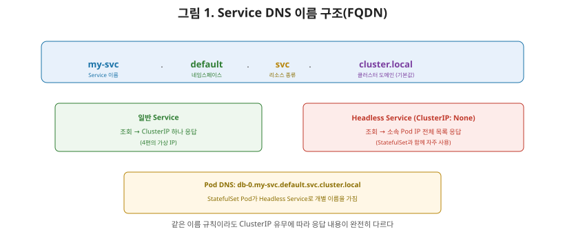
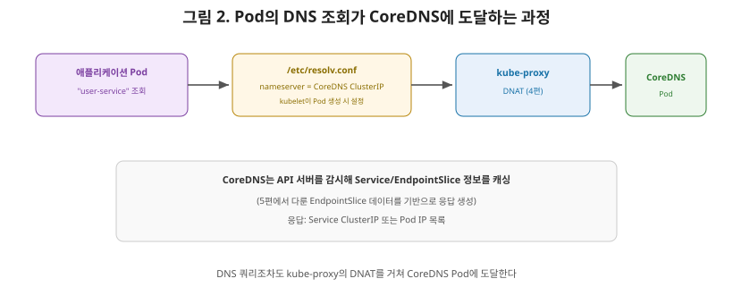

# [쿠버네티스 6편] CoreDNS — IP 대신 이름으로 서비스를 찾아가기

지금까지 다룬 Service, EndpointSlice, kube-proxy는 전부 **IP 기반**의 이야기였습니다. 그런데 실제 애플리케이션 코드에서 다른 서비스를 호출할 때 IP 주소를 하드코딩하는 경우는 거의 없습니다. `http://user-service:8080`처럼 **이름**으로 접근하죠. 네트워크 시리즈 6편에서 다룬 DNS가 인터넷 전체의 이름 해석을 담당했다면, 쿠버네티스 클러스터 안에서 이 역할을 하는 것이 이번 편의 주제인 **CoreDNS**입니다.

## 1. CoreDNS — 쿠버네티스의 기본 클러스터 DNS

CoreDNS는 범용의 권위 있는(authoritative) DNS 서버로, 쿠버네티스와 하위 호환되면서도 확장 가능한 통합을 제공합니다. 원래 쿠버네티스는 kube-dns라는 애드온을 기본 DNS 서버로 썼지만, 쿠버네티스 1.11부터 CoreDNS가 서비스 디스커버리를 위한 DNS 방식으로 정식(GA) 지원되기 시작했고, kubeadm이 CoreDNS를 기본 옵션으로 설치하도록 바뀌었습니다. 대부분의 클라우드 제공업체도 이 방향을 따라 CoreDNS를 기본 DNS 서버로 씁니다.

여기서 상급자가 짚어야 할 흥미로운 지점은, **CoreDNS 자체도 결국 쿠버네티스 위에서 돌아가는 하나의 워크로드**라는 것입니다. CoreDNS는 보통 Deployment로 배포되고(kube-system 네임스페이스에서 확인할 수 있습니다), 그 앞에는 다시 Service(주로 이름이 `kube-dns`)가 붙어 안정적인 ClusterIP를 갖습니다. 즉 DNS 서버 자체도 지금까지 배운 개념들(Deployment, Service, ClusterIP)로 만들어진 하나의 클러스터 구성 요소입니다.

## 2. Service의 DNS 이름 규칙

일반적인(Headless가 아닌) Service는 `내서비스이름.내네임스페이스.svc.클러스터도메인` 형태의 A/AAAA 레코드를 자동으로 부여받습니다. 클러스터 도메인의 기본값은 `cluster.local`이므로, `default` 네임스페이스의 `my-svc`라는 Service는 `my-svc.default.svc.cluster.local`이라는 이름으로 조회할 수 있고, 이 이름을 조회하면 **그 Service의 ClusterIP**가 응답으로 돌아옵니다.

## 3. Headless Service — ClusterIP 없이 Pod IP를 직접 노출

여기서 5편에서 다룬 개념과 이어지는 특수한 경우가 있습니다. Service를 만들 때 ClusterIP를 명시적으로 `None`으로 설정하면, 이를 **Headless Service**라고 부릅니다. Headless Service도 같은 형태의 DNS 이름을 갖지만, 이번엔 **그 Service에 속한 모든 Pod의 IP 목록**이 그대로 응답으로 돌아옵니다. ClusterIP라는 중간 단계(4편에서 다룬 가상 IP와 DNAT)를 건너뛰고, 클라이언트가 직접 여러 Pod 중 하나를 골라 붙게 만드는 방식입니다.

이 방식이 유용한 대표적인 경우가 2편에서 다룬 **StatefulSet**입니다. StatefulSet은 각 Pod가 `db-0`, `db-1`, `db-2`처럼 고유한 이름을 유지한다고 했는데, StatefulSet을 Headless Service와 함께 쓰면 각 Pod가 `db-0.my-headless-svc.default.svc.cluster.local`처럼 **개별적으로 조회 가능한 안정적인 DNS 이름**을 갖게 됩니다. 데이터베이스 클러스터에서 "몇 번째 노드가 마스터인지" 같은 것을 이름으로 구분해 접근해야 할 때 정확히 이 구조가 필요합니다.

## 4. Pod와 SRV 레코드

Pod도 (설정에 따라) 자체 DNS A/AAAA 레코드를 가질 수 있으며, 형태는 `IP주소를-하이픈으로-바꾼값.네임스페이스.pod.클러스터도메인`입니다. 예를 들어 `default` 네임스페이스의 IP `1.2.3.4`인 Pod는 `1-2-3-4.default.pod.cluster.local`로 조회할 수 있습니다.

**SRV 레코드**는 Service에 정의된 이름 붙은 포트(named port)에 대해 만들어지며, `_포트이름._프로토콜.서비스이름.네임스페이스.svc.클러스터도메인` 형태를 가집니다. 일반 Service에서는 포트 번호와 Service의 도메인 이름으로 응답하고, Headless Service에서는 그 Service를 구성하는 **각 Pod마다 하나씩** 여러 응답이 돌아옵니다.

| 레코드 대상 | 이름 형식 | 응답 내용 |
|---|---|---|
| 일반 Service | `svc이름.ns.svc.cluster.local` | Service의 ClusterIP 하나 |
| Headless Service | `svc이름.ns.svc.cluster.local` | 소속된 모든 Pod의 IP 목록 |
| Pod | `IP-하이픈표기.ns.pod.cluster.local` | 해당 Pod의 IP |
| SRV(이름 붙은 포트) | `_포트명._프로토콜.svc이름.ns.svc.cluster.local` | 포트 번호 + 도메인(Headless는 Pod별 응답) |

## 5. Pod가 실제로 CoreDNS를 찾아가는 과정

애플리케이션 코드에서 `user-service`처럼 이름을 조회하면, 그 요청이 실제로 CoreDNS까지 어떻게 도달할까요? kubelet은 Pod를 생성할 때 그 Pod 내부의 `/etc/resolv.conf` 파일에 **CoreDNS Service의 ClusterIP**를 네임서버로 설정해둡니다. 즉 Pod 안의 어떤 프로그램이 이름을 조회하면, 그 DNS 쿼리는 자동으로 CoreDNS의 ClusterIP로 전송되고, 4편에서 다룬 kube-proxy의 DNAT를 거쳐 실제 CoreDNS Pod 중 하나로 라우팅됩니다.

CoreDNS는 이 쿼리를 받으면, 자신이 API 서버를 감시해 계속 최신 상태로 캐싱해둔 Service와 Pod 정보(결국 5편에서 다룬 EndpointSlice에서 나오는 정보)를 바탕으로 응답을 만들어 돌려줍니다.

## 6. 정리

- CoreDNS는 쿠버네티스 1.11부터 kube-dns를 대체한 기본 클러스터 DNS 서버이며, 그 자체도 Deployment와 Service로 구성된 클러스터 워크로드다.
- 일반 Service는 `svc이름.네임스페이스.svc.cluster.local` 형태의 이름으로 조회하면 ClusterIP를 돌려주고, Headless Service는 같은 이름 형태로 조회해도 소속 Pod의 IP 목록을 그대로 돌려준다.
- Headless Service는 StatefulSet과 함께 쓰여, 각 Pod가 고유한 DNS 이름으로 개별 조회 가능하게 만드는 데 주로 활용된다.
- Pod 안의 DNS 쿼리는 kubelet이 설정한 `/etc/resolv.conf`를 통해 CoreDNS의 ClusterIP로 전달되고, kube-proxy의 DNAT를 거쳐 실제 CoreDNS Pod에 도달한다.

다음 편에서는 Ingress(L7)로 넘어가, 지금까지 다룬 Service(L4)만으로는 해결하기 어려운 문제 — 여러 도메인과 경로를 하나의 진입점으로 라우팅하는 방법을 다룹니다.

---

**참고한 공식 문서**
- [DNS for Services and Pods](https://kubernetes.io/docs/concepts/services-networking/dns-pod-service/)
- [CoreDNS GA for Kubernetes Cluster DNS](https://kubernetes.io/blog/2018/07/10/coredns-ga-for-kubernetes-cluster-dns/)
- [Using CoreDNS for Service Discovery](https://kubernetes.io/docs/tasks/administer-cluster/coredns/)
