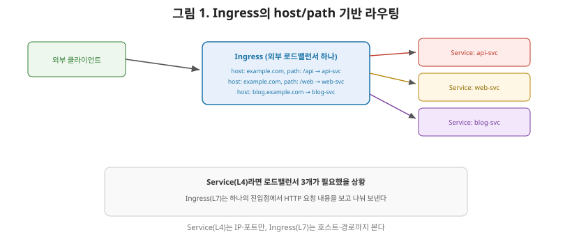
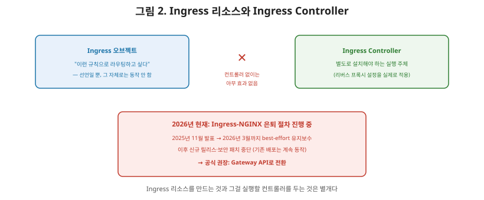

# [쿠버네티스 7편] Ingress(L7) — 하나의 진입점으로 여러 서비스를 라우팅하기

4편에서 다룬 Service, 그중에서도 LoadBalancer 타입은 외부 트래픽을 클러스터로 들여오는 방법이었다고 정리했습니다. 그런데 여기엔 비용 문제가 있습니다. 클러스터 안에 서비스가 10개 있고 각각을 외부에 노출하고 싶다면, LoadBalancer 타입 Service를 10개 만들어야 하고, 클라우드 로드밸런서도 10개가 생성됩니다. 게다가 Service(L4)는 IP와 포트 수준에서만 라우팅할 뿐, `example.com/api`와 `example.com/web`을 서로 다른 서비스로 보내는 것 같은 **도메인이나 경로 기반 라우팅**은 할 수 없습니다. 이 문제를 해결하는 것이 이번 편의 주제인 **Ingress**입니다.

## 1. Ingress란 무엇인가

쿠버네티스 명세는 Ingress를 "백엔드가 정의한 엔드포인트에 도달할 수 있도록 인바운드 연결을 허용하는 규칙들의 모음"이라고 정의합니다. Ingress는 서비스에 외부에서 접근 가능한 URL을 부여하고, 트래픽을 로드밸런싱하고, SSL을 종료하고, 이름 기반 가상 호스팅을 제공하도록 설정할 수 있습니다. 더 직관적으로 말하면, **클러스터 외부에서 들어오는 HTTP/HTTPS 요청을 클러스터 내부의 Service들로 라우팅하는 규칙 집합**입니다.

Ingress 규칙은 세 가지 요소로 구성됩니다.

| 구성 요소 | 역할 |
|---|---|
| **host** | 어떤 도메인으로 온 요청인지 (`api.example.com`처럼) |
| **path** | URL 경로와 매칭 방식(pathType: Prefix 또는 Exact) |
| **backend** | 최종적으로 트래픽을 보낼 Service 오브젝트와 그 포트 |

## 2. L4(Service)와 L7(Ingress)의 결정적 차이

여기서 상급자가 짚어야 할 핵심은, Service(L4)가 IP와 포트만 보고 라우팅하는 반면 **Ingress(L7)는 HTTP 요청의 내용(호스트 헤더, URL 경로)을 들여다보고 라우팅한다**는 것입니다. 네트워크 시리즈에서 다뤘던 L4 로드밸런싱과 L7 로드밸런싱의 차이가 정확히 여기에 대응합니다. 이 덕분에 외부 로드밸런서 **하나**만으로도, `example.com/api`는 API 서비스로, `example.com/web`은 웹 서비스로, `blog.example.com`은 블로그 서비스로 나눠 보낼 수 있습니다. LoadBalancer Service를 서비스 개수만큼 만들 필요 없이, Ingress 하나가 여러 Service 앞의 교통정리를 담당하는 셈입니다.

## 3. Ingress Controller — 규칙은 선언일 뿐, 실행은 컨트롤러가 한다

여기서 반드시 짚어야 할, 그리고 실무에서 가장 많이 혼동하는 포인트가 있습니다. 공식 문서는 명확히 경고합니다. **"Ingress를 충족시키려면 반드시 Ingress 컨트롤러가 있어야 한다. Ingress 리소스만 만드는 것은 아무 효과가 없다."**

2편에서 다룬 kube-controller-manager 안의 기본 컨트롤러들과 달리, Ingress를 실제로 동작시키는 컨트롤러는 **쿠버네티스에 기본 내장돼 있지 않습니다.** Ingress라는 오브젝트를 만드는 것은 그저 "이런 라우팅 규칙을 원한다"는 선언일 뿐이고, 이 규칙을 실제로 읽어서 리버스 프록시를 설정하고 트래픽을 처리하는 것은 별도로 설치해야 하는 **Ingress Controller**의 몫입니다.

## 4. 2026년 현재 중요한 변화 — Ingress-NGINX의 은퇴

여기서 시기적으로 매우 중요한 최신 동향을 짚고 넘어가야 합니다. 가장 널리 쓰이던 Ingress Controller인 **Ingress-NGINX**가 은퇴 수순을 밟고 있습니다. 쿠버네티스 SIG Network와 보안 대응 위원회는 2025년 11월, 생태계의 안전을 위해 Ingress-NGINX의 은퇴를 발표했습니다. 2026년 3월까지 최선을 다한(best-effort) 유지보수만 이어지고, 그 이후로는 신규 릴리스, 버그 수정, 보안 취약점 대응이 전혀 이뤄지지 않습니다. 기존에 배포된 Ingress-NGINX는 계속 동작하고 설치 아티팩트도 남아있지만, 더 이상 새로운 보안 패치는 나오지 않는다는 뜻입니다.

공식 문서는 이 상황에서 "Ingress의 현대적 대체재인 **Gateway API**로 마이그레이션할 것"을 권장하며, 기존 Ingress를 계속 써야 한다면 문서에 나열된 다른 대안 Ingress Controller를 검토하라고 안내합니다. 실제로 이 전환을 돕기 위한 **Ingress2Gateway**라는 자동 변환 도구도 나왔습니다.

## 5. 정리

- Ingress는 host·path·backend로 구성된 규칙을 통해, 클러스터 외부의 HTTP/HTTPS 요청을 도메인·경로 기준으로 여러 Service에 라우팅하는 오브젝트다.
- Service(L4)가 IP·포트만 보고 라우팅하는 것과 달리, Ingress(L7)는 HTTP 요청 내용을 보고 라우팅해, 외부 로드밸런서 하나로 여러 서비스를 노출할 수 있게 해준다.
- Ingress 리소스는 선언일 뿐이며, 실제 트래픽 처리는 별도로 설치해야 하는 Ingress Controller가 담당한다 — 이 둘을 혼동하면 "규칙을 만들었는데 왜 안 되냐"는 흔한 실수로 이어진다.
- 2026년 현재 가장 널리 쓰이던 Ingress-NGINX는 은퇴 절차를 밟고 있으며(2026년 3월 이후 보안 패치 중단), 공식적으로 Gateway API로의 전환이 권장되고 있다.

다음 편에서는 바로 이 흐름을 이어받아, Ingress의 현대적 후속 표준인 **Gateway API**가 기존 Ingress와 근본적으로 무엇이 다른지, 그리고 왜 차세대 표준으로 자리잡고 있는지를 다룹니다.

---

**참고한 공식 문서**
- [Ingress](https://kubernetes.io/docs/concepts/services-networking/ingress/)
- [Ingress Controllers](https://kubernetes.io/docs/concepts/services-networking/ingress-controllers/)
- [Ingress NGINX Retirement: What You Need to Know](https://kubernetes.io/blog/2025/11/11/ingress-nginx-retirement/)
