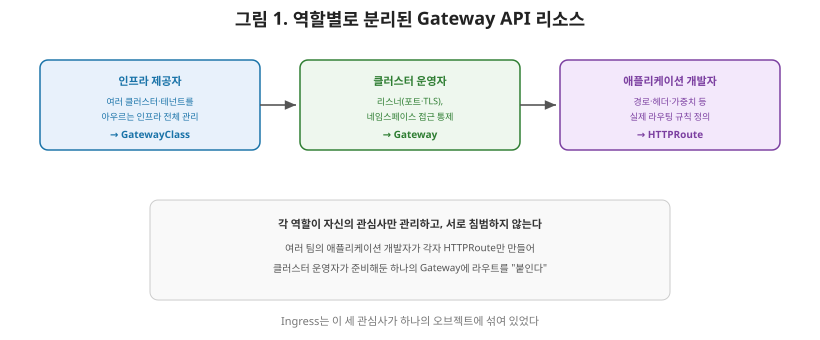
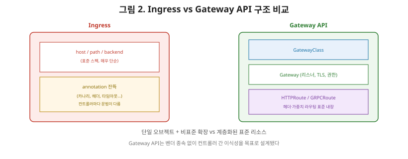

# [쿠버네티스 8편] Gateway API — Ingress를 대체하는 역할 분리 설계

7편에서 Ingress-NGINX가 은퇴 절차를 밟고 있고, 공식적으로 **Gateway API**로의 전환이 권장된다고 정리했습니다. 그런데 왜 하필 지금 이 시점에 새로운 표준이 필요했을까요? 이번 편에서는 Ingress가 실무에서 부딪혀온 구조적 한계와, Gateway API가 이를 어떻게 근본적으로 다르게 설계했는지 정리하겠습니다.

## 1. Ingress의 숨겨진 한계 — annotation 지옥

7편에서 다룬 Ingress의 규칙(host, path, backend)은 사실 매우 단순합니다. 그런데 실무에서는 헤더 기반 라우팅, 트래픽 비율 분할(카나리 배포), 재시도 정책, 타임아웃 설정처럼 더 정교한 기능이 자주 필요합니다. 문제는 **Ingress 표준 스펙 자체에는 이런 기능이 정의돼 있지 않다**는 것입니다.

그래서 각 Ingress Controller(NGINX, Traefik, HAProxy 등)는 이 부족한 부분을 저마다 다른 방식의 **annotation(주석)**으로 채워왔습니다. 예를 들어 NGINX Ingress Controller에서 카나리 배포를 설정하는 annotation과 다른 컨트롤러에서 같은 기능을 설정하는 방법은 완전히 다릅니다. 그 결과, 한 번 특정 Ingress Controller에 맞춰 annotation을 잔뜩 써두면 다른 컨트롤러로 옮기기가 매우 어려워지는 **사실상의 벤더 종속** 상태가 됩니다. 표준이라고 부르기엔 실제 동작의 대부분이 표준 바깥의 비표준 확장에 의존하고 있었던 셈입니다.

## 2. Gateway API의 핵심 설계 — 역할 지향(Role-Oriented) 구조

Gateway API는 이 문제를 "역할에 따라 리소스를 분리한다"는 근본적으로 다른 접근으로 풉니다. 공식 문서는 세 가지(때로는 네 가지) 페르소나를 정의합니다.

| 역할(페르소나) | 책임 | 관리하는 리소스 |
|---|---|---|
| **인프라 제공자**(Infrastructure Provider) | 여러 클러스터·여러 테넌트에 걸친 인프라 전체를 관리 | **GatewayClass** |
| **클러스터 운영자**(Cluster Operator) | 클러스터가 여러 사용자의 요구를 만족시키도록 정책·네트워크 접근·권한을 관리 | **Gateway** |
| **애플리케이션 개발자**(Application Developer) | 클러스터에서 실행되는 자신의 애플리케이션을 만들고 관리 | **HTTPRoute** 등 |

Ingress가 이 모든 관심사를 **하나의 오브젝트**에 뒤섞어놓고 그 부족분을 annotation으로 메웠다면, Gateway API는 애초에 **"누가 무엇을 결정하는가"에 따라 오브젝트 자체를 분리**했습니다.

## 3. 세 가지 핵심 리소스

- **GatewayClass**: 공통 설정과 동작을 공유하는 게이트웨이들의 집합을 정의하는 클러스터 수준 리소스입니다. "어떤 구현체(NGINX 기반인지, 클라우드 로드밸런서인지 등)를 쓸 것인가"를 정의하며, 보통 인프라를 제공하는 조직이 미리 준비해둡니다.
- **Gateway**: 트래픽이 클러스터 내부 Service로 변환될 수 있는 지점을 요청하는 리소스입니다. 각 Gateway는 GatewayClass 하나에 연결되며, 실제 로드밸런서를 인스턴스화하고, 리스너(포트, TLS 인증서)를 설정하고, 어떤 네임스페이스의 라우트가 이 Gateway에 붙을 수 있는지를 통제합니다.
- **HTTPRoute**(및 GRPCRoute, TCPRoute 등): HTTP 또는 종료된 HTTPS 연결을 멀티플렉싱하기 위한 리소스로, 호스트네임·경로·헤더·쿼리 파라미터로 요청을 매칭하고 라우팅하는 실질적인 규칙을 담습니다. 애플리케이션 개발자가 자신의 서비스에 필요한 라우팅만 여기에 정의합니다.

## 4. Ingress 대비 무엇이 개선됐는가

| 항목 | Ingress | Gateway API |
|---|---|---|
| 구조 | 단일 오브젝트에 모든 설정 혼재 | 역할별로 GatewayClass/Gateway/HTTPRoute 분리 |
| 고급 기능(헤더 라우팅, 트래픽 분할 등) | 컨트롤러마다 다른 annotation | 표준 스펙에 내장 |
| 프로토콜 확장성 | HTTP/HTTPS 중심 | HTTPRoute 외 GRPCRoute, TCPRoute 등으로 확장 |
| 권한 분리 | 어려움(하나의 리소스를 다 같이 수정) | Gateway가 어떤 네임스페이스의 Route를 허용할지 통제 가능 |
| 이식성 | 컨트롤러 종속적인 annotation에 의존 | 표준화된 필드로 컨트롤러 간 이식성 향상 |

이 표에서 가장 실무적으로 중요한 항목은 **권한 분리**입니다. 클러스터 운영자가 Gateway 하나(예: 외부 도메인과 TLS 인증서가 설정된 진입점)를 만들어두고, 여러 팀의 애플리케이션 개발자들이 각자 자신의 네임스페이스에서 HTTPRoute만 만들어 그 Gateway에 라우트를 "붙이는" 것이 표준으로 지원됩니다. Ingress 시절에는 이런 세밀한 권한 분리를 표준 스펙만으로는 구현하기 어려웠습니다.

## 5. 정리

- Ingress는 표준 스펙이 단순한 대신, 실무에 필요한 고급 기능을 컨트롤러마다 다른 annotation으로 메워야 했고, 이는 사실상의 벤더 종속으로 이어졌다.
- Gateway API는 인프라 제공자(GatewayClass), 클러스터 운영자(Gateway), 애플리케이션 개발자(HTTPRoute)라는 역할별로 리소스를 분리하는 설계를 택했다.
- Gateway는 로드밸런서 인스턴스화와 리스너·TLS 설정, 그리고 어떤 네임스페이스의 라우트를 허용할지를 통제하고, HTTPRoute는 실제 라우팅 규칙을 담당한다.
- 이 구조 덕분에 헤더 기반 라우팅, 트래픽 분할 같은 기능이 표준 스펙에 내장됐고, 여러 팀이 하나의 Gateway를 공유하면서도 권한을 분리해 사용할 수 있게 됐다.

다음 편에서는 NetworkPolicy로 넘어가, 지금까지 다룬 것이 "트래픽을 어떻게 들여보내고 라우팅할지"였다면 이번엔 "누가 누구와 통신할 수 있는지"를 제어하는 L3/L4 트래픽 정책을 다룹니다.

---

**참고한 공식 문서**
- [Gateway API Introduction](https://gateway-api.sigs.k8s.io/docs/introduction/)
- [API Overview - Gateway API](https://gateway-api.sigs.k8s.io/docs/concepts/api-overview/)
- [Roles and Personas - Gateway API](https://gateway-api.sigs.k8s.io/docs/concepts/roles-and-personas/)
- [Gateway API | Kubernetes](https://kubernetes.io/docs/concepts/services-networking/gateway/)
