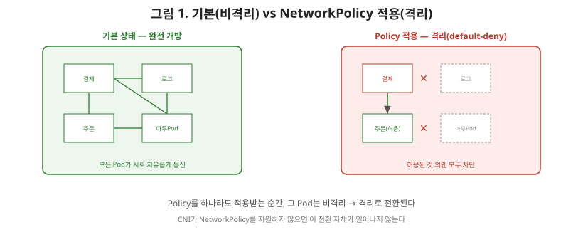
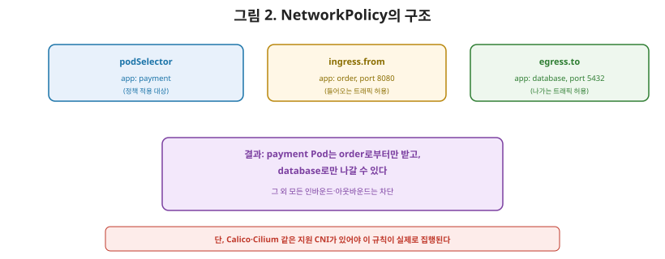

# [쿠버네티스 9편] NetworkPolicy — 누가 누구와 통신할 수 있는가

3편에서 쿠버네티스 네트워킹 모델의 기본 요구사항은 "모든 Pod가 NAT 없이 서로 직접 통신할 수 있어야 한다"는 것이라고 정리했습니다. 그런데 이 말을 뒤집어보면, **기본 상태의 쿠버네티스 클러스터는 사실상 완전히 개방된 네트워크**라는 뜻이기도 합니다. 결제 서비스 Pod와 아무 상관 없는 로그 수집 Pod가 서로 자유롭게 통신할 수 있다면 보안상 바람직하지 않겠죠. 이 트래픽을 제어하는 것이 이번 편의 주제인 **NetworkPolicy**입니다.

## 1. 기본 상태 — 모든 Pod는 비격리(non-isolated) 상태다

NetworkPolicy를 아무것도 만들지 않은 클러스터에서는, 모든 Pod가 **비격리(non-isolated)** 상태입니다. 즉 어떤 Pod로 들어오는 트래픽(ingress)이든 나가는 트래픽(egress)이든 전부 허용됩니다. 이 상태에서 NetworkPolicy를 하나라도 특정 Pod에 적용하는 순간, 그 Pod는 **격리(isolated)** 상태로 전환됩니다. 격리된 Pod는 그 정책들이 명시적으로 허용한 트래픽을 제외한 나머지를 전부 거부하는 **기본 거부(default-deny)** 모델로 바뀝니다.

여기서 상급자가 짚어야 할 핵심은, **이 격리는 정책이 하나라도 적용되는 순간에만 발동**한다는 것입니다. 아무 정책도 없으면 완전 개방, 정책이 하나라도 있으면 그 정책의 허용 범위 안으로 좁혀지는 이분법적 전환이 일어납니다.

## 2. NetworkPolicy의 구조

NetworkPolicy는 크게 세 부분으로 구성됩니다.

- **podSelector**: 이 정책을 적용할 대상 Pod를 라벨로 지정합니다. 같은 네임스페이스 안의 Pod만 선택할 수 있습니다.
- **policyTypes**: Ingress와 Egress 중 어느 방향의 규칙을 포함할지 지정합니다. 별도로 지정하지 않으면 Ingress 규칙이 있는 경우 Ingress가, Egress 규칙이 있는 경우 Egress가 자동으로 포함됩니다.
- **ingress / egress**: 실제로 허용할 트래픽의 조건입니다. 어떤 Pod(라벨), 어떤 네임스페이스, 또는 어떤 IP 대역에서 오는(또는 어디로 나가는) 트래픽을 허용할지, 그리고 몇 번 포트인지를 명시합니다.

| 구성 요소 | 관점 | 예시 |
|---|---|---|
| podSelector | 정책 적용 대상 | `app: payment` 라벨을 가진 Pod |
| policyTypes | 제어 방향 | Ingress, Egress |
| ingress.from | 들어오는 트래픽 허용 조건 | `app: order` 라벨을 가진 Pod로부터, 8080 포트 |
| egress.to | 나가는 트래픽 허용 조건 | `app: database` 라벨을 가진 Pod로, 5432 포트 |

예를 들어 "결제 서비스(`app: payment`)는 주문 서비스(`app: order`)로부터의 요청만 받고, 자신은 데이터베이스(`app: database`)로만 나갈 수 있다"는 정책을 만들면, 결제 서비스 Pod는 그 외의 모든 인바운드·아웃바운드 트래픽이 차단되는 격리 상태가 됩니다.

## 3. 결정적 함정 — NetworkPolicy도 구현체가 있어야 동작한다

여기서 7편의 Ingress를 다룰 때와 정확히 똑같은 패턴의 함정이 등장합니다. 공식 문서는 명확히 경고합니다. **"NetworkPolicy를 쓰려면 이를 지원하는 네트워킹 솔루션을 쓰고 있어야 한다. 이를 구현하는 컨트롤러 없이 NetworkPolicy 리소스만 만들면 아무 효과가 없다."**

3편에서 다룬 CNI 플러그인 중에서도 **NetworkPolicy를 실제로 집행(enforce)하는 기능을 갖춘 것과 그렇지 않은 것**이 나뉩니다. Calico, Cilium, Kube-router, Weave Net 같은 플러그인은 NetworkPolicy를 지원하지만, 아주 단순한 일부 네트워크 플러그인은 이 기능이 없습니다. 지원하지 않는 CNI를 쓰는 클러스터에서 NetworkPolicy 오브젝트를 아무리 정성껏 작성해도, 그 규칙은 **완전히 무시된 채 트래픽이 여전히 전부 개방된 상태로 흐릅니다.** Ingress 리소스만 만들고 Ingress Controller를 깜빡했을 때와 똑같이, "정책을 만들었으니 당연히 막히겠지"라고 가정했다가 실제로는 아무 방어도 되지 않는 상황을 마주할 수 있다는 뜻입니다.

## 4. 정리

- 기본 상태의 쿠버네티스 클러스터는 모든 Pod가 비격리 상태이며, 모든 트래픽이 허용된다.
- NetworkPolicy를 특정 Pod에 하나라도 적용하면 그 Pod는 격리 상태로 전환되어, 명시적으로 허용된 트래픽 외에는 전부 거부된다.
- NetworkPolicy는 podSelector(대상), policyTypes(방향), ingress/egress(허용 조건)로 구성된다.
- NetworkPolicy는 이를 지원하는 CNI 플러그인(Calico, Cilium 등)이 있어야만 실제로 동작하며, 지원하지 않는 환경에서는 리소스를 만들어도 아무 효과가 없다.

다음 편에서는 이 쿠버네티스 네트워킹 시리즈의 마지막 편으로, 실전 트러블슈팅으로 넘어갑니다. `kubectl`로 Service 연결이 안 될 때 어느 계층(Pod IP, EndpointSlice, kube-proxy, DNS, Ingress)에서 문제가 생겼는지 순서대로 좁혀나가는 진단 흐름을 다룹니다.

---

**참고한 공식 문서**
- [Network Policies](https://kubernetes.io/docs/concepts/services-networking/network-policies/)
- [NetworkPolicy API Reference](https://kubernetes.io/docs/reference/kubernetes-api/networking/network-policy-v1/)
