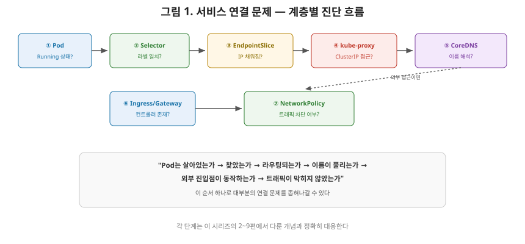
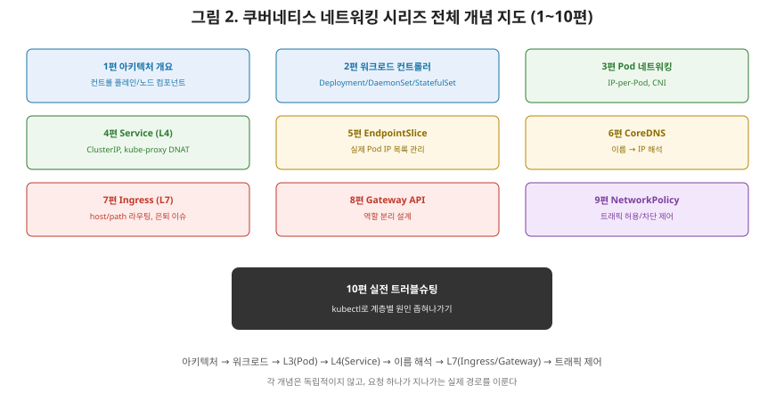

# [쿠버네티스 10편] 실전 트러블슈팅 — "왜 서비스에 연결이 안 되지?"

1편에서 9편까지 아키텍처, 워크로드 컨트롤러, Pod 네트워킹, Service, EndpointSlice, CoreDNS, Ingress, Gateway API, NetworkPolicy를 차례로 정리해 왔습니다. 이 시리즈의 마지막 편에서는 이 개념들을 실전에서 어떻게 활용하는지 살펴보겠습니다. 쿠버네티스를 처음 다루는 사람이 가장 자주 마주치는 문제, **"분명히 Service를 만들었는데 연결이 안 된다"**를 계층별로 진단하는 순서를 정리하겠습니다.

## 1. 공식 가이드의 접근 — 계층을 하나씩 좁혀나간다

공식 문서의 "Debug Services" 가이드는 이 문제를 "Deployment로 Pod를 띄우고 Service를 만들었는데 새 설치 환경에서 자주 발생하는 문제"로 소개하며, 원인을 찾아가는 절차를 제시합니다. 핵심은 **문제가 어느 계층에 있는지 순서대로 확인**하는 것입니다. 이 시리즈에서 다룬 순서(2편 워크로드 → 3편 Pod 네트워킹 → 4편 Service → 5편 EndpointSlice → 6편 DNS → 7·8편 Ingress/Gateway → 9편 NetworkPolicy)를 그대로 진단 순서로 뒤집어 쓴다고 보면 됩니다.



## 2. 1단계 — Pod가 실제로 떠 있고 정상인가

가장 먼저 확인할 것은 대상 Pod 자체입니다. `kubectl get pods`로 Pod가 `Running` 상태인지, `kubectl describe pod`로 재시작 이력이나 이벤트에 이상이 없는지 봅니다. 2편에서 다룬 것처럼, Deployment의 셀렉터와 Pod 템플릿의 라벨이 어긋나 있으면 컨트롤러가 Pod를 새로 만들지 못하는 경우도 흔합니다.

## 3. 2단계 — Service의 셀렉터가 Pod의 라벨과 정확히 일치하는가

Service의 `spec.selector`에 적힌 라벨과, 실제 Pod에 붙은 라벨이 글자 하나라도 다르면 그 Service는 어떤 Pod도 찾지 못합니다. `app: my-app`과 `app: myapp`처럼 오타 하나로 이 연결이 끊기는 경우가 실무에서 매우 흔한 실수입니다.

## 4. 3단계 — EndpointSlice에 Pod IP가 채워졌는가

5편에서 다룬 대로, kube-apiserver는 Service마다 하나 이상의 EndpointSlice를 만들어 제공합니다. 다음 명령으로 확인합니다.

```
kubectl get endpointslice -l kubernetes.io/service-name=myservice
```

이 결과에 나오는 엔드포인트 수가 실제로 그 Service의 멤버가 되어야 할 Pod 수와 일치하는지 확인해야 합니다. 여기가 비어 있다면, 문제의 원인은 십중팔구 **2단계의 셀렉터 불일치**입니다. Service는 있는데 EndpointSlice가 비어 있다는 것은 "조건은 정의됐지만 그 조건에 맞는 Pod가 하나도 없다"는 뜻이기 때문입니다.

## 5. 4단계 — Pod 안에서 직접 접근을 시도해본다

EndpointSlice가 정상이라면, 이번엔 4편에서 다룬 kube-proxy의 DNAT가 제대로 동작하는지 확인할 차례입니다. 다른 Pod 안에서 `kubectl exec`로 들어가 Service의 ClusterIP와 포트로 직접 요청을 보내봅니다. 이 단계에서 연결이 되면 라우팅 자체는 정상이라는 뜻이고, 안 된다면 kube-proxy의 프록시 모드 설정이나 노드의 방화벽 규칙을 의심해야 합니다.

## 6. 5단계 — DNS가 이름을 제대로 풀어주는가

IP로는 되는데 이름으로는 안 된다면, 6편에서 다룬 CoreDNS 쪽 문제입니다. 공식 문서는 `dnsutils`라는 디버깅용 Pod를 띄운 뒤 다음 명령으로 확인하라고 안내합니다.

```
kubectl exec -i -t dnsutils -- nslookup kubernetes.default
```

이 명령이 실패하면, Pod 내부의 `/etc/resolv.conf`가 올바른 네임서버(CoreDNS의 ClusterIP)를 가리키고 있는지, 그리고 CoreDNS Pod 자체가 정상 동작하고 있는지를 순서대로 점검합니다.

## 7. 6단계 — 외부 접근이라면 Ingress/Gateway 쪽을 본다

클러스터 외부에서의 접근이 문제라면, 7·8편에서 다룬 대로 **Ingress 리소스와 이를 실행하는 Ingress Controller(또는 Gateway와 Gateway Controller)가 둘 다 준비돼 있는지**부터 확인해야 합니다. Ingress/Gateway 리소스만 만들고 이를 실행할 컨트롤러가 없다면, 이 시리즈에서 반복해 강조했던 함정 그대로 아무 효과가 없습니다. 컨트롤러의 로그를 확인해 라우팅 규칙이 제대로 반영됐는지도 함께 봐야 합니다.

## 8. 7단계 — NetworkPolicy가 트래픽을 막고 있지는 않은가

여기까지 다 정상인데도 연결이 안 된다면, 9편에서 다룬 NetworkPolicy가 의도치 않게 트래픽을 차단하고 있을 가능성을 마지막으로 점검합니다. 최근에 격리 정책을 추가하지 않았는지, `kubectl get networkpolicy`로 대상 Pod에 적용된 정책이 있는지 확인합니다.

| 단계 | 확인 대상 | 관련 편 |
|---|---|---|
| 1 | Pod가 Running 상태인가 | 2편(워크로드 컨트롤러) |
| 2 | Service selector와 Pod label이 일치하는가 | 4편(Service) |
| 3 | EndpointSlice에 IP가 채워졌는가 | 5편(EndpointSlice) |
| 4 | ClusterIP로 직접 접근이 되는가 | 3·4편(Pod 네트워킹, kube-proxy) |
| 5 | DNS 이름이 정상적으로 풀리는가 | 6편(CoreDNS) |
| 6 | Ingress/Gateway 컨트롤러가 동작 중인가 | 7·8편(Ingress, Gateway API) |
| 7 | NetworkPolicy가 차단하고 있지 않은가 | 9편(NetworkPolicy) |

## 9. 시리즈를 마치며

10편에 걸쳐 쿠버네티스의 네트워킹 내부를 공식 문서를 기준으로 훑어왔습니다. 1편에서 컨트롤 플레인과 노드 컴포넌트의 역할을 다졌고, 2편에서 이 위에서 동작하는 다양한 워크로드 컨트롤러(Deployment, DaemonSet, StatefulSet, Job/CronJob)의 차이를 봤습니다. 3편에서는 Pod가 어떻게 고유한 IP를 갖고 CNI가 이를 구현하는지, 4·5편에서는 흔들리는 Pod IP를 Service와 EndpointSlice가 어떻게 안정화하는지를 다뤘습니다. 6편에서는 이 모든 것을 사람이 읽을 수 있는 이름으로 연결하는 CoreDNS를, 7·8편에서는 L7 트래픽을 라우팅하는 Ingress와 그 후속 표준인 Gateway API를(2026년 현재 진행 중인 Ingress-NGINX 은퇴라는 실제 업계 전환 시점까지 포함해서), 9편에서는 트래픽 자체를 통제하는 NetworkPolicy를 살펴봤습니다.

지금까지 다룬 모든 개념은 사실 이번 편의 진단 순서 하나로 요약됩니다. **"Pod는 살아있는가 → Service가 Pod를 찾았는가 → 라우팅이 되는가 → 이름이 풀리는가 → 외부 진입점이 동작하는가 → 트래픽이 차단되지 않았는가."** 이 순서를 몸에 익히면, 어떤 쿠버네티스 클러스터의 네트워킹 문제를 마주하든 당황하지 않고 원인을 좁혀나갈 수 있을 것입니다.



여기까지 함께해 주셔서 감사합니다.

---

**참고한 공식 문서**
- [Debug Services](https://kubernetes.io/docs/tasks/debug/debug-application/debug-service/)
- [Debugging DNS Resolution](https://kubernetes.io/docs/tasks/administer-cluster/dns-debugging-resolution/)
- [EndpointSlices](https://kubernetes.io/docs/concepts/services-networking/endpoint-slices/)
