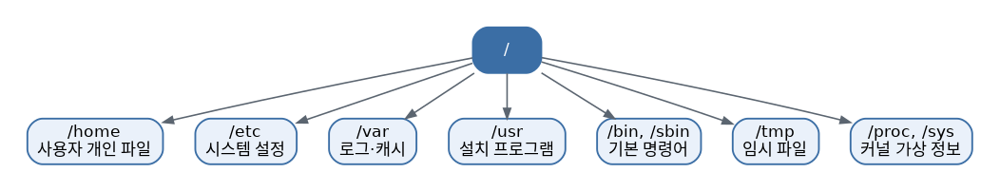

# [리눅스 개념 1편] 파일 시스템 구조, 왜 전부 `/`로 시작할까?

윈도우를 쓰다가 리눅스를 처음 만지면 가장 먼저 낯설게 느껴지는 게 드라이브 개념이 없다는 점입니다. C드라이브, D드라이브처럼 저장 공간이 알파벳으로 나뉘어 있지 않고, 리눅스에서는 모든 게 `/`(루트)라는 하나의 지점에서 시작하는 커다란 나무 구조로 이어져 있습니다.

## 모든 길은 `/`로 통한다

디스크를 하나 더 꽂든, USB를 연결하든, 심지어 네트워크 너머의 저장 공간을 가져오든 리눅스는 이걸 전부 별도의 드라이브 문자가 아니라 기존 트리 구조 어딘가에 "마운트"해서 붙여버립니다. 그래서 `/mnt/usb`처럼 특정 폴더에 들어가면 그게 실제로는 물리적으로 전혀 다른 장치일 수도 있습니다. 이 방식 덕분에 사용자 입장에서는 데이터가 어디에 물리적으로 있는지 신경 쓸 필요 없이 일관된 경로로 접근할 수 있습니다.

현재 어떤 장치가 어디에 마운트되어 있는지 궁금하다면 `df -h`나 `lsblk`로 확인할 수 있고, 새 디스크를 특정 위치에 연결하고 싶다면 `mount` 명령을 사용합니다. 이 표준적인 디렉토리 배치 규칙을 FHS(Filesystem Hierarchy Standard)라고 부르는데, 배포판마다 세부 사항은 조금씩 달라도 큰 틀은 대부분 이 표준을 따릅니다.

## 자주 보게 될 주요 디렉토리

터미널을 열고 이곳저곳 둘러보다 보면 계속 마주치는 폴더들이 있습니다. 처음엔 그냥 이름만 외워둬도 충분합니다.

- `/home`: 각 사용자의 개인 파일이 저장되는 곳. 윈도우의 "내 문서"와 비슷한 역할입니다.
- `/etc`: 시스템 전반의 설정 파일이 모여 있는 곳. 프로그램 설정을 바꾸려면 대부분 여기로 오게 됩니다.
- `/var`: 로그나 캐시처럼 계속 변하고 쌓이는 데이터가 저장되는 곳.
- `/usr`: 사용자가 설치한 프로그램, 라이브러리, 문서 등이 위치하는 곳. 실제로는 시스템 대부분의 실행 파일이 여기 들어 있어서 `/usr/bin`, `/usr/lib`처럼 하위 구조가 꽤 큽니다.
- `/bin`, `/sbin`: `ls`, `cp` 같은 기본 실행 명령어들이 실제로 들어 있는 곳. 최근 배포판들은 `/bin`을 `/usr/bin`에 대한 심볼릭 링크로 통합하는 추세입니다.
- `/tmp`: 재부팅하면 사라지는 임시 파일이 저장되는 곳.
- `/proc`, `/sys`: 실제 디스크에 존재하는 파일이 아니라, 커널이 실시간으로 만들어내는 가상의 파일 시스템입니다. 프로세스 정보나 하드웨어 상태를 파일처럼 읽을 수 있게 해줍니다. 예를 들어 `/proc/cpuinfo`를 열면 CPU 정보를 텍스트로 볼 수 있습니다.

## 조금 더 깊이: inode와 링크

리눅스 파일 시스템을 제대로 이해하려면 inode 개념을 알아야 합니다. 우리가 흔히 "파일 이름"이라고 부르는 것은 사실 실제 데이터가 아니라, inode라는 메타데이터 구조체를 가리키는 이름표에 불과합니다. inode에는 파일의 크기, 권한, 소유자, 데이터가 디스크 어디에 저장되어 있는지 등의 정보가 담겨 있고, 정작 파일 이름 자체는 inode 안에 없습니다. `ls -i` 명령으로 각 파일의 inode 번호를 확인할 수 있습니다.

이 구조 덕분에 하나의 실제 데이터에 여러 개의 이름을 붙이는 하드 링크(hard link)가 가능해집니다. `ln 원본 링크이름`으로 만든 하드 링크는 원본과 완전히 동등한 존재로, 원본을 지워도 데이터는 사라지지 않고 살아 있습니다. 반면 우리가 흔히 "바로가기"처럼 사용하는 심볼릭 링크(symbolic link, `ln -s`)는 실제 데이터가 아니라 다른 파일의 경로를 가리키는 별도의 작은 파일이라서, 원본이 사라지면 링크도 깨져버립니다.

## 문제 상황별 빠른 참고표

| 상황 | 확인할 곳 / 명령어 |
|---|---|
| 설정이 이상함 | `/etc` |
| 로그를 보고 싶음 | `/var/log` |
| 내 파일을 찾고 싶음 | `/home` |
| 디스크 용량 부족 | `df -h`, `du -sh *` |
| 마운트된 장치 확인 | `lsblk`, `mount` |

## 왜 이 구조를 알아야 할까

문제가 생겼을 때 "어디를 봐야 하는지" 감을 잡는 게 이 구조를 이해하는 진짜 목적입니다. 설정이 이상하면 `/etc`, 로그를 확인하고 싶으면 `/var/log`, 내가 만든 파일을 찾고 싶으면 `/home`, 디스크 용량이 부족한 것 같으면 `df -h`와 `du -sh *`로 어느 디렉토리가 공간을 잡아먹고 있는지 확인하는 식으로 문제 상황에 따라 찾아갈 곳이 정해져 있습니다. 처음엔 외우기보다 `cd`와 `ls`로 직접 돌아다니면서 눈에 익히는 게 가장 빠릅니다.

*다음 편에서는 리눅스가 여러 사용자를 어떻게 구분하고 보호하는지, 권한(Permissions) 개념을 다룹니다.*
