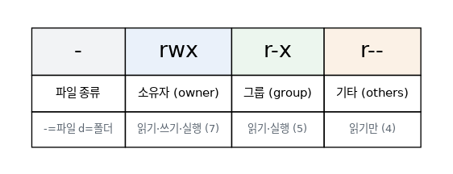

# [리눅스 개념 2편] `rwxr-xr--`, 이 암호 같은 문자열의 정체

`ls -l` 명령을 쳐본 적이 있다면 파일 이름 앞에 `-rwxr-xr--` 같은 알 수 없는 문자열을 본 적이 있을 겁니다. 처음엔 그냥 무시하고 넘어가기 쉽지만, 사실 이건 리눅스가 여러 사용자를 안전하게 공존시키기 위해 만든 권한(Permissions) 시스템입니다.

## 세 부류, 세 가지 권한

리눅스는 하나의 파일에 대해 세 부류의 사용자를 구분합니다.

- 소유자(owner): 그 파일을 만든 사람
- 그룹(group): 소유자와 같은 그룹에 속한 사람들
- 기타(others): 그 외 모든 사람

그리고 각 부류마다 세 가지 권한을 가질 수 있습니다.

- 읽기(r, read): 파일 내용을 볼 수 있음
- 쓰기(w, write): 파일을 수정할 수 있음
- 실행(x, execute): 파일을 프로그램처럼 실행할 수 있음

아까 봤던 `-rwxr-xr--`을 다시 보면, 맨 앞 문자는 파일 종류(`-`는 일반 파일, `d`는 디렉토리, `l`은 심볼릭 링크)를 뜻하고, 그다음부터 3글자씩 끊어서 읽습니다. `rwx`는 소유자가 읽기·쓰기·실행을 모두 할 수 있다는 뜻이고, 그다음 `r-x`는 그룹이 읽기와 실행만 가능하다는 뜻이며, 마지막 `r--`는 그 외 사용자는 읽기만 가능하다는 의미입니다.

## 숫자로 표현하는 권한

`chmod`를 쓰다 보면 `chmod 755 file.sh`처럼 숫자로 권한을 지정하는 경우를 자주 봅니다. r=4, w=2, x=1을 더해서 하나의 숫자로 표현하는 방식인데, 예를 들어 `rwx`는 4+2+1=7, `r-x`는 4+0+1=5, `r--`는 4+0+0=4가 됩니다. 그래서 755는 "소유자는 다 되고(7), 그룹과 기타는 읽기·실행만(5, 5)" 이라는 뜻이 되고, 흔히 보는 644는 "소유자는 읽기·쓰기(6), 그룹과 기타는 읽기만(4, 4)"을 의미합니다.

## 숫자 표기 빠른 참고표

| 권한 | 의미 | 숫자 |
|---|---|---|
| `rwx` | 읽기+쓰기+실행 | 7 |
| `rw-` | 읽기+쓰기 | 6 |
| `r-x` | 읽기+실행 | 5 |
| `r--` | 읽기만 | 4 |
| `---` | 권한 없음 | 0 |

## 조금 더 깊이: 특수 권한과 umask

기본 rwx 외에도 특수한 상황에서 쓰이는 권한들이 있습니다.

- **SUID**: 실행 파일에 설정하면, 그 파일을 누가 실행하든 파일 소유자의 권한으로 동작합니다. `passwd` 명령이 대표적인 예로, 일반 사용자가 실행해도 내부적으로는 비밀번호 파일을 수정할 root 권한이 잠깐 부여됩니다.
- **SGID**: 디렉토리에 설정하면, 그 안에 새로 생성되는 파일이 자동으로 해당 디렉토리의 그룹 소속을 물려받습니다. 여러 사람이 협업하는 공유 폴더에서 유용합니다.
- **Sticky bit**: 대표적으로 `/tmp`에 걸려 있는 설정인데, 디렉토리에 설정하면 그 안의 파일은 소유자 본인만 삭제할 수 있게 제한합니다. 누구나 쓸 수 있는 공유 폴더인데 서로 파일을 함부로 지우지 못하게 막는 역할입니다.

또한 새로 만드는 파일의 기본 권한은 매번 `chmod`로 지정하는 게 아니라 `umask`라는 값에 의해 자동으로 결정됩니다. 시스템 기본값에서 umask 값만큼 권한을 빼는 방식으로 계산되는데, 이 값을 조정하면 새로 생성되는 파일의 기본 권한 자체를 바꿀 수 있습니다.

## 권한을 바꾸고 싶다면

권한을 조정하고 싶을 때 쓰는 명령이 `chmod`입니다. 파일 소유자 자체를 바꾸고 싶다면 `chown`, 그룹만 바꾸고 싶다면 `chgrp`을 사용합니다. 서버를 운영하다 보면 "Permission denied" 에러를 자주 만나게 되는데, 대부분 이 권한 설정이 원인입니다.

## 권한이 중요한 이유

여러 사람이 같은 서버를 쓰는 상황을 생각해보면 이해가 쉽습니다. 내 파일을 다른 사용자가 마음대로 수정하거나 삭제할 수 있다면 곤란하겠죠. 권한 시스템은 바로 이런 상황을 막기 위한 기본적인 보안 장치입니다. 특히 실행 권한(x)이 없으면 스크립트 파일이 있어도 실행이 안 되는 경우가 많으니, 뭔가 실행이 안 될 때는 권한부터 확인해보는 습관을 들이면 좋습니다. 참고로 디렉토리에서의 x 권한은 파일 실행이 아니라 "그 디렉토리 안으로 들어갈 수 있는지"를 의미한다는 점도 헷갈리기 쉬운 부분이니 기억해두면 좋습니다.

*다음 편에서는 지금 시스템에서 어떤 프로그램들이 돌아가고 있는지 확인하고 제어하는 프로세스 관리를 다룹니다.*
