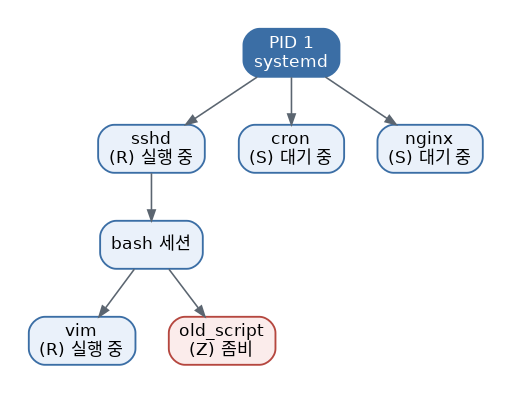

# [리눅스 개념 3편] 지금 내 컴퓨터에서 뭐가 돌아가고 있을까? 프로세스 관리

프로그램을 실행하면 리눅스는 그걸 "프로세스"라는 단위로 관리합니다. 웹 브라우저를 하나 켜도, 백그라운드에서 도는 시스템 서비스도, 심지어 지금 여러분이 쓰고 있는 터미널 자체도 전부 프로세스입니다. 그리고 이 모든 프로세스는 PID(Process ID)라는 고유한 번호표를 하나씩 달고 있습니다.

## PID, 프로세스의 이름표

PID는 프로세스가 시작될 때 순차적으로 부여되는 번호입니다. 같은 프로그램을 여러 번 실행해도 PID는 매번 다르게 부여되기 때문에, 여러 개의 프로세스 중 정확히 어떤 걸 다뤄야 할지 구분할 수 있게 해줍니다.

## 부모와 자식, 프로세스 트리

리눅스의 모든 프로세스는 다른 프로세스에 의해 생성됩니다. 이 관계를 부모(parent)-자식(child)이라고 부르고, 가장 최상위에는 시스템이 부팅될 때 처음 실행되는 프로세스(PID 1, 보통 systemd)가 있습니다. `pstree` 명령을 실행하면 이 부모-자식 관계가 나무 구조로 눈에 보이는데, 어떤 프로그램이 어떤 과정을 거쳐 실행됐는지 파악할 때 유용합니다. 만약 부모 프로세스가 먼저 죽으면 자식 프로세스는 "고아 프로세스(orphan)"가 되어 PID 1이 대신 입양해가는 식으로 처리됩니다.

## 지금 뭐가 돌아가는지 확인하기

가장 자주 쓰는 명령은 `ps`와 `top`입니다.

- `ps aux`: 현재 실행 중인 프로세스 목록을 한 번 딱 찍어서 보여줍니다. 각 줄에는 CPU·메모리 사용률, 실행한 사용자, 상태 등이 함께 표시됩니다.
- `top`: 프로세스 목록을 실시간으로 갱신해서 보여줍니다. CPU나 메모리를 많이 쓰는 프로그램을 찾을 때 특히 유용합니다. 최근에는 더 보기 편한 `htop`을 대신 쓰는 경우도 많습니다.

`ps` 결과에서 STAT 항목을 보면 프로세스의 상태를 알 수 있습니다. R(실행 중), S(대기 중), D(디스크 입출력 대기), Z(좀비) 같은 코드가 붙는데, 특히 Z(좀비 프로세스)는 이미 실행이 끝났지만 부모 프로세스가 종료 상태를 아직 회수하지 않아 프로세스 테이블에 잔재만 남아 있는 상태를 뜻합니다. 좀비 프로세스가 계속 쌓인다면 해당 프로그램의 종료 처리 로직에 문제가 있다는 신호입니다.

## 프로세스 상태 코드 참고표

| 코드 | 상태 | 의미 |
|---|---|---|
| R | Running | 실행 중이거나 실행 대기 중 |
| S | Sleeping | 이벤트를 기다리며 대기 중 |
| D | Disk sleep | 디스크 입출력 완료를 기다리는 중 (강제 종료 불가) |
| Z | Zombie | 실행은 끝났지만 부모가 아직 회수하지 않은 상태 |

## 포그라운드, 백그라운드, 그리고 job control

터미널에서 명령을 실행하면 기본적으로 포그라운드에서 실행되어 끝날 때까지 터미널을 붙잡고 있습니다. 명령 끝에 `&`를 붙이면 백그라운드로 넘어가서 터미널을 계속 쓸 수 있습니다. 이미 실행 중인 작업은 `Ctrl+Z`로 잠시 멈춘 뒤 `bg`로 백그라운드로 보내거나, `fg`로 다시 포그라운드로 불러올 수 있습니다. 현재 셸에서 관리 중인 작업 목록은 `jobs` 명령으로 확인합니다.

## 멈춰버린 프로그램 강제 종료하기

가끔 프로그램이 응답을 멈추거나 오작동할 때가 있습니다. 이럴 때는 `kill` 명령에 해당 프로세스의 PID를 지정해서 종료 신호를 보낼 수 있습니다. 사실 `kill`은 다양한 시그널을 보낼 수 있는 명령인데, 기본값인 `SIGTERM`(15)은 프로세스에게 "정리하고 종료해달라"고 정중하게 요청하는 신호이고, `kill -9`로 보내는 `SIGKILL`은 프로세스에게 선택권을 주지 않고 커널이 강제로 즉시 종료시키는 신호입니다. 그래서 `SIGKILL`은 정말 최후의 수단으로만 쓰는 게 좋습니다. 저장 중이던 작업이 있었다면 데이터가 유실될 수도 있기 때문입니다.

## 우선순위 조정, nice와 renice

여러 프로세스가 CPU를 두고 경쟁할 때, 리눅스는 nice 값이라는 우선순위 지표로 누구에게 CPU 시간을 더 줄지 조정합니다. 값의 범위는 -20(가장 높은 우선순위)부터 19(가장 낮은 우선순위)까지이고, 새 프로세스를 낮은 우선순위로 시작하고 싶다면 `nice`, 이미 실행 중인 프로세스의 우선순위를 바꾸고 싶다면 `renice`를 사용합니다. 중요하지 않은 배치 작업을 백그라운드에서 오래 돌릴 때 nice 값을 낮춰두면 다른 작업에 영향을 덜 주게 됩니다.

## 왜 프로세스를 이해해야 할까

서버를 운영하다 보면 "이 포트를 누가 쓰고 있지?", "왜 메모리가 이렇게 부족하지?", "왜 이 프로세스가 안 죽지?" 같은 질문에 답해야 할 때가 많습니다. 프로세스 관리는 바로 이런 문제를 진단하고 해결하는 첫 번째 도구입니다. `ps`, `top`, `kill`에 익숙해지는 것만으로도 문제 상황에서의 대응 속도가 확 달라집니다.

*다음 편에서는 리눅스 사용의 핵심 도구, 셸(Shell)과 명령어 조합법을 다룹니다.*
