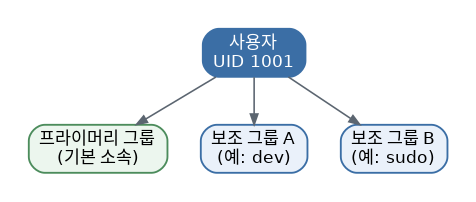
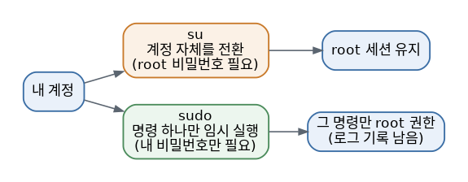

# [리눅스 개념 6편] `sudo`를 아무 때나 남발해도 될까? 사용자와 그룹

리눅스는 처음부터 여러 사람이 한 컴퓨터를 함께 쓰는 상황을 전제로 설계됐습니다. 서버 하나에 여러 개발자가 접속해서 각자 작업하는 경우를 떠올리면 이해가 쉽습니다. 이걸 가능하게 하는 기반이 바로 사용자(User)와 그룹(Group) 개념입니다.

## 모든 사용자는 번호를 가진다

리눅스에 등록된 각 사용자는 UID(User ID)라는 고유 번호를 가지고 있고, 하나 이상의 그룹에 속하게 됩니다. 사용자마다 기본으로 속하는 그룹을 프라이머리 그룹(primary group)이라 하고, 추가로 더 속할 수 있는 그룹을 보조 그룹(secondary group)이라고 부릅니다. 이 정보들은 `/etc/passwd`(사용자 정보)와 `/etc/group`(그룹 정보) 파일에 저장되어 있어서, 궁금하면 직접 열어볼 수도 있습니다. 실제 비밀번호(정확히는 암호화된 해시값)는 `/etc/passwd`가 아니라 일반 사용자는 읽을 수 없는 `/etc/shadow` 파일에 별도로 보관됩니다.

그룹은 왜 필요할까요? 예를 들어 개발팀 5명이 같은 프로젝트 폴더를 함께 써야 한다면, 그 5명을 하나의 그룹으로 묶고 그 폴더의 권한을 그룹 단위로 설정하면 관리가 훨씬 편해집니다. 앞서 다룬 권한 개념(2편)이 바로 이 사용자·그룹 구조 위에서 작동하는 것입니다.

## 사용자와 그룹을 다루는 명령어

새 사용자를 만들 때는 `useradd`, 기존 사용자 정보를 수정할 때는 `usermod`, 삭제할 때는 `userdel`을 사용합니다. 예를 들어 어떤 사용자를 기존 그룹에 추가로 소속시키고 싶다면 `usermod -aG [그룹명] [사용자명]`처럼 사용합니다. 그룹 자체를 만들거나 지울 때는 `groupadd`, `groupdel`을 씁니다.

## `su`와 `sudo`, 뭐가 다를까

관리자 권한이 필요할 때 쓰는 대표적인 명령이 `su`와 `sudo`인데, 둘의 작동 방식이 다릅니다. `su`는 아예 다른 사용자(주로 root)로 로그인 세션 자체를 전환하는 방식이라, root의 비밀번호를 알아야 하고 한번 전환하면 계속 그 권한으로 작업하게 됩니다. 반면 `sudo`는 현재 계정을 유지한 채로 특정 명령 하나만 관리자 권한으로 잠깐 실행하는 방식이라, 자기 자신의 비밀번호만 입력하면 되고 실행 기록도 로그로 남습니다. 보안 측면에서는 필요한 순간에만 권한을 빌려 쓰는 `sudo` 방식이 더 안전하다고 여겨집니다.

## 조금 더 깊이: sudoers 파일

누가 `sudo`를 쓸 수 있는지, 어떤 명령까지 허용되는지는 `/etc/sudoers` 파일에서 정의됩니다. 이 파일은 직접 텍스트 편집기로 열지 않고 `visudo`라는 전용 명령으로 수정하는 게 원칙인데, 문법 오류가 있으면 저장 전에 미리 검사해줘서 시스템이 완전히 잠겨버리는 사고를 막아주기 때문입니다. 실무에서는 특정 사용자 전체가 아니라 특정 그룹(Ubuntu에서는 보통 `sudo` 그룹)에 속한 사람에게만 관리자 권한을 부여하는 방식을 많이 씁니다.

## 왜 알아야 할까

"Permission denied" 에러를 만났을 때 무작정 `sudo`를 붙이기 전에, 애초에 이 작업이 왜 권한이 필요한지, 내가 어떤 사용자와 그룹에 속해 있는지 이해하고 있으면 문제를 훨씬 정확하게 진단할 수 있습니다. `sudo`를 남발하는 건 좋은 습관이 아닙니다. 실수로 잘못된 명령을 관리자 권한으로 실행하면 시스템 전체에 영향을 줄 수 있기 때문에, 정말 필요한 경우에만 사용하는 게 원칙입니다. 특히 여러 명이 함께 쓰는 서버를 관리할 일이 있다면 이 개념은 선택이 아니라 필수입니다.

*다음 편에서는 리눅스 서버를 다룰 때 빠질 수 없는 네트워킹 기초를 다룹니다.*
