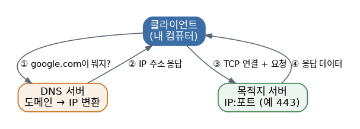

# [리눅스 개념 7편] 서버가 살아있는지부터 확인하자, 네트워킹 기초

리눅스를 서버 운영이나 원격 접속 목적으로 다룬다면 네트워킹 개념을 피해갈 수 없습니다. 다행히 처음부터 전문가 수준으로 알 필요는 없고, 몇 가지 핵심 도구만 손에 익혀도 웬만한 상황은 대응할 수 있습니다.

## 통신의 기본 단위, IP와 포트

컴퓨터끼리 통신하려면 서로를 식별할 방법이 필요합니다. IP 주소가 "어느 컴퓨터인지"를 가리킨다면, 포트는 "그 컴퓨터 안에서 어떤 프로그램과 통신할지"를 결정합니다. 웹서버는 보통 80번(HTTP)이나 443번(HTTPS) 포트를 쓰고, SSH 접속은 22번 포트를 쓰는 식으로 정해진 역할이 있습니다.

## TCP와 UDP, 통신 방식의 차이

포트로 통신할 때도 방식이 두 가지로 나뉩니다. TCP는 데이터가 제대로 도착했는지 확인하고 순서를 보장하는 대신 속도가 조금 느린 방식이라 웹 접속, 파일 전송, SSH처럼 정확성이 중요한 곳에 쓰이고, UDP는 확인 절차 없이 그냥 데이터를 보내버리는 대신 속도가 빠른 방식이라 실시간 스트리밍이나 온라인 게임처럼 속도가 더 중요한 곳에 쓰입니다. 둘 다 옳고 그름의 문제가 아니라 상황에 맞는 트레이드오프를 선택한 결과입니다.

## 도메인 이름은 어떻게 IP로 바뀔까, DNS

`google.com`처럼 사람이 기억하기 쉬운 이름을 실제 서버의 IP 주소로 변환해주는 시스템이 DNS입니다. 컴퓨터가 도메인 이름을 찾아가는 순서를 알아두면 접속 문제를 진단할 때 도움이 됩니다. 먼저 `/etc/hosts` 파일에 직접 등록된 이름이 있는지 확인하고, 없으면 설정된 DNS 서버에 질의해서 IP 주소를 받아옵니다. 특정 도메인의 DNS 조회 결과를 직접 확인하고 싶다면 `nslookup`이나 `dig` 명령을 사용할 수 있습니다.

## 자주 쓰게 될 도구들

- `ip` 또는 `ifconfig`: 내 컴퓨터의 네트워크 인터페이스 정보(IP 주소 등)를 확인합니다. 최근에는 `ip`가 더 표준으로 쓰입니다.
- `ping`: 상대방 서버가 살아있는지, 연결이 되는지를 가장 빠르게 확인하는 방법입니다. 접속이 안 될 때 제일 먼저 시도해보는 명령입니다.
- `traceroute`: `ping`은 응답이 오는지만 알려주지만, `traceroute`는 내 컴퓨터에서 목적지까지 데이터가 거쳐가는 각 경유지(홉)를 순서대로 보여줍니다. 어느 구간에서 지연이나 끊김이 발생하는지 짚어낼 때 유용합니다.
- `curl` 또는 `wget`: 터미널에서 웹 요청을 직접 보내볼 수 있는 도구입니다. 웹서버가 응답 자체는 정상적으로 주는지, 브라우저 없이도 확인할 수 있어서 디버깅에 자주 쓰입니다.
- `ss` 또는 `netstat`: 지금 내 컴퓨터에서 어떤 포트가 열려 있고 어떤 프로그램이 그 포트를 쓰고 있는지 확인합니다.
- `iptables`나 `ufw`: 어떤 트래픽을 허용하고 차단할지 정하는 방화벽 설정 도구입니다.

## 진단 도구 빠른 참고표

| 도구 | 확인하는 것 |
|---|---|
| `ping` | 서버가 응답하는지 |
| `traceroute` | 어느 경유지에서 지연이 생기는지 |
| `curl`/`wget` | 웹 요청 자체가 정상 응답을 주는지 |
| `ss`/`netstat` | 어떤 포트가 열려 있는지 |
| `dig`/`nslookup` | 도메인이 어떤 IP로 풀리는지 |

## 조금 더 깊이: SSH 키 기반 인증

원격 서버에 접속할 때 매번 비밀번호를 입력하는 대신, SSH 키 쌍(공개키·개인키)을 이용한 인증 방식이 훨씬 안전하고 편리합니다. `ssh-keygen`으로 키 쌍을 만들고, 공개키만 서버의 `~/.ssh/authorized_keys`에 등록해두면, 개인키를 가진 사람만 비밀번호 없이 로그인할 수 있게 됩니다. 개인키는 절대 외부에 노출되면 안 되고, 서버에는 오직 공개키만 올라간다는 점이 이 방식의 핵심입니다. 실무에서 여러 서버를 관리한다면 비밀번호 로그인 자체를 아예 막아두고 키 기반 인증만 허용하는 경우가 많습니다.

## 문제 해결의 실마리

서버 접속이 안 될 때는 보통 순서대로 확인합니다. 먼저 `ping`으로 서버 자체가 응답하는지 보고, 응답한다면 원하는 포트가 열려 있는지 `ss`로 확인하고, 그래도 안 되면 방화벽 설정을 의심해보고, 도메인 이름으로 접속이 안 된다면 DNS 조회 문제인지 `dig`로 따로 확인해보는 식입니다. 이 순서만 알아도 "왜 안 되는지 감이 안 잡히는" 막막한 상황을 상당 부분 벗어날 수 있습니다.

*다음 편에서는 컴퓨터 전원을 켜는 순간부터 로그인 화면까지, 커널과 부팅 과정을 다룹니다.*
