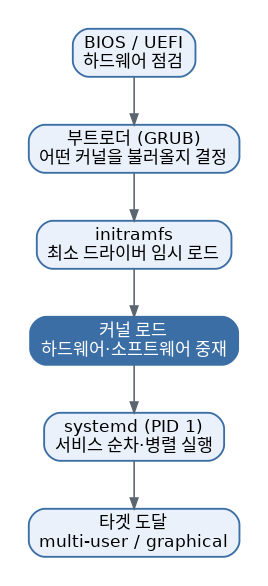

# [리눅스 개념 8편] 전원 버튼을 누르면 그 안에서 무슨 일이 벌어질까

전원 버튼을 누르고 로그인 화면이 뜨기까지, 우리 눈에 보이지 않는 곳에서 여러 단계가 순서대로 진행됩니다. 이 흐름을 알아두면 부팅이 안 되거나 서비스가 제대로 안 뜨는 문제를 만났을 때 "어느 단계에서 막혔는지" 짚어낼 수 있습니다.

## 부팅의 단계

1. **BIOS/UEFI**: 전원이 켜지면 가장 먼저 하드웨어를 점검하는 펌웨어가 실행됩니다. 최근에는 옛날 방식인 BIOS 대신 더 빠르고 기능이 많은 UEFI가 주로 쓰입니다.
2. **부트로더**: 그다음 부트로더가 실행되어 어떤 운영체제(커널)를 불러올지 결정합니다. 리눅스에서 가장 흔히 쓰이는 부트로더는 GRUB이고, 한 컴퓨터에 여러 운영체제를 설치했을 때 부팅 시 고를 수 있는 메뉴가 바로 이 GRUB 화면입니다.
3. **initramfs 로드**: 커널이 진짜 디스크(루트 파일 시스템)에 접근하기 전, 필요한 최소한의 드라이버만 담은 임시 파일 시스템인 initramfs를 먼저 메모리에 올려서 부팅에 필요한 준비를 마칩니다.
4. **커널 로드**: 부트로더가 리눅스 커널을 메모리에 올리고 실행을 넘깁니다. 커널은 하드웨어와 소프트웨어 사이를 중재하는 운영체제의 핵심입니다.
5. **init 시스템 실행**: 커널이 준비되면 나머지 서비스들을 순서대로 켜는 init 시스템이 실행됩니다.

## systemd, 요즘 리눅스의 표준

과거에는 SysVinit처럼 다양한 init 시스템이 쓰였고 이때는 부팅 상태를 0부터 6까지의 런레벨(runlevel) 숫자로 구분했습니다. 요즘 대부분의 주요 배포판은 systemd를 기본으로 사용하는데, systemd는 이 런레벨 개념을 타겟(target)이라는 이름으로 바꿔서 이어받았습니다. 예를 들어 그래픽 화면 없이 서버로만 쓰는 상태는 `multi-user.target`, 데스크톱 화면까지 띄우는 상태는 `graphical.target`에 대응합니다. `systemctl get-default`로 현재 기본 타겟을 확인할 수 있고, `systemctl isolate [타겟명]`으로 즉시 전환할 수도 있습니다.

systemd는 부팅 시 필요한 서비스들을 정해진 순서와 조건에 따라 병렬로 실행하고, 실행 중에도 서비스 상태를 관리합니다. 서비스를 다루고 싶다면 `systemctl` 명령을 사용합니다.

- `systemctl start [서비스명]`: 서비스 시작
- `systemctl stop [서비스명]`: 서비스 중지
- `systemctl status [서비스명]`: 서비스 상태 확인
- `systemctl enable [서비스명]`: 부팅 시 자동 시작 설정

## 조금 더 깊이: 커널 모듈

리눅스 커널은 모든 기능을 하나의 거대한 덩어리로 미리 다 담아두지 않고, 필요한 기능을 모듈이라는 단위로 나눠서 필요할 때만 동적으로 불러오는 구조를 씁니다. 새 USB 장치를 꽂았을 때 별도 설치 없이 바로 인식되는 것도 대부분 관련 커널 모듈이 자동으로 로드되기 때문입니다. 현재 로드된 모듈 목록은 `lsmod`로 확인할 수 있고, 필요하다면 `modprobe`로 특정 모듈을 직접 불러오거나 제거할 수 있습니다. 특정 하드웨어가 인식되지 않는 문제를 진단할 때 이 모듈 목록을 확인해보는 게 도움이 되는 경우가 많습니다.

## 왜 알아야 할까

"서버를 재부팅했는데 웹서버가 안 뜬다" 같은 상황은 실무에서 흔하게 벌어집니다. 이럴 때 부팅 과정을 이해하고 있으면 `systemctl status`로 해당 서비스가 애초에 켜지긴 했는지, 켜졌다면 왜 죽었는지, 혹은 애초에 `enable` 설정이 빠져서 자동으로 시작되지 않은 건 아닌지를 순서대로 짚어나갈 수 있습니다. 무작정 재부팅을 반복하기보다 이 흐름을 따라가며 원인을 찾는 게 훨씬 빠릅니다.

*다음 편에서는 반복 작업을 자동화하는 무기, 환경 변수와 셸 스크립팅을 다룹니다.*
