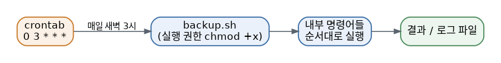

# [리눅스 개념 9편] 매번 손으로 치지 말고 스크립트로 만들자

리눅스를 쓰다 보면 자주 반복하게 되는 작업들이 생깁니다. 매번 똑같은 명령어 여러 줄을 순서대로 입력하는 게 번거롭게 느껴질 때쯤, 환경 변수와 셸 스크립팅이라는 개념이 유용해집니다.

## 환경 변수란

환경 변수는 시스템 전반에서 참조되는 값들을 담아두는 저장소 같은 개념입니다. 그중에서도 특히 자주 마주치는 건 `PATH`입니다. `PATH`는 명령어를 입력했을 때 그 실행 파일을 어느 폴더들에서 찾을지 정의해두는 변수입니다. 새로 설치한 프로그램의 명령어가 안 먹힐 때 "PATH에 추가가 안 됐나 보다"라는 말을 듣는 이유가 바로 이것 때문입니다. `HOME`은 현재 사용자의 홈 디렉토리 경로를 담고 있는 변수입니다. 현재 설정된 모든 환경 변수는 `env` 또는 `printenv` 명령으로 한 번에 확인할 수 있습니다.

앞선 4편에서 다뤘듯, 일반 셸 변수는 `export`를 붙여야 자식 프로세스에서도 접근 가능한 진짜 환경 변수가 됩니다. 이 원리 때문에 스크립트 안에서 새로 만든 변수를 다른 프로그램에 넘겨주고 싶다면 `export` 처리를 잊지 않아야 합니다.

## 셸 스크립트의 기본 문법

반복되는 명령어들을 한 파일에 순서대로 적어두면, 그 파일을 실행하는 것만으로 전체 작업을 한 번에 처리할 수 있습니다. 이렇게 만든 파일이 셸 스크립트이고, 보통 `.sh` 확장자를 붙입니다. 스크립트 첫 줄에 `#!/bin/bash` 같은 표시를 적어두는데, 이걸 셔뱅(shebang)이라고 부르며 "이 파일을 어떤 인터프리터로 실행할지" 시스템에게 알려주는 역할을 합니다.

간단한 조건문과 반복문도 스크립트 안에서 쓸 수 있습니다.

```bash
#!/bin/bash
# 조건문 예시
if [ -f "/var/log/app.log" ]; then
    echo "로그 파일이 존재합니다"
else
    echo "로그 파일이 없습니다"
fi

# 반복문 예시
for file in /home/user/backup/*.txt; do
    echo "처리 중: $file"
done
```

파일을 스크립트로 실행하려면 앞서 2편에서 다룬 실행 권한(x)이 있어야 합니다. `chmod +x script.sh`로 실행 권한을 부여한 뒤 `./script.sh`로 실행하는 게 기본적인 흐름입니다.

## crontab 시간 필드 참고표

| 필드 | 의미 | 예 |
|---|---|---|
| 1번째 | 분 (0-59) | `0` |
| 2번째 | 시 (0-23) | `3` |
| 3번째 | 일 (1-31) | `*` |
| 4번째 | 월 (1-12) | `*` |
| 5번째 | 요일 (0-6, 0=일요일) | `*` |

`0 3 * * *`는 "매일 새벽 3시 0분"을 의미합니다.

## 예약된 시간에 자동으로 실행하기, cron

만든 스크립트를 사람이 매번 손으로 실행하는 대신, 정해진 시간마다 자동으로 실행되게 만들 수도 있습니다. 이때 쓰는 게 cron이라는 스케줄러입니다. `crontab -e`로 편집할 수 있는 크론탭 파일에 "분 시 일 월 요일 명령어" 형식으로 한 줄을 등록해두면, 정해진 주기마다 시스템이 알아서 그 명령을 실행합니다. 예를 들어 매일 새벽 3시에 백업 스크립트를 돌리고 싶다면 `0 3 * * * /home/user/backup.sh`처럼 등록하면 됩니다.



## 왜 알아야 할까

셸 스크립팅은 리눅스를 "그때그때 명령어 몇 개 치는 도구"에서 "내 대신 일해주는 자동화 도구"로 바꿔주는 핵심 열쇠입니다. 예를 들어 매일 특정 폴더를 백업하고, 오래된 로그를 정리하고, 결과를 파일로 남기는 작업을 매번 손으로 한다면 시간이 꽤 걸릴 겁니다. 이 명령어들을 스크립트 하나로 묶고 cron으로 예약해두면, 사람 개입 없이 조용히 자동으로 돌아가게 만들 수 있습니다. 처음에는 복잡해 보이지만, 자주 반복하는 명령어 몇 줄을 파일 하나에 옮겨 적는 것부터 시작하면 됩니다.

*마지막 편에서는 문제가 생겼을 때 가장 먼저 확인해야 할 곳, 로그와 모니터링을 다룹니다.*
