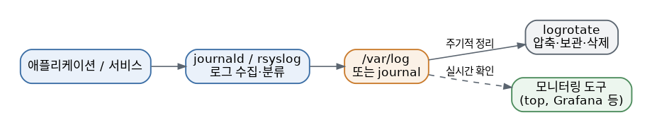

# [리눅스 개념 10편] 문제가 생기면 제일 먼저 여기를 봐야 한다, 로그와 모니터링

시스템이 이상하게 동작하거나 서비스가 갑자기 죽었을 때, 초보자와 숙련자를 가르는 결정적인 차이는 "어디를 먼저 보느냐"입니다. 리눅스는 거의 모든 활동을 로그로 남기기 때문에, 이 로그를 읽을 줄 아는 것만으로 문제 해결 속도가 크게 달라집니다.

## 전통적인 로그의 집, `/var/log`

오래전부터 리눅스 시스템과 애플리케이션들은 대부분 `/var/log` 아래에 로그 파일을 쌓아왔습니다. 예를 들어 인증 관련 기록은 `/var/log/auth.log`, 시스템 전반 로그는 `/var/log/syslog`에 남는 식입니다. 문제가 생겼을 때 이 폴더 안을 뒤져보면 실마리를 찾을 수 있는 경우가 많습니다. 이런 전통적인 로그를 실제로 파일에 기록해주는 배후 프로그램이 rsyslog인데, 여러 프로그램이 보내는 로그 메시지를 받아서 정해진 규칙에 따라 각각 다른 파일로 분류해 저장하는 역할을 합니다.

## systemd 시대의 통합 로그, `journalctl`

요즘 대부분의 배포판이 사용하는 systemd는 자체적으로 로그를 통합 관리하는 저널(journal) 시스템을 가지고 있습니다. `journalctl` 명령을 쓰면 여러 파일을 일일이 뒤지지 않고도 한곳에서 로그를 조회할 수 있습니다.

- `journalctl -u [서비스명]`: 특정 서비스의 로그만 확인
- `journalctl -f`: 실시간으로 로그가 쌓이는 걸 확인 (마치 방송 중계처럼)
- `journalctl --since "1 hour ago"`: 최근 한 시간 동안의 로그만 확인
- `journalctl -p err`: 에러 수준 이상의 로그만 걸러서 확인

## 부팅 단계의 기록, `dmesg`

시스템이 켜지는 과정에서 커널이 남기는 메시지는 `dmesg` 명령으로 확인할 수 있습니다. 하드웨어 인식 문제나 드라이버 관련 오류를 진단할 때 특히 유용합니다.

## 상황별 로그·모니터링 도구 참고표

| 궁금한 것 | 도구 |
|---|---|
| 특정 서비스가 왜 죽었나 | `journalctl -u [서비스명]` |
| 부팅 시 하드웨어 인식 문제 | `dmesg` |
| 지금 CPU/메모리를 뭐가 쓰나 | `top`, `htop` |
| 디스크 입출력이 병목인가 | `iostat` |
| 메모리 여유가 얼마나 있나 | `free -h` |

## 조금 더 깊이: 로그 로테이션과 실시간 모니터링

로그가 아무 제한 없이 계속 쌓이기만 하면 결국 디스크 용량을 다 잡아먹게 됩니다. 이걸 막기 위해 리눅스는 logrotate라는 도구로 로그 파일을 주기적으로 압축·보관하거나 오래된 것부터 자동으로 삭제하는 규칙을 적용합니다. 대부분의 배포판에는 이미 기본 설정이 되어 있지만, 특정 애플리케이션의 로그가 너무 빨리 쌓인다면 `/etc/logrotate.d/` 아래에 해당 서비스용 규칙을 직접 조정할 수도 있습니다.

로그가 "무슨 일이 있었는지"를 사후에 알려준다면, 실시간 모니터링 도구는 "지금 무슨 일이 벌어지고 있는지"를 보여줍니다. `top`이나 `htop`으로 CPU와 메모리 사용률을 실시간으로 볼 수 있고, `vmstat`으로 시스템 전반의 자원 사용 흐름을, `iostat`으로 디스크 입출력 부하를, `free -h`로 메모리 여유 상태를 확인할 수 있습니다. 규모가 있는 서버 환경이라면 이런 지표들을 직접 명령어로 확인하는 대신 Prometheus나 Grafana 같은 모니터링 도구를 연결해서 그래프로 추적하고, 특정 임계값을 넘으면 자동으로 알림을 받도록 구성하는 경우가 많습니다.

## 왜 알아야 할까

로그는 시스템이 스스로 남기는 일기장 같은 존재입니다. "왜 갑자기 서버가 느려졌지", "왜 이 서비스가 자꾸 꺼지지" 같은 질문에 답을 찾으려면 결국 로그를 열어봐야 합니다. 무작정 재시작하거나 감으로 문제를 추측하기 전에, 로그부터 확인하는 습관을 들이면 훨씬 정확하고 빠르게 원인에 다가갈 수 있습니다. 그리고 로그만으로 부족하다면 실시간 모니터링 도구로 지금 이 순간 시스템이 어떤 상태인지 함께 살펴보는 습관을 들이면 좋습니다.

이렇게 10편에 걸쳐 리눅스의 핵심 개념들을 하나씩 살펴봤습니다. 파일 시스템부터 권한, 프로세스, 셸, 패키지 관리, 사용자, 네트워킹, 부팅 과정, 스크립팅, 로그까지 각 개념은 독립적으로도 유용하지만 실전에서는 서로 얽혀서 등장합니다. 완벽히 외우려 하기보다 터미널을 열어 직접 손으로 명령어를 쳐보면서 익히는 게 가장 빠른 길입니다.
