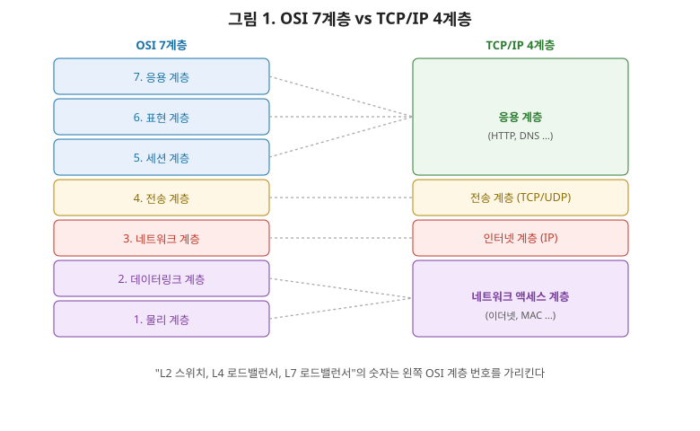
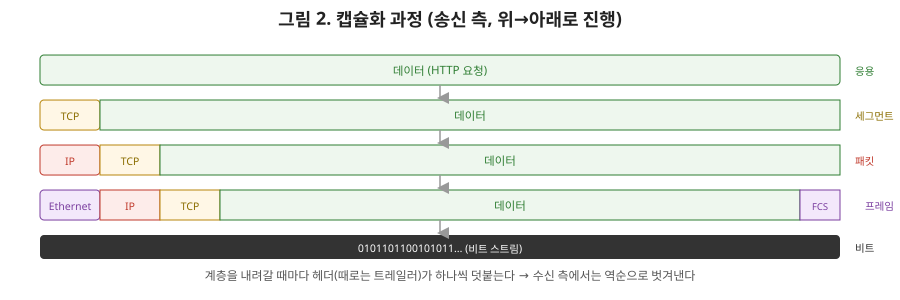

# [네트워크 1편] 왜 계층으로 나눴을까 — OSI 7계층과 TCP/IP 4계층

네트워크를 처음 공부하면 누구나 OSI 7계층을 "물-데-네-전-세-표-응"으로 통암기부터 합니다. 그런데 상급자로 넘어가려면 순서를 외우는 것보다 **왜 계층으로 나눴는지, 각 계층이 실제로 무슨 일을 하는지, 데이터가 계층을 오가며 어떻게 변하는지**를 이해하고 있어야 합니다. 이번 편에서는 그 전체 그림을 처음부터 끝까지 잡아보겠습니다.

## 1. 왜 계층으로 나눴을까

만약 네트워크가 계층 없이 하나의 거대한 프로그램이라고 생각해보세요. 케이블 신호를 다루는 코드와 웹 페이지를 렌더링하는 코드가 한 덩어리로 섞여 있다면 어떻게 될까요? 와이파이가 5G로 바뀌어도, 이더넷이 광케이블로 바뀌어도 그 위에서 동작하는 HTTP는 전혀 몰라도 됩니다. 반대로 HTTP가 HTTP/2로 바뀌어도 그 아래 TCP는 전혀 영향을 받지 않습니다. 이게 계층화의 핵심입니다. **각 계층은 자신의 바로 아래 계층이 제공하는 서비스만 이용하고, 바로 위 계층에는 자신이 하는 일의 결과만 전달합니다.** 내부 구현이 어떻게 바뀌든 계층 간 약속(인터페이스)만 지키면 서로 영향을 주지 않죠. 스프링 시리즈에서 봤던 컨트롤러-서비스-리포지토리 계층형 아키텍처, 그리고 인터페이스에만 의존하고 구현체를 몰라도 되는 DIP와 정확히 같은 설계 철학입니다.

## 2. OSI 7계층 vs TCP/IP 4계층

계층 모델은 사실 두 가지 버전이 있습니다. 국제표준화기구(ISO)가 만든 **OSI 7계층**은 이론적으로 정교하게 나눈 모델이고, 실제 인터넷이 돌아가는 방식은 **TCP/IP 4계층**(또는 5계층)입니다. 실무에서는 TCP/IP가 실제로 쓰이지만, 계층을 설명할 때는 여전히 OSI 7계층 용어가 표준 어휘로 쓰이기 때문에 둘 다 알아야 합니다.

그림을 보시죠. 왼쪽이 OSI, 오른쪽이 TCP/IP입니다. TCP/IP의 "네트워크 액세스 계층"이 OSI의 물리+데이터링크 계층을 합친 것이고, TCP/IP의 "응용 계층"이 OSI의 세션+표현+응용 계층을 합친 겁니다. 실무에서 "L2 스위치", "L3 라우팅", "L4 로드밸런서", "L7 로드밸런서"라는 표현을 쓸 때의 그 숫자가 전부 OSI 계층 번호입니다. 이 번호 체계를 알아야 나중에 인프라 문서를 읽을 때 헷갈리지 않습니다.

각 계층의 역할과 대표 프로토콜, 대표 장비, 그리고 그 계층에서 다루는 데이터 단위(PDU)까지 표로 정리하겠습니다.

| 계층 | OSI 이름 | 역할 | PDU(데이터 단위) | 대표 프로토콜/기술 | 대표 장비 |
|---|---|---|---|---|---|
| 7 | 응용 계층 | 사용자가 사용하는 서비스 | 메시지 | HTTP, DNS, SMTP | - |
| 6 | 표현 계층 | 인코딩, 암호화, 압축 | 메시지 | SSL/TLS, JPEG | - |
| 5 | 세션 계층 | 통신 세션 관리 | 메시지 | RPC, NetBIOS | - |
| 4 | 전송 계층 | 종단 간 신뢰성 있는 전달 | 세그먼트(TCP)/데이터그램(UDP) | TCP, UDP | L4 로드밸런서 |
| 3 | 네트워크 계층 | 목적지까지 경로 선택 | 패킷 | IP, ICMP, 라우팅 프로토콜 | 라우터 |
| 2 | 데이터링크 계층 | 같은 네트워크 내 전달 | 프레임 | 이더넷, MAC | 스위치 |
| 1 | 물리 계층 | 전기 신호·광 신호 전송 | 비트 | 케이블, 전압, 광신호 | 허브, 리피터 |

이 표에서 상급자가 특히 눈여겨봐야 할 열은 "PDU"입니다. 같은 데이터라도 계층에 따라 부르는 이름이 다릅니다. 이게 왜 중요하냐면, 다음 절에서 다룰 캡슐화 과정을 이해하는 핵심 키가 되기 때문입니다.

## 3. 캡슐화와 역캡슐화

데이터가 송신 측에서 계층을 타고 내려가면서 무슨 일이 벌어질까요? 각 계층은 상위 계층에서 받은 데이터에 **자신만의 헤더(때로는 트레일러까지)를 덧붙여서** 다음 계층으로 넘깁니다. 이 과정을 **캡슐화(encapsulation)**라고 부릅니다.

그림을 보시면, 응용 계층에서 만든 데이터(예: HTTP 요청)가 전송 계층으로 내려가면서 TCP 헤더가 붙어 세그먼트가 되고, 네트워크 계층으로 내려가면서 IP 헤더가 붙어 패킷이 되고, 데이터링크 계층으로 내려가면서 이더넷 헤더와 트레일러가 붙어 프레임이 됩니다. 마지막으로 물리 계층에서 이 프레임이 비트(0과 1) 신호로 변환되어 전선이나 전파를 타고 실제로 전송됩니다.

수신 측에서는 이 과정이 정반대로 일어납니다. 물리 계층에서 받은 비트를 프레임으로 복원하고, 이더넷 헤더를 벗겨 패킷을 꺼내고, IP 헤더를 벗겨 세그먼트를 꺼내고, TCP 헤더를 벗겨 마지막에 원본 HTTP 요청 데이터를 응용 계층에 전달합니다. 이걸 **역캡슐화(decapsulation)**라고 합니다.

여기서 상급자가 짚어야 할 포인트가 하나 있습니다. **각 계층은 자신이 받은 데이터의 내용물이 무엇인지 전혀 몰라도 됩니다.** 데이터링크 계층은 자신이 감싸고 있는 게 IP 패킷인지, 그 안에 TCP 세그먼트가 들었는지, HTTP 요청인지 관심이 없습니다. 그냥 "누군가 나에게 페이로드를 줬으니 내 헤더만 붙여서 다음으로 넘긴다"는 역할만 충실히 수행합니다. 이 무관심함이야말로 계층화가 주는 유연성의 원천입니다.

## 4. 계층과 실제 장비의 관계

표에서 대표 장비 열을 다시 보면, 스위치는 2계층(데이터링크), 라우터는 3계층(네트워크)에서 동작한다고 나와 있습니다. 이게 실무에서 왜 중요하냐면, 장비가 "어느 계층까지의 정보를 읽고 판단하는지"가 곧 그 장비의 기능을 결정하기 때문입니다.

스위치는 프레임의 이더넷 헤더(MAC 주소)만 보고 어느 포트로 전달할지 결정합니다. IP 주소 같은 상위 계층 정보는 열어보지도 않습니다. 반면 라우터는 패킷의 IP 헤더까지 열어봐서 목적지 네트워크로 가는 최적 경로를 계산합니다. L4 로드밸런서는 여기서 한 단계 더 들어가 TCP/UDP 포트 번호까지 보고 트래픽을 분산하고, L7 로드밸런서(리버스 프록시)는 아예 HTTP 요청의 URL이나 헤더 내용까지 읽어서 라우팅을 결정합니다. **장비 이름 앞에 붙는 L2, L3, L4, L7이라는 숫자는 결국 "이 장비가 어느 계층의 헤더까지 뜯어보는가"를 의미**하는 겁니다.

## 5. 정리

- 계층화는 관심사 분리를 통해 각 계층이 독립적으로 발전할 수 있게 해주는 설계 원칙이다.
- OSI 7계층은 이론적 표준 어휘, TCP/IP 4계층은 실제 인터넷이 동작하는 실질적 구조다. 실무 용어(L2, L4, L7 등)는 OSI 계층 번호를 기준으로 한다.
- 데이터는 송신 시 계층을 내려가며 각 계층의 헤더가 덧붙는 캡슐화를 거치고, 수신 시 반대로 헤더가 벗겨지는 역캡슐화를 거친다.
- 각 계층은 자신이 감싸는 데이터의 내용을 몰라도 되며, 이 무관심함이 계층화의 유연성을 만든다.
- 네트워크 장비(스위치, 라우터, 로드밸런서)는 각자 어느 계층의 헤더까지 읽고 판단하느냐로 구분된다.

다음 편에서는 이번 편에서 가장 아래에 있던 물리 계층과 데이터링크 계층을 더 깊게 파고들어, 이더넷 프레임의 구조, MAC 주소, 그리고 스위치가 충돌 도메인과 브로드캐스트 도메인을 어떻게 나누는지 다룹니다.
