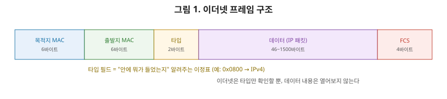
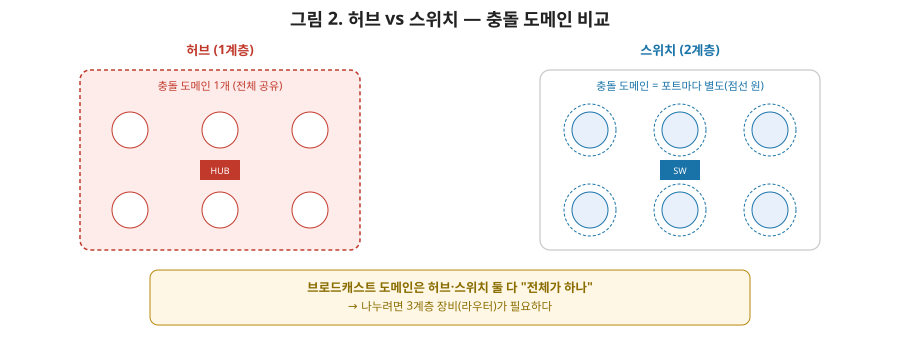

# [네트워크 2편] 이더넷, MAC 주소, 그리고 스위치가 똑똑해지는 원리

1편에서 7계층 전체를 훑어봤다면, 이번 편은 가장 아래에 있는 **물리 계층과 데이터링크 계층**을 깊게 파봅니다. 이 두 계층은 "같은 네트워크 안에서" 데이터를 실어 나르는 역할을 담당합니다. 여기서 "같은 네트워크"라는 표현이 핵심인데요, 왜 그런지는 뒤에서 브로드캐스트 도메인을 다루면서 자연스럽게 이해되실 겁니다.

## 1. 물리 계층 — 그냥 신호일 뿐이다

물리 계층은 정말 단순합니다. 상위 계층이 만들어준 비트(0과 1)를 실제로 전송 매체(구리선의 전압, 광섬유의 빛, 공기 중의 전파)에 실어 보내는 역할만 합니다. UTP 케이블이든 광케이블이든 와이파이든, 물리 계층 입장에서는 그냥 "0과 1을 신호로 바꿔서 보내고 받는" 일이 전부입니다. 이 계층에서 동작하는 장비가 **허브(리피터)**인데, 허브는 들어온 신호를 그냥 증폭해서 연결된 모든 포트로 그대로 흘려보낼 뿐, 그 신호가 무슨 의미인지는 전혀 해석하지 않습니다.

## 2. 데이터링크 계층 — 이더넷 프레임

물리 계층이 신호를 나른다면, 데이터링크 계층은 그 신호에 **의미 있는 단위(프레임)**를 부여합니다. 오늘날 유선 네트워크에서 사실상 표준은 **이더넷(Ethernet)**입니다. 이더넷 프레임의 구조를 보면 데이터링크 계층이 실제로 무슨 일을 하는지 감이 옵니다.

| 필드 | 크기 | 역할 |
|---|---|---|
| 목적지 MAC 주소 | 6바이트 | 이 프레임을 받아야 할 장치 |
| 출발지 MAC 주소 | 6바이트 | 이 프레임을 보낸 장치 |
| 타입(EtherType) | 2바이트 | 상위 계층 프로토콜 종류(대부분 IPv4를 의미하는 `0x0800`) |
| 데이터(페이로드) | 46~1500바이트 | 상위 계층에서 캡슐화되어 넘어온 IP 패킷 |
| FCS(체크섬) | 4바이트 | 전송 중 오류가 없었는지 검증(CRC) |

여기서 상급자가 짚어야 할 포인트는 "타입" 필드입니다. 이 필드 덕분에 이더넷은 자신이 감싸고 있는 게 IP 패킷인지, ARP 요청인지, 다른 프로토콜인지 신경 쓰지 않고도 상위 계층에게 정확히 전달할 수 있습니다. 1편에서 말씀드린 "각 계층은 내용물을 몰라도 된다"는 원칙이 이 한 줄의 필드로 구현되는 겁니다.

## 3. MAC 주소 — 하드웨어에 새겨진 고유 번호

MAC 주소는 48비트(6바이트)로 이뤄져 있고, 네트워크 인터페이스 카드(NIC)에 하드웨어적으로 새겨져 있습니다. 앞의 24비트는 제조사를 식별하는 OUI(Organizationally Unique Identifier)이고, 뒤의 24비트는 제조사가 부여하는 고유 번호입니다. IP 주소가 "어느 네트워크의 몇 번째 장치인가"를 나타내는 논리적 주소라면, MAC 주소는 "이 장치 자체가 누구인가"를 나타내는 물리적 주소입니다. 이 둘의 관계(어떤 IP 주소가 어떤 MAC 주소를 갖고 있는지 알아내는 과정, 바로 ARP)는 3편에서 자세히 다루겠습니다.

## 4. 허브 vs 스위치 — 똑같이 생겼지만 완전히 다른 계층

겉보기엔 둘 다 여러 대의 컴퓨터를 케이블로 연결하는 상자입니다. 하지만 동작하는 계층이 다르면 성능과 보안이 완전히 달라집니다.

**허브(1계층)**는 한 포트로 신호가 들어오면 그걸 나머지 모든 포트로 그대로 복사해서 내보냅니다. 프레임의 목적지 MAC 주소 같은 건 아예 읽지 않습니다. 그래서 관련 없는 컴퓨터도 다른 컴퓨터에게 가는 데이터를 전부 받게 되고(보안 문제), 여러 장치가 동시에 신호를 보내면 신호끼리 부딪혀 충돌(collision)이 발생합니다.

**스위치(2계층)**는 이더넷 프레임을 열어 목적지 MAC 주소를 확인하고, 그 주소가 연결된 포트로만 정확히 전달합니다. 이걸 가능하게 하는 게 스위치 내부의 **MAC 주소 테이블**입니다.

### 4-1. 스위치가 MAC 주소를 학습하는 과정

1. **학습(Learning)**: 어떤 포트로 프레임이 들어오면, 스위치는 그 프레임의 출발지 MAC 주소를 보고 "이 MAC 주소는 이 포트 뒤에 있구나"를 MAC 주소 테이블에 기록한다.
2. **플러딩(Flooding)**: 목적지 MAC 주소가 아직 테이블에 없으면(처음 보는 주소라면), 일단 들어온 포트를 제외한 모든 포트로 흘려보낸다.
3. **포워딩(Forwarding)**: 목적지 MAC 주소가 테이블에 있으면, 그 포트로만 정확히 전달한다.
4. **필터링(Filtering)**: 목적지가 출발지와 같은 포트에 있다면(같은 세그먼트 내 통신이라면), 아예 다른 포트로 내보내지 않는다.

이 학습 과정 덕분에 스위치는 시간이 지날수록 "누가 어느 포트에 있는지" 점점 더 정확히 알게 되고, 불필요한 트래픽을 최소화합니다.

## 5. 충돌 도메인과 브로드캐스트 도메인

이번 편의 핵심 개념입니다. 상급자 면접에서 정말 자주 나오는 질문이기도 하죠.

- **충돌 도메인(Collision Domain)**: 동시에 신호를 보내면 충돌이 발생할 수 있는 범위. 허브에 연결된 모든 장치는 하나의 충돌 도메인을 공유합니다. 반면 스위치는 포트 하나하나가 독립된 충돌 도메인입니다. 즉 **스위치를 쓰면 충돌 도메인이 포트 수만큼 잘게 쪼개집니다.**
- **브로드캐스트 도메인(Broadcast Domain)**: 브로드캐스트 프레임(목적지 MAC이 `FF:FF:FF:FF:FF:FF`인 프레임)이 도달하는 범위. 허브든 스위치든 상관없이, **2계층 장비만으로 연결된 네트워크는 여전히 하나의 브로드캐스트 도메인**입니다. 스위치는 MAC 주소를 모르는 프레임을 플러딩하고, 브로드캐스트 프레임은 원래 모든 곳에 전달돼야 하므로 스위치를 아무리 여러 대 연결해도 브로드캐스트 도메인은 나뉘지 않습니다.

| 구분 | 허브 | 스위치 |
|---|---|---|
| 동작 계층 | 1계층(물리) | 2계층(데이터링크) |
| 목적지 판단 | 안 함(무조건 전체 전달) | MAC 주소 테이블 기반 |
| 충돌 도메인 | 전체가 하나 | **포트마다 별도** |
| 브로드캐스트 도메인 | 전체가 하나 | 전체가 하나(동일) |
| 보안 | 낮음(모두가 모든 트래픽 수신) | 상대적으로 높음 |

표에서 보이듯 브로드캐스트 도메인은 스위치를 아무리 늘려도 줄어들지 않습니다. **브로드캐스트 도메인을 나누려면 3계층 장비(라우터)가 필요합니다.** 이 부분이 바로 다음 편에서 다룰 IP와 라우팅으로 이어지는 연결고리입니다. 참고로 스위치 안에서도 VLAN(가상 랜)이라는 기능으로 브로드캐스트 도메인을 논리적으로 나눌 수 있는데, 이건 조금 더 심화 주제라 이번 시리즈 범위를 넘어가는 부분이니 참고만 해두시면 됩니다.

## 6. CSMA/CD, 지금은 왜 안 쓰나

과거 허브 기반 네트워크에서는 여러 장치가 하나의 충돌 도메인을 공유했기 때문에 충돌이 자주 발생했고, 이를 감지하고 처리하는 방식이 **CSMA/CD(반송파 감지 다중 접근/충돌 탐지)**였습니다. 대략 "보내기 전에 회선이 비어 있는지 확인하고, 보내는 도중 충돌이 감지되면 잠시 대기 후 재전송"하는 방식입니다. 오늘날 스위치 기반 네트워크는 포트마다 독립된 충돌 도메인을 가지면서 대부분 전이중(full-duplex) 통신을 하기 때문에, 애초에 충돌이 발생할 여지가 없어 CSMA/CD는 사실상 역사 속 개념이 됐습니다. 다만 "왜 예전에는 이게 필요했는가"를 알아두면 스위치가 해결한 문제가 무엇인지 더 명확하게 이해됩니다.

## 7. 정리

- 물리 계층은 비트를 신호로 바꿔 전송할 뿐 의미를 해석하지 않으며, 허브가 이 계층에서 동작한다.
- 데이터링크 계층은 이더넷 프레임 단위로 데이터를 다루며, 프레임의 타입 필드 덕분에 상위 계층 내용을 몰라도 정확히 전달할 수 있다.
- MAC 주소는 48비트의 물리적 하드웨어 주소이며, OUI로 제조사를, 나머지로 개별 장치를 식별한다.
- 스위치는 MAC 주소 테이블을 학습·플러딩·포워딩·필터링 과정으로 구축해, 허브와 달리 필요한 포트로만 프레임을 전달한다.
- 스위치는 충돌 도메인을 포트 단위로 잘게 쪼개지만, 브로드캐스트 도메인은 나누지 못한다. 브로드캐스트 도메인을 나누려면 3계층 장비(라우터)가 필요하다.

다음 편에서는 네트워크 계층으로 올라가, IP 주소 체계와 서브네팅, 라우팅 테이블이 목적지를 찾아가는 원리, 그리고 IP 주소와 MAC 주소를 연결해주는 ARP를 다룹니다.
