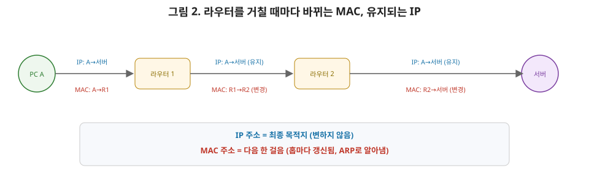

# [네트워크 3편] IP 주소, 서브네팅, 그리고 라우터를 거칠 때마다 벌어지는 일

2편 마지막에 "브로드캐스트 도메인을 나누려면 3계층 장비, 즉 라우터가 필요하다"고 말씀드렸습니다. 이번 편이 바로 그 답을 다루는 편입니다. 데이터링크 계층이 "같은 네트워크 안"의 전달을 책임졌다면, 네트워크 계층(IP)은 **서로 다른 네트워크 사이**를 연결하는 역할을 합니다. IP 주소 체계, 서브네팅, 라우팅, 그리고 2편에서 예고했던 ARP까지 이번 편에서 전부 정리하겠습니다.

## 1. IP 계층이 하는 일

MAC 주소만으로 전 세계 모든 장치를 찾아갈 수 있다면 참 편하겠지만, 그건 불가능에 가깝습니다. MAC 주소에는 "이 장치가 어디에 있는지"에 대한 정보가 전혀 없기 때문입니다(하드웨어에 새겨진 고유 번호일 뿐이니까요). 반면 **IP 주소는 계층적인 구조를 가진 논리적 주소**입니다. 우편 주소에 비유하면 이해가 빠릅니다. MAC 주소가 "이 사람의 주민등록번호"라면, IP 주소는 "서울시 강남구 테헤란로 1번지"처럼 상위 지역부터 하위 지역까지 계층적으로 좁혀가는 주소입니다. 라우터는 이 계층 구조를 보고 "일단 서울로 보내고, 서울에서 강남구로, 강남구에서 테헤란로로"처럼 목적지에 점점 가깝게 전달합니다. 이게 바로 **라우팅**입니다.

## 2. IP 주소의 구조: 네트워크부와 호스트부

IPv4 주소는 32비트이고, 우리가 흔히 보는 `192.168.1.10` 같은 표기는 8비트씩 4묶음(옥텟)을 점으로 구분한 것입니다. 이 32비트는 다시 두 부분으로 나뉩니다.

- **네트워크부**: 어느 네트워크(서브넷)에 속하는지
- **호스트부**: 그 네트워크 안에서 몇 번째 장치인지

문제는 "몇 비트까지가 네트워크부인지"를 주소만 봐서는 알 수 없다는 겁니다. 그래서 **서브넷 마스크** 또는 **CIDR 표기법**(`/24`처럼 슬래시 뒤에 비트 수를 붙이는 방식)으로 네트워크부의 길이를 명시합니다.

`192.168.1.10/24`라는 표기를 예로 들면, `/24`는 앞의 24비트가 네트워크부라는 뜻입니다. 32비트 중 24비트를 빼면 호스트부는 8비트가 남고, 2⁸ = 256개의 주소를 이 네트워크가 가질 수 있습니다(실제 할당 가능한 호스트 수는 네트워크 주소와 브로드캐스트 주소를 뺀 254개입니다).

| 개념 | 설명 | 예시(`/24` 기준) |
|---|---|---|
| 네트워크 주소 | 호스트부를 전부 0으로 채운 주소 | `192.168.1.0` |
| 브로드캐스트 주소 | 호스트부를 전부 1로 채운 주소 | `192.168.1.255` |
| 사용 가능한 호스트 | 네트워크 주소·브로드캐스트 주소를 제외한 나머지 | `192.168.1.1` ~ `192.168.1.254` |
| 서브넷 마스크 | 네트워크부를 표시하는 마스크 | `255.255.255.0` |

## 3. 서브네팅 — 네트워크를 잘게 쪼개기

회사에 `192.168.1.0/24` 대역(254개 호스트) 하나를 할당받았는데, 이걸 개발팀·인사팀 네트워크로 물리적으로 나누고 싶다고 해봅시다. 네트워크부 비트를 하나 더 늘려서(`/24` → `/25`) 이 대역을 둘로 쪼갤 수 있습니다.

- `192.168.1.0/25` : `192.168.1.0` ~ `192.168.1.127` (126개 호스트 사용 가능)
- `192.168.1.128/25` : `192.168.1.128` ~ `192.168.1.255` (126개 호스트 사용 가능)

네트워크부 비트를 한 자리 늘릴 때마다 대역의 개수는 2배가 되고, 대역 하나당 사용 가능한 호스트 수는 절반으로 줄어듭니다. 이게 서브네팅의 기본 원리입니다. 이렇게 나눈 서브넷끼리는 서로 다른 브로드캐스트 도메인이 되고, 서브넷 사이의 통신은 반드시 라우터(3계층 장비)를 거쳐야 합니다. 2편에서 다룬 "브로드캐스트 도메인을 나누려면 라우터가 필요하다"는 말이 바로 이 얘기입니다.

## 4. 사설 IP와 공인 IP

IPv4는 32비트라 주소 공간이 약 43억 개로 한정돼 있습니다. 전 세계 모든 장치에 고유한 공인 IP를 할당하기엔 턱없이 부족하죠. 그래서 특정 대역을 **사설 IP**로 예약해두고, 회사나 가정 내부 네트워크에서 자유롭게 재사용할 수 있게 했습니다.

| 사설 IP 대역 | 범위 | 주로 쓰이는 곳 |
|---|---|---|
| Class A | `10.0.0.0` ~ `10.255.255.255` | 대규모 사내망 |
| Class B | `172.16.0.0` ~ `172.31.255.255` | 중대형 네트워크 |
| Class C | `192.168.0.0` ~ `192.168.255.255` | 가정용 공유기, 소규모 사무실 |

사설 IP를 쓰는 장치가 인터넷(공인 IP 영역)과 통신하려면 **NAT(Network Address Translation)**가 필요합니다. 공유기가 내부의 사설 IP를 공인 IP로 변환해주는 역할을 하는데, 이 부분은 뒤 편(로드밸런싱/CDN)에서 리버스 프록시와 함께 조금 더 다루겠습니다.

## 5. 라우팅 — 목적지까지 경로를 찾아가는 원리

라우터는 **라우팅 테이블**을 보고 패킷을 어느 방향으로 보낼지 결정합니다. 라우팅 테이블에는 "이 목적지 네트워크 대역으로 가려면 이 다음 홉(장비)으로 보내라"는 규칙들이 쌓여 있습니다. 목적지 IP가 여러 규칙과 동시에 일치할 수 있는데, 이때 라우터는 **가장 구체적으로 일치하는(비트가 더 많이 일치하는) 규칙**을 선택합니다. 이를 **최장 일치(Longest Prefix Match)**라고 합니다. 예를 들어 `192.168.1.0/24`로 가는 규칙과 `0.0.0.0/0`(기본 경로, 어디에도 해당하지 않을 때 쓰는 마지막 수단)이 동시에 있다면, 더 구체적인 `/24` 규칙이 우선 선택됩니다.

## 6. ARP — IP는 알지만 MAC은 모를 때

여기서 2편의 내용과 다시 연결됩니다. 실제로 프레임을 전송하려면 이더넷 헤더에 목적지 **MAC 주소**를 채워 넣어야 하는데, 우리가 알고 있는 건 목적지의 **IP 주소**뿐입니다. 이 간극을 메워주는 프로토콜이 **ARP(Address Resolution Protocol)**입니다.

1. 송신 장치가 "이 IP 주소를 가진 장치의 MAC 주소가 뭐야?"라는 **ARP 요청**을 같은 네트워크 전체에 브로드캐스트로 뿌린다.
2. 해당 IP를 가진 장치만 "내 MAC 주소는 이거야"라고 **ARP 응답**을 유니캐스트로 돌려준다.
3. 송신 장치는 이 매핑 정보를 **ARP 캐시**에 잠시 저장해두고, 이후 같은 목적지로 보낼 때는 매번 다시 물어보지 않는다.

### 6-1. 라우터를 거칠 때마다 MAC 주소가 바뀌는 이유 (상급자 핵심 포인트)

여기가 이번 편에서 가장 중요한 그림입니다. PC A가 다른 네트워크에 있는 서버로 패킷을 보낸다고 합시다. PC A는 목적지가 자기 네트워크 밖에 있다는 걸 알고 있으므로, 목적지 IP는 서버의 IP를 그대로 쓰지만, 이더넷 프레임의 목적지 MAC 주소는 서버의 MAC이 아니라 **자신의 기본 게이트웨이(라우터)의 MAC 주소**를 채워 넣습니다. 라우터는 이 프레임을 받아 이더넷 헤더를 벗기고, IP 헤더의 목적지 IP를 보고 다음 홉을 결정한 뒤, **새로운 이더넷 헤더를 만들어 다시 씌웁니다.** 이 과정이 목적지에 도착할 때까지 라우터를 거칠 때마다 반복됩니다.

정리하면, **IP 주소(출발지·목적지)는 패킷이 끝까지 가는 동안 절대 바뀌지 않지만, MAC 주소는 한 홉을 지날 때마다 매번 바뀝니다.** IP가 "최종 목적지가 어디인지"를 나타내는 정보라면, MAC은 "바로 다음 한 걸음을 누구에게 맡길지"를 나타내는 정보이기 때문입니다. 이 차이를 정확히 설명할 수 있으면 네트워크 계층과 데이터링크 계층의 역할 분리를 제대로 이해했다고 볼 수 있습니다.

## 7. 정리

- IP 주소는 네트워크부와 호스트부로 이뤄진 계층적 논리 주소이며, CIDR 표기법(`/24` 등)으로 네트워크부의 길이를 나타낸다.
- 서브네팅은 네트워크부 비트를 늘려 하나의 대역을 여러 개의 작은 브로드캐스트 도메인으로 쪼개는 작업이다.
- IPv4 주소 부족 문제를 사설 IP와 NAT로 해결하며, 사설 IP는 인터넷에 직접 노출되지 않는다.
- 라우터는 라우팅 테이블에서 최장 일치 규칙을 찾아 다음 홉을 결정한다.
- ARP는 IP 주소를 MAC 주소로 변환해주며, 패킷이 라우터를 지날 때마다 IP는 유지되지만 MAC 주소는 매번 새로 채워진다.

다음 편에서는 전송 계층으로 올라가, TCP의 3-way handshake와 4-way termination, 흐름 제어와 혼잡 제어, 그리고 TCP와 UDP 중 무엇을 선택해야 하는지를 다룹니다.
