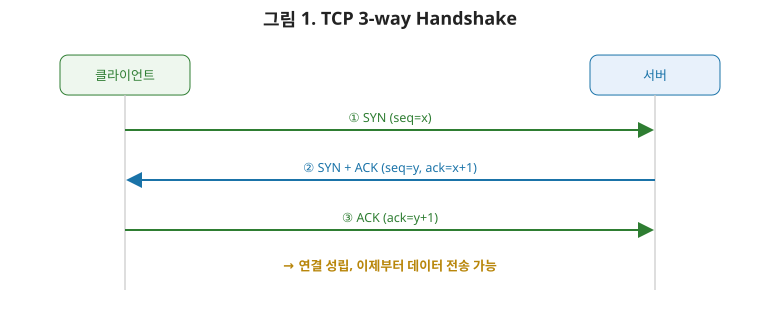
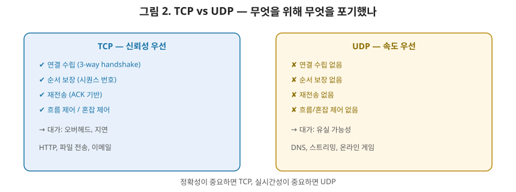

# [네트워크 4편] TCP는 어떻게 신뢰성을 보장하는가 — 3-way handshake부터 혼잡 제어까지

3편에서 IP가 목적지까지 경로를 찾아준다고 했습니다. 그런데 IP는 딱 거기까지만 책임집니다. 패킷이 중간에 유실돼도, 순서가 뒤바뀌어 도착해도 IP는 신경 쓰지 않습니다. **이 빈틈을 메우는 게 전송 계층, 그중에서도 TCP**입니다. 이번 편에서는 TCP가 어떻게 "신뢰성"이라는 걸 만들어내는지, 그리고 그 신뢰성을 포기한 대가로 UDP가 얻는 게 무엇인지 정리하겠습니다.

## 1. 포트 번호 — 같은 컴퓨터 안에서 프로세스를 구분하기

IP 주소가 "어느 컴퓨터인지"를 찾아준다면, 포트 번호는 "그 컴퓨터 안의 어떤 프로세스인지"를 찾아줍니다. 웹 브라우저는 443번(HTTPS), 백엔드 서버는 8080번처럼 포트별로 각각 다른 프로세스가 데이터를 주고받을 수 있는 이유가 이겁니다. **IP 주소 + 포트 번호의 조합을 소켓(Socket)**이라고 부르며, TCP 연결 하나는 (출발지 IP, 출발지 포트, 목적지 IP, 목적지 포트) 네 가지 정보의 조합으로 유일하게 식별됩니다. 같은 서버의 같은 포트(예: 443)로 여러 클라이언트가 동시에 접속해도 서로 다른 연결로 구분되는 이유가 바로 이 네 가지 조합 덕분입니다.

## 2. TCP 3-way Handshake — 연결을 맺는 과정

TCP는 데이터를 주고받기 전에 먼저 "연결"을 맺습니다. 이 연결을 맺는 과정이 그 유명한 **3-way handshake**입니다.

그림의 화살표 위에 적힌 시퀀스 번호(seq)와 확인 번호(ack)를 눈여겨보세요. 서버가 보내는 ②번 메시지의 `ack=x+1`은 "네가 보낸 seq=x까지 잘 받았고, 다음엔 x+1을 기대한다"는 뜻입니다. 이 숫자 하나하나가 곧 신뢰성의 근거가 됩니다.

1. **SYN**: 클라이언트가 서버에게 "연결하고 싶다"는 의미로 `SYN` 플래그를 담은 세그먼트를 보낸다. 이때 자신이 사용할 초기 시퀀스 번호(ISN)도 함께 알린다.
2. **SYN + ACK**: 서버가 "연결 요청을 받았고, 나도 준비됐다"는 의미로 `SYN`과 `ACK` 플래그를 함께 담아 응답한다. 서버도 자신의 초기 시퀀스 번호를 알린다.
3. **ACK**: 클라이언트가 "확인했다"는 의미로 `ACK`를 보내면 연결이 완성된다.

여기서 상급자가 짚어야 할 포인트는 **시퀀스 번호**입니다. 이 handshake 과정에서 서로의 초기 시퀀스 번호를 교환하는 이유는, 이후 주고받을 모든 세그먼트에 순서를 매기기 위해서입니다. 시퀀스 번호가 있어야 수신 측이 "몇 번째 데이터까지 받았는지", "몇 번이 빠졌는지"를 정확히 파악할 수 있고, 이게 바로 다음 절에서 다룰 신뢰성 보장의 기반이 됩니다.

## 3. 연결 종료 — 4-way Termination

연결을 맺을 때는 3단계였지만, 끊을 때는 보통 4단계를 거칩니다. 왜 하나 더 필요할까요? TCP는 양방향 통신이기 때문입니다. 클라이언트가 "나는 더 보낼 데이터가 없다"(`FIN`)고 알려도, 서버는 아직 보낼 데이터가 남아있을 수 있습니다. 그래서 종료는 각 방향마다 독립적으로 이뤄집니다.

1. 클라이언트가 `FIN`을 보낸다 (나는 더 안 보낸다).
2. 서버가 `ACK`로 확인한다.
3. 서버도 보낼 데이터를 다 보낸 뒤 `FIN`을 보낸다 (나도 더 안 보낸다).
4. 클라이언트가 `ACK`로 확인하면 완전히 종료된다.

마지막 `ACK`를 보낸 클라이언트는 곧바로 소켓을 닫지 않고 일정 시간(`TIME_WAIT`) 대기합니다. 혹시 마지막 `ACK`가 유실돼 서버가 `FIN`을 재전송할 경우에 대비하기 위해서입니다. 서버를 운영하다 보면 `TIME_WAIT` 상태의 소켓이 쌓여 포트가 고갈되는 문제를 마주칠 수 있는데, 이게 바로 이 대기 상태 때문입니다.

## 4. TCP가 신뢰성을 만드는 방법

TCP가 "신뢰성 있는 전송"이라고 불리는 이유는 다음 메커니즘들 덕분입니다.

- **시퀀스 번호와 ACK**: 보낸 데이터마다 순서 번호를 매기고, 수신 측은 "여기까지 잘 받았다"는 확인 응답(ACK)을 돌려준다. 순서가 뒤바뀌어 도착해도 시퀀스 번호를 보고 원래 순서로 재조립할 수 있다.
- **재전송(Retransmission)**: 일정 시간 안에 ACK가 오지 않으면, 해당 세그먼트가 유실됐다고 판단하고 다시 보낸다.

### 4-1. 흐름 제어(Flow Control)

수신 측의 처리 속도가 송신 측보다 느리면, 수신 버퍼가 넘쳐 데이터가 유실될 수 있습니다. 이를 막기 위해 수신 측은 자신이 "지금 받을 수 있는 여유 공간"을 **수신 윈도우(receive window)** 크기로 송신 측에 알립니다. 송신 측은 이 윈도우 크기를 넘지 않는 범위에서만 데이터를 보내고, 수신 측 상황에 따라 윈도우 크기가 계속 조정되는 방식(슬라이딩 윈도우)으로 흐름을 제어합니다. **한마디로 흐름 제어는 "받는 쪽이 감당할 수 있는 만큼만 보내라"는 규칙**입니다.

### 4-2. 혼잡 제어(Congestion Control)

흐름 제어가 수신 측 사정을 봐주는 거라면, 혼잡 제어는 **네트워크 중간 구간의 사정**을 봐주는 겁니다. 아무리 수신 측이 여유가 있어도, 중간 라우터나 회선이 혼잡하면 패킷이 유실됩니다. TCP는 처음에 아주 작은 전송량(윈도우)으로 시작해서 문제없이 도착하는 걸 확인할 때마다 점점 전송량을 늘려가는 **느린 시작(Slow Start)** 방식을 씁니다. 그러다 패킷 유실이 감지되면 "지금 네트워크가 혼잡하구나"라고 판단하고 전송량을 확 줄인 뒤 다시 서서히 늘려갑니다. 이 과정을 통해 TCP는 네트워크 상태에 스스로 적응하며 전체 네트워크의 혼잡을 완화합니다.

## 5. UDP — 신뢰성을 포기하고 속도를 얻다

UDP는 TCP와 정반대의 철학을 가진 프로토콜입니다. 연결을 맺는 과정(handshake)도 없고, 시퀀스 번호나 ACK, 재전송, 흐름 제어, 혼잡 제어도 전혀 없습니다. 그냥 "보낸다"가 전부입니다. 헤더도 출발지/목적지 포트, 길이, 체크섬 정도로 아주 단순합니다.

이렇게 아무것도 보장하지 않는데 왜 쓸까요? **보장이 없다는 건 오버헤드도 없다는 뜻**이기 때문입니다. handshake 없이 바로 데이터를 보낼 수 있고, 재전송 대기로 인한 지연도 없습니다. 실시간 스트리밍이나 온라인 게임처럼 "약간의 데이터 유실보다 지연이 더 치명적인" 상황, 그리고 DNS 조회처럼 "요청·응답이 짧고 재전송 로직을 애플리케이션에서 직접 처리해도 되는" 상황에 적합합니다.

## 6. TCP vs UDP, 언제 무엇을 쓸까

| 구분 | TCP | UDP |
|---|---|---|
| 연결 방식 | 연결지향(3-way handshake) | 비연결지향(바로 전송) |
| 신뢰성 | 순서 보장, 재전송 O | 보장 없음 |
| 흐름·혼잡 제어 | O | 없음 |
| 헤더 크기 | 20바이트 이상 | 8바이트 |
| 속도 | 상대적으로 느림 | **빠름** |
| 대표 사용처 | HTTP, 파일 전송, 이메일 | DNS, 스트리밍, 온라인 게임, WebRTC |

실무에서 판단 기준은 명확합니다. **데이터가 하나라도 빠지거나 순서가 바뀌면 안 되는가?** 그렇다면 TCP입니다. **속도와 실시간성이 정확성보다 중요하고, 유실을 애플리케이션 레벨에서 직접 다룰 수 있는가?** 그렇다면 UDP를 고려할 수 있습니다. 대부분의 웹 서비스(HTTP 기반 API)는 정확성이 절대적으로 중요하므로 TCP 위에서 동작하며, 이 흐름은 다음 편에서 다룰 HTTP로 자연스럽게 이어집니다.

## 7. 정리

- 포트 번호는 같은 IP 안에서 프로세스를 구분하며, IP+포트의 조합이 소켓을 이룬다.
- TCP는 3-way handshake로 연결을 맺고, 4-way termination으로 종료하며, 종료 후 `TIME_WAIT`로 잠시 대기한다.
- TCP의 신뢰성은 시퀀스 번호·ACK·재전송으로 만들어지고, 흐름 제어는 수신 측 여유를, 혼잡 제어는 네트워크 상태를 반영해 전송량을 조절한다.
- UDP는 연결·신뢰성 보장을 모두 포기하는 대신 오버헤드가 적어 빠르며, 실시간성이 중요한 상황에 적합하다.
- 선택 기준은 명확하다. 정확성이 중요하면 TCP, 속도와 실시간성이 중요하면 UDP다.

다음 편에서는 우리가 매일 쓰는 HTTP로 넘어가, 요청/응답 구조, HTTP/1.1과 HTTP/2·HTTP/3의 차이, 그리고 캐싱과 쿠키가 동작하는 원리를 다룹니다.
