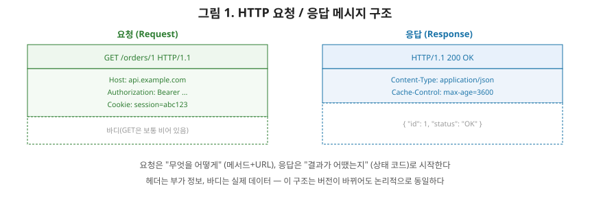
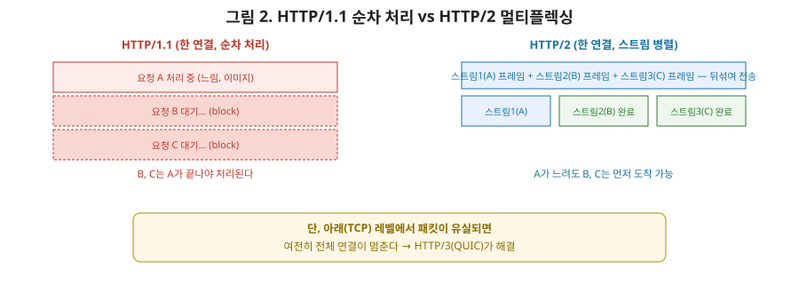

# [네트워크 5편] HTTP, 그리고 HTTP/1.1이 HTTP/3까지 진화한 이유

4편에서 TCP가 신뢰성 있는 전달을 보장한다고 했습니다. 이번 편의 주인공인 **HTTP는 바로 그 TCP(또는 HTTP/3의 경우 QUIC) 위에서 실제 데이터를 어떤 형식으로 주고받을지** 정의하는 응용 계층 프로토콜입니다. 요청/응답 구조부터 시작해서, HTTP가 왜 버전을 거듭하며 진화해야 했는지 순서대로 짚어보겠습니다.

## 1. HTTP 메시지의 구조

HTTP는 요청과 응답이라는 딱 두 종류의 메시지만 주고받습니다.

요청 메시지는 "무엇을, 어떻게 해달라"는 요청 라인(메서드 + URL + 버전)으로 시작해서, 부가 정보를 담은 헤더들, 그리고 실제로 보낼 데이터인 바디로 구성됩니다. 응답 메시지는 "결과가 어땠는지"를 나타내는 상태 라인(버전 + 상태 코드 + 메시지)으로 시작해서, 마찬가지로 헤더와 바디가 이어집니다.

### 1-1. HTTP 메서드

| 메서드 | 의미 | 멱등성 |
|---|---|---|
| GET | 리소스 조회 | O |
| POST | 리소스 생성, 처리 요청 | X |
| PUT | 리소스 전체 교체 | O |
| PATCH | 리소스 일부 수정 | X(스펙상 보장 안 됨) |
| DELETE | 리소스 삭제 | O |

여기서 **멱등성(idempotency)**이라는 개념을 짚고 넘어가야 합니다. 같은 요청을 여러 번 보내도 결과가 동일하게 유지되는 성질을 말합니다. `GET`으로 같은 글을 열 번 조회해도 서버 상태는 변하지 않고, `DELETE`로 같은 리소스를 열 번 삭제 요청해도 결국 "그 리소스가 없는 상태"라는 결과는 동일합니다. 반면 `POST`로 주문을 열 번 요청하면 주문이 열 개 생겨버립니다. 이 성질은 네트워크 오류로 요청을 재시도해야 할 때 "재시도해도 안전한 메서드인가"를 판단하는 핵심 기준이 됩니다.

### 1-2. 상태 코드

| 그룹 | 의미 | 예시 |
|---|---|---|
| 1xx | 정보성(처리 중) | 100 Continue |
| 2xx | 성공 | 200 OK, 201 Created, 204 No Content |
| 3xx | 리다이렉션 | 301 Moved Permanently, 304 Not Modified |
| 4xx | 클라이언트 오류 | 400 Bad Request, 401 Unauthorized, 404 Not Found |
| 5xx | 서버 오류 | 500 Internal Server Error, 503 Service Unavailable |

## 2. HTTP는 상태를 기억하지 않는다 (Stateless)

HTTP의 근본적인 특징은 **무상태(stateless)**입니다. 서버는 이전 요청이 무엇이었는지 전혀 기억하지 못합니다. 요청 하나하나가 독립적으로 처리됩니다. 로그인한 사용자가 다음 페이지로 넘어갈 때마다 "너 로그인했었지?"를 서버가 기억하지 못한다는 뜻이죠. 그래서 클라이언트가 매 요청마다 자신의 상태 정보(로그인 세션 등)를 직접 담아 보내야 하는데, 이 역할을 하는 게 **쿠키**입니다. 서버가 응답에 `Set-Cookie` 헤더로 값을 내려주면, 브라우저는 이후 같은 도메인으로 보내는 모든 요청에 이 쿠키를 자동으로 함께 실어 보냅니다. 쿠키에는 `Secure`(HTTPS에서만 전송), `HttpOnly`(자바스크립트로 접근 불가, XSS 방어), `SameSite`(다른 사이트에서의 요청에 쿠키를 실을지 제어, CSRF 방어) 같은 보안 속성을 붙일 수 있습니다.

## 3. HTTP/1.1의 한계 — Head-of-Line Blocking

초기 HTTP/1.0은 요청 하나마다 TCP 연결을 새로 맺고 끊었습니다. 매번 3-way handshake를 반복하는 셈이니 비효율적이었죠. HTTP/1.1부터는 `Connection: keep-alive`로 하나의 TCP 연결을 재사용할 수 있게 됐습니다.

문제는 이 연결 하나 안에서 요청을 **순서대로, 하나씩** 처리해야 한다는 점입니다. 앞선 요청의 응답이 아직 안 왔는데 큰 이미지 파일이라 오래 걸리고 있다면, 그 뒤에 줄 서 있는 작은 요청들은 앞의 응답이 끝날 때까지 기다려야 합니다. 이걸 **HOL(Head-of-Line) Blocking**이라고 부릅니다. 브라우저들은 이 문제를 우회하려고 한 도메인에 여러 개의 TCP 연결(보통 6개)을 동시에 열어 병렬로 처리했지만, 이는 완전한 해결책이 아니라 TCP 연결 자체의 오버헤드(각 연결마다 3-way handshake, 느린 시작)를 늘리는 임시방편이었습니다.

## 4. HTTP/2 — 멀티플렉싱으로 해결하다

HTTP/2는 **하나의 TCP 연결 안에서 여러 요청·응답을 스트림 단위로 동시에 주고받는 멀티플렉싱**을 도입해 이 문제를 해결했습니다.

그림에서 보듯 HTTP/1.1은 요청을 한 줄로 세워 순서대로 처리하지만, HTTP/2는 요청들을 작은 프레임 단위로 쪼개 하나의 연결 위에 뒤섞어 보내고, 각 프레임에 스트림 ID를 붙여 수신 측에서 다시 구분해 조립합니다. 앞선 요청이 오래 걸려도 뒤의 요청이 먼저 도착할 수 있어, 브라우저가 연결을 여러 개 열 필요가 없어졌습니다. 여기에 더해 HTTP/2는 반복되는 헤더 정보를 압축하는 **HPACK**, 그리고 클라이언트가 요청하지 않은 리소스를 서버가 미리 보내주는 **서버 푸시** 기능도 도입했습니다(다만 서버 푸시는 실효성 문제로 최근엔 잘 쓰이지 않습니다).

## 5. HTTP/3 — TCP를 버리고 QUIC으로

HTTP/2가 HOL Blocking을 해결한 것처럼 보였지만, 사실 완전히 해결하지 못한 문제가 하나 남아 있었습니다. **TCP 계층 자체의 HOL Blocking**입니다. HTTP/2가 스트림을 아무리 잘 나눠도, 그 아래 TCP는 여전히 "순서가 보장된 하나의 바이트 스트림"으로 동작합니다. 패킷 하나가 유실되면, TCP는 그 패킷이 재전송되어 순서가 맞춰질 때까지 그 뒤에 도착한 모든 데이터를(다른 스트림에 속한 데이터라도) 애플리케이션에 넘겨주지 않고 붙잡아둡니다. 즉 HTTP 레벨에서는 스트림이 독립적이어도, TCP 레벨에서는 여전히 하나로 묶여 있던 겁니다.

HTTP/3는 이 문제를 근본적으로 해결하기 위해 TCP를 버리고, **UDP 위에 구현된 QUIC**이라는 새 전송 프로토콜을 사용합니다. QUIC은 스트림마다 독립적으로 순서를 관리하기 때문에, 한 스트림에서 패킷이 유실돼도 다른 스트림은 영향을 받지 않습니다. 4편에서 UDP가 "신뢰성을 포기하는 대신 오버헤드가 없다"고 했는데, QUIC은 UDP 위에 스트림별 신뢰성·순서 보장·혼잡 제어 로직을 애플리케이션 레벨에서 직접 구현해, TCP의 신뢰성과 UDP의 유연함을 동시에 취한 셈입니다. 여기에 QUIC은 TLS 암호화를 프로토콜 안에 기본으로 내장하고 있어, 연결을 맺는 handshake 과정도 TCP+TLS보다 더 적은 왕복 횟수로 끝낼 수 있습니다.

## 6. HTTP 버전 한눈에 비교

| 구분 | HTTP/1.1 | HTTP/2 | HTTP/3 |
|---|---|---|---|
| 전송 계층 | TCP | TCP | **QUIC (UDP 기반)** |
| 연결당 요청 처리 | 순차적(HOL Blocking) | 멀티플렉싱 | 멀티플렉싱(TCP HOL도 해결) |
| 헤더 압축 | 없음 | HPACK | QPACK |
| 암호화 | 별도(TLS 얹음) | 별도(TLS 얹음) | **기본 내장** |
| 연결 수립 비용 | TCP handshake | TCP handshake | 더 적은 왕복 |

## 7. 캐싱 — 아예 요청을 안 보내는 게 가장 빠르다

아무리 프로토콜이 빨라져도 요청 자체를 안 보내는 것보다 빠를 순 없습니다. HTTP 캐싱은 이전에 받은 응답을 재사용해 네트워크 왕복 자체를 생략합니다.

- **신선도(freshness)**: 응답 헤더의 `Cache-Control: max-age=3600` 같은 값으로 "이 응답은 1시간 동안 신선하다"고 알려주면, 그 시간 안에는 서버에 묻지도 않고 캐시된 응답을 바로 씁니다.
- **재검증(validation)**: 신선도가 지났다면, 캐시를 완전히 버리는 게 아니라 서버에 "혹시 바뀌었니?"라고 물어봅니다. 이때 `ETag`(리소스의 지문 같은 값)나 `Last-Modified`(마지막 수정 시각)를 함께 보내면, 바뀐 게 없을 경우 서버는 바디 없이 `304 Not Modified`만 돌려줘 대역폭을 아낍니다.

## 8. 정리

- HTTP 메시지는 요청 라인/상태 라인 + 헤더 + 바디로 구성되며, 메서드의 멱등성은 재시도 안전성을 판단하는 기준이 된다.
- HTTP는 무상태 프로토콜이라 쿠키로 상태(세션)를 클라이언트가 직접 들고 다닌다.
- HTTP/1.1은 연결 재사용은 가능해졌지만 순차 처리로 인한 HOL Blocking이 있었고, HTTP/2는 멀티플렉싱으로 이를 완화했다.
- 그러나 TCP 자체의 HOL Blocking은 HTTP/2로도 못 고쳤고, HTTP/3는 QUIC(UDP 기반)으로 전송 계층부터 바꿔 이를 근본적으로 해결했다.
- 캐싱은 신선도와 재검증 두 단계로 동작하며, 캐시 히트가 늘어날수록 네트워크 왕복 자체를 줄여준다.

다음 편에서는 DNS로 넘어가, 도메인 이름이 IP 주소로 바뀌는 계층적 조회 과정과, 그 과정에서 반복적으로 등장하는 캐싱과 TTL을 다룹니다.
