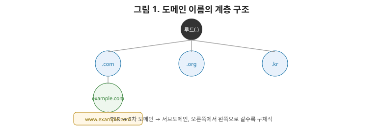
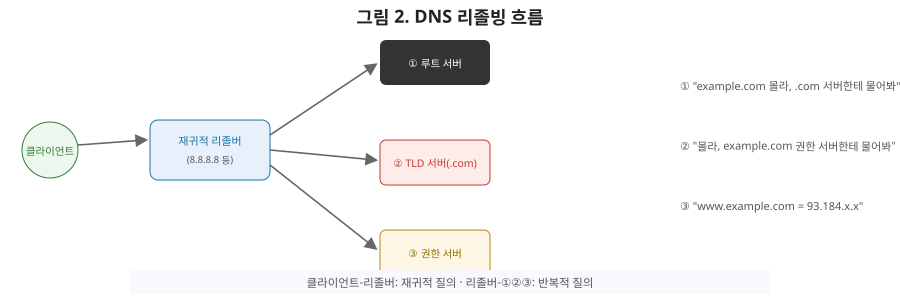

# [네트워크 6편] DNS — 도메인 이름은 어떻게 IP 주소가 되는가

3편에서 라우터는 IP 주소만 보고 길을 찾아간다고 했습니다. 하지만 우리는 브라우저에 IP 주소가 아니라 `www.example.com` 같은 도메인 이름을 입력합니다. 이 이름을 실제 IP 주소로 바꿔주는 게 **DNS(Domain Name System)**입니다. 이번 편에서는 도메인 이름의 계층 구조부터, 이름 하나를 풀어내기 위해 뒤에서 벌어지는 조회 과정, 그리고 이 모든 걸 빠르게 만들어주는 캐싱까지 다룹니다.

## 1. 도메인 이름의 계층 구조

`www.example.com`을 오른쪽부터 읽어보면 도메인 이름이 왜 계층적인지 알 수 있습니다.

- **루트(.)**: 모든 도메인의 시작점. 보통 생략되지만 실제로는 `www.example.com.`처럼 맨 끝에 점이 하나 더 있다고 생각하면 됩니다.
- **TLD(Top-Level Domain)**: `.com`, `.org`, `.kr`처럼 최상위 영역.
- **2차 도메인**: `example`처럼 실제 조직이 등록한 이름.
- **서브도메인**: `www`, `api`, `mail`처럼 조직이 자유롭게 나눠 쓰는 하위 영역.

이 구조가 3편에서 본 IP 주소의 네트워크부/호스트부 개념과 닮아 있다는 걸 눈치채셨을 겁니다. **점점 오른쪽에서 왼쪽으로 갈수록(루트에서 서브도메인으로 갈수록) 더 구체적인 대상을 가리킨다는 점에서 두 체계 모두 "큰 범위에서 작은 범위로 좁혀가는" 계층적 설계**를 공유합니다.

## 2. DNS 리졸빙 — 이름을 IP로 바꾸는 전체 과정

브라우저가 `www.example.com`의 IP 주소를 알아내는 과정을 순서대로 따라가 보겠습니다.

1. **로컬 캐시 확인**: 브라우저와 OS는 최근에 조회했던 도메인-IP 매핑을 자체적으로 캐싱해둡니다. 여기 있으면 조회는 여기서 끝입니다.
2. **재귀적 리졸버(Recursive Resolver)에게 질의**: 캐시에 없다면, 보통 ISP가 제공하거나 사용자가 직접 설정한 리졸버(예: `8.8.8.8`, `1.1.1.1`)에게 "이 도메인의 IP가 뭐야?"라고 묻습니다. 이 리졸버는 클라이언트를 대신해 아래 3~5번 과정을 전부 수행해준다는 의미에서 "재귀적"이라고 부릅니다.
3. **루트 DNS 서버에 질의**: 리졸버는 먼저 루트 서버에게 묻습니다. 루트 서버는 답을 모르지만, "`.com`을 담당하는 TLD 서버는 여기야"라고 알려줍니다.
4. **TLD DNS 서버에 질의**: 리졸버는 `.com` TLD 서버에게 다시 묻습니다. TLD 서버도 정확한 답은 모르지만, "`example.com`을 관리하는 권한 있는(authoritative) 서버는 여기야"라고 알려줍니다.
5. **권한 있는(Authoritative) DNS 서버에 질의**: 리졸버는 마지막으로 이 서버에게 묻고, 여기서 비로소 `www.example.com`의 실제 IP 주소를 받습니다.
6. **응답 전달 및 캐싱**: 리졸버는 이 결과를 클라이언트에게 돌려주는 동시에, 자신도 이 매핑을 잠시 캐싱해 다음 요청부터는 3~5번 과정을 생략합니다.

여기서 상급자가 짚어야 할 용어 구분이 있습니다. 클라이언트와 리졸버 사이의 질의는 **재귀적(recursive)** 질의입니다("네가 알아서 최종 답을 찾아와줘"). 반면 리졸버와 루트/TLD/권한 서버 사이의 질의는 **반복적(iterative)** 질의입니다("네가 아는 만큼만 알려줘, 나머지는 내가 다음 서버에 물어볼게"). 이 두 방식의 차이를 아는 것만으로도 DNS 구조에 대한 이해도가 한 단계 올라갑니다.

## 3. 레코드 타입 — DNS가 저장하는 정보의 종류

DNS 서버는 도메인-IP 매핑 말고도 다양한 정보를 저장합니다.

| 레코드 타입 | 의미 |
|---|---|
| A | 도메인 → IPv4 주소 |
| AAAA | 도메인 → IPv6 주소 |
| CNAME | 도메인 → 다른 도메인 이름(별칭) |
| MX | 도메인의 메일 서버 정보 |
| NS | 이 도메인을 관리하는 네임서버 정보 |
| TXT | 임의의 텍스트(도메인 소유권 검증, SPF 등에 사용) |

실무에서 `CNAME`을 자주 마주치는데, `blog.example.com`을 `example.github.io` 같은 외부 서비스로 연결할 때 A 레코드로 IP를 직접 박아두지 않고 CNAME으로 도메인 이름을 참조하게 만듭니다. 그러면 그 외부 서비스의 IP가 바뀌어도 우리 쪽 DNS 설정은 건드릴 필요가 없어집니다.

## 4. TTL과 캐싱 — 빠르지만 갱신은 느리다

DNS 조회 결과에는 **TTL(Time To Live)**이라는 값이 함께 옵니다. "이 매핑 정보를 몇 초 동안 캐싱해도 좋다"는 뜻입니다. TTL이 3600(1시간)이라면, 리졸버와 클라이언트는 1시간 동안 다시 조회하지 않고 캐싱된 값을 그대로 씁니다. 이게 DNS 조회를 빠르게 만드는 핵심이지만, 동시에 **변경 사항이 전파되는 데 시간이 걸린다는 단점**이기도 합니다.

예를 들어 서버 이전 등으로 IP 주소를 바꿨는데 기존 TTL이 24시간이었다면, 최대 24시간 동안은 일부 사용자가 예전 IP로 계속 접속을 시도할 수 있습니다. 그래서 실무에서는 서버 이전이나 인프라 변경을 계획할 때, **미리 TTL을 짧게(예: 300초) 낮춰뒀다가 변경 작업을 마친 뒤 다시 원래 값으로 늘리는** 방식을 씁니다. 이 TTL 조정 타이밍을 놓치면 배포 이후에도 한참 동안 옛날 서버로 트래픽이 들어오는 사고로 이어질 수 있으니 주의해야 합니다.

## 5. 브라우저에 주소를 입력하면 벌어지는 일 (미리보기)

지금까지 다룬 내용을 한 번 이어붙여 보겠습니다. 브라우저에 `https://example.com`을 입력하면, 먼저 이번 편에서 다룬 **DNS 조회**로 IP를 알아내고, 그 IP를 향해 4편에서 다룬 **TCP 3-way handshake**로 연결을 맺고, HTTPS라면 TLS handshake까지 거친 뒤(9편에서 다룰 내용), 마지막으로 5편에서 다룬 **HTTP 요청/응답**이 오갑니다. 지금까지 6편 동안 아래에서 위로 쌓아 올린 계층들이, 결국 우리가 매일 무심코 누르는 엔터 키 한 번 안에 전부 압축돼 있는 셈입니다.

## 6. 정리

- 도메인 이름은 루트 → TLD → 2차 도메인 → 서브도메인 순으로 계층화돼 있으며, IP 주소의 네트워크부/호스트부 구조와 같은 설계 철학을 공유한다.
- DNS 리졸빙은 클라이언트-리졸버 간 재귀적 질의와, 리졸버-루트/TLD/권한 서버 간 반복적 질의로 나뉜다.
- A, AAAA, CNAME, MX, NS, TXT 등 다양한 레코드 타입으로 도메인과 관련된 여러 정보를 저장한다.
- TTL은 캐싱 기간을 결정하며, 조회는 빠르게 해주지만 변경 사항 전파는 그만큼 느려진다. 인프라 변경 전에는 TTL을 미리 낮춰두는 게 실무 관행이다.

다음 편에서는 소켓과 I/O 모델로 넘어가, 블로킹·논블로킹과 동기·비동기의 차이, 그리고 수많은 커넥션을 동시에 처리하기 위한 epoll·select 같은 I/O 멀티플렉싱 기법을 다룹니다.
