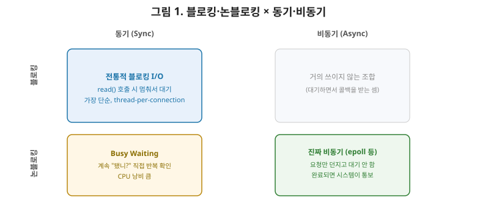
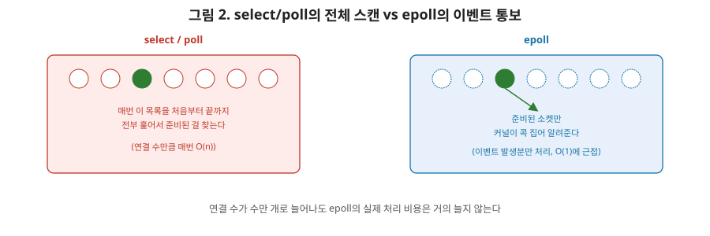

# [네트워크 7편] 서버는 수만 개의 연결을 어떻게 동시에 처리할까 — 소켓과 I/O 모델

지금까지 6편에 걸쳐 데이터가 어떤 프로토콜로, 어떤 형식으로 오가는지 다뤘습니다. 이번 편은 관점을 바꿔서, **서버가 이 수많은 연결을 코드 레벨에서 실제로 어떻게 처리하는지**를 다룹니다. 블로킹/논블로킹, 동기/비동기라는 헷갈리기 쉬운 개념부터, 왜 Nginx나 Redis 같은 프로그램이 epoll이라는 걸 쓰는지까지 순서대로 정리하겠습니다.

## 1. 소켓 — 프로그램이 네트워크를 만지는 창구

4편에서 소켓을 "IP 주소 + 포트 번호의 조합"이라고 정의했습니다. 프로그래밍 관점에서 보면 소켓은 조금 더 구체적입니다. **운영체제(커널)가 네트워크 통신을 위해 제공하는 파일 디스크립터(file descriptor)**입니다. 리눅스에서는 파일이든, 네트워크 연결이든, 심지어 파이프든 전부 파일 디스크립터라는 정수 번호로 다뤄지는데, 소켓도 예외가 아닙니다. 개발자가 `read()`, `write()` 같은 함수로 소켓을 다루면, 커널이 그 뒤에서 실제 네트워크 카드와의 데이터 송수신을 대신 처리해주는 구조입니다.

## 2. 블로킹 vs 논블로킹, 동기 vs 비동기

이 네 단어는 정말 자주 혼동됩니다. 기준을 명확히 나눠서 설명하겠습니다.

- **블로킹(Blocking) vs 논블로킹(Non-blocking)**: 함수를 호출했을 때 **결과가 준비될 때까지 호출한 쪽이 멈춰서 기다리는가**의 문제입니다. 블로킹은 데이터가 도착할 때까지 `read()` 호출이 리턴되지 않고 멈춰 있습니다. 논블로킹은 데이터가 없으면 "지금은 없다"는 신호를 즉시 돌려주고, 호출한 쪽은 계속 다른 일을 할 수 있습니다.
- **동기(Sync) vs 비동기(Async)**: 작업이 끝났을 때 **그 결과를 누가 처리하는가**의 문제입니다. 동기는 호출한 쪽이 결과를 직접 확인하고 처리합니다. 비동기는 작업이 끝나면 시스템(또는 콜백)이 알아서 호출한 쪽에 통보하고, 호출한 쪽은 결과가 나올 때까지 신경 쓸 필요가 없습니다.

| 구분 | 동기(Sync) | 비동기(Async) |
|---|---|---|
| 블로킹(Blocking) | 요청 후 결과가 올 때까지 멈춰서 대기 | 거의 쓰이지 않는 조합 |
| 논블로킹(Non-blocking) | 계속 "됐니?"라고 직접 반복 확인(busy waiting) | 요청만 던져두고, 완료되면 시스템이 알려줌(진짜 비동기) |

실무에서 가장 많이 쓰이는 조합은 이해하기 쉬운 **블로킹+동기**(전통적인 스레드 기반 서버)와, 성능이 중요한 곳에서 쓰는 **논블로킹+비동기**(이벤트 기반 서버)입니다. 나머지 두 조합은 이론적으로는 가능하지만 실무에서 잘 쓰이지 않습니다.

## 3. Thread-per-Connection 모델의 한계

가장 직관적인 서버 구현 방식은 "연결 하나마다 스레드 하나를 배정"하는 것입니다. 각 스레드는 블로킹 방식으로 자기 소켓만 처리하면 되니 코드가 단순합니다. 문제는 연결 수가 늘어날 때 벌어집니다. 스레드 하나는 보통 수백 KB에서 1MB 이상의 스택 메모리를 차지하고, 스레드가 많아질수록 CPU가 어떤 스레드를 실행할지 계속 바꿔가며 처리하는 **컨텍스트 스위칭 비용**도 커집니다. 동시 접속자가 수천, 수만 명 규모가 되면 스레드를 그만큼 만드는 것 자체가 서버 자원을 갉아먹는 병목이 됩니다. 이 한계를 흔히 **C10K 문제(동시 접속 1만 개를 처리하기 어려운 문제)**라고 부릅니다.

## 4. I/O 멀티플렉싱 — 하나의 스레드로 여러 소켓 감시하기

C10K 문제의 해법은 "연결마다 스레드를 쓰지 말고, 적은 수의 스레드가 많은 소켓을 동시에 감시하게 하자"는 발상입니다. 이걸 **I/O 멀티플렉싱**이라고 부르고, 대표적인 구현이 `select`, `poll`, `epoll`입니다.

- **select**: 감시하고 싶은 소켓 목록을 커널에 통째로 넘기면, 커널이 그 목록을 처음부터 끝까지 훑어서 "이 중에 준비된 애가 있어?"를 알려줍니다. 감시 대상이 늘어날수록 매번 전체를 훑어야 해서 느려지고(O(n)), 감시할 수 있는 소켓 개수에도 제한(`FD_SETSIZE`, 보통 1024개)이 있습니다.
- **poll**: select와 동작 방식은 비슷하지만 개수 제한은 없습니다. 다만 여전히 매번 전체 목록을 순회해야 하는 O(n) 방식이라는 한계는 그대로입니다.
- **epoll**(리눅스): 접근 방식 자체가 다릅니다. 커널에 "이 소켓들을 감시해줘"라고 한 번만 등록해두면, 이후에는 매번 전체를 훑을 필요 없이 **실제로 이벤트가 발생한 소켓만** 커널이 콕 집어 알려줍니다. 감시 대상이 몇만 개로 늘어나도 실제 처리 비용은 "이벤트가 발생한 소켓 수"에 비례하지, 전체 개수에 비례하지 않습니다.

| 구분 | select | poll | epoll |
|---|---|---|---|
| 감시 대상 개수 제한 | 있음(보통 1024) | 없음 | 없음 |
| 준비된 소켓 탐색 방식 | 매번 전체 스캔 | 매번 전체 스캔 | **이벤트 발생 소켓만 통보** |
| 시간 복잡도(대략) | O(n) | O(n) | O(1)에 가까움 |
| 대표 사용처 | 레거시 코드 | 레거시 코드 | **Nginx, Redis, Node.js 등** |

이 표에서 보이듯, 오늘날 대규모 트래픽을 처리하는 서버(Nginx, Redis, Node.js의 이벤트 루프 등)는 거의 예외 없이 epoll(또는 macOS/BSD의 kqueue) 기반으로 동작합니다. 적은 수의 스레드(심지어 하나)로도 수만 개의 커넥션을 감시할 수 있기 때문입니다.

## 5. 커넥션도 아껴 쓴다 — 커넥션 풀

I/O 모델과는 별개로, 연결을 맺는 비용 자체를 줄이는 방법도 있습니다. 4편에서 TCP 연결을 맺으려면 3-way handshake가 필요하다고 했습니다. 이 비용이 결코 공짜가 아니기 때문에, DB 연결이나 외부 API 호출처럼 반복적으로 같은 대상과 통신해야 하는 경우에는 **매번 연결을 새로 맺고 끊는 대신, 이미 맺어둔 연결을 재사용**합니다. 이게 **커넥션 풀(Connection Pool)**의 기본 아이디어입니다. 스프링에서 HikariCP 같은 DB 커넥션 풀을 쓰는 이유도 결국 이 3-way handshake와 연결 유지 비용을 아끼기 위해서입니다. I/O 모델이 "많은 연결을 효율적으로 감시하는" 문제를 푼다면, 커넥션 풀은 "연결 자체를 덜 만드는" 방향으로 문제를 풉니다.

## 6. 정리

- 소켓은 커널이 제공하는 통신 종단점이며, 개발자는 파일 디스크립터를 다루듯 소켓을 다룬다.
- 블로킹/논블로킹은 "호출자가 대기하는가", 동기/비동기는 "결과를 누가 처리하는가"의 문제이며, 실무에서는 블로킹+동기 또는 논블로킹+비동기 조합이 주로 쓰인다.
- 연결마다 스레드를 배정하는 모델은 스레드 수가 늘어날수록 메모리와 컨텍스트 스위칭 비용이 커져 대규모 동시 접속(C10K)에 한계가 있다.
- select·poll은 매번 전체 소켓 목록을 훑는 O(n) 방식이지만, epoll은 이벤트가 발생한 소켓만 통보받아 대규모 커넥션을 효율적으로 처리한다.
- 연결을 맺는 비용 자체를 줄이는 커넥션 풀도 I/O 효율화의 또 다른 축이다.

다음 편에서는 네트워크 보안으로 넘어가, TLS/SSL 핸드셰이크가 대칭키와 비대칭키를 어떻게 조합해서 안전한 통신을 만들어내는지, 그리고 HTTPS와 방화벽의 동작 원리를 다룹니다.
