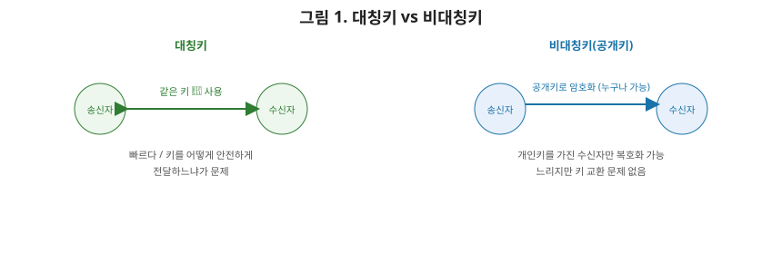
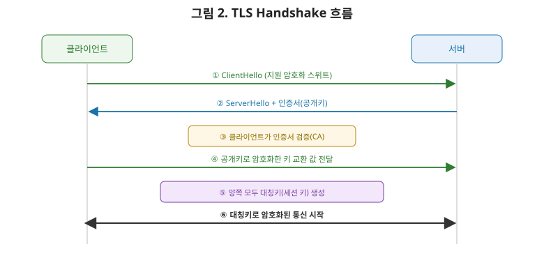

# [네트워크 8편] TLS는 어떻게 두 마리 토끼(속도와 안전)를 잡는가

5편에서 HTTP가 평문으로 오간다고 했습니다. 문제는 이 평문이 3편에서 다룬 여러 라우터를 거치는 동안, 중간의 누군가가 마음만 먹으면 다 들여다볼 수 있다는 겁니다. 이 문제를 해결하는 게 **TLS(Transport Layer Security, 예전 이름은 SSL)**입니다. 이번 편에서는 TLS가 "빠른 암호화"와 "안전한 키 교환"이라는 상충하는 두 요구를 어떻게 동시에 만족시키는지, 그리고 방화벽이 어떤 계층에서 무엇을 걸러내는지 정리하겠습니다.

## 1. 암호화의 두 방식: 대칭키와 비대칭키

### 1-1. 대칭키(Symmetric Key)

같은 키로 암호화하고 복호화합니다. 연산이 단순해서 **속도가 빠릅니다.** 문제는 이 키를 상대방에게 어떻게 안전하게 전달하느냐입니다. 키를 평문으로 그냥 보내면 중간에서 누군가 가로채 똑같이 복호화할 수 있으니 의미가 없습니다. 이걸 **키 교환 문제**라고 부릅니다.

### 1-2. 비대칭키(Asymmetric Key, 공개키 암호화)

키를 **공개키**와 **개인키** 한 쌍으로 만듭니다. 공개키로 암호화한 데이터는 오직 짝을 이루는 개인키로만 풀 수 있습니다. 공개키는 말 그대로 누구에게나 공개해도 안전합니다. 누가 그 공개키로 데이터를 암호화해서 보내도, 개인키를 가진 사람만 풀 수 있으니까요. 키 교환 문제는 해결되지만, 연산이 훨씬 복잡해서 **속도가 느립니다.**

| 구분 | 대칭키 | 비대칭키(공개키) |
|---|---|---|
| 키 개수 | 1개(암호화·복호화 동일) | 2개(공개키·개인키 쌍) |
| 속도 | **빠름** | 느림 |
| 키 교환 문제 | 있음(안전하게 전달할 방법 필요) | **없음**(공개키는 공개해도 안전) |
| 대표 알고리즘 | AES | RSA, ECDSA |

## 2. TLS의 해법: 두 방식을 조합한다

TLS는 "그럼 둘 다 쓰면 되지 않나?"라는 발상으로 이 딜레마를 해결합니다. **비대칭키로 안전하게 대칭키(세션 키)를 교환한 뒤, 실제 대량의 데이터는 빠른 대칭키로 암호화**합니다. 연결을 맺는 아주 짧은 순간에만 느린 비대칭키 연산을 쓰고, 이후 오랫동안 오갈 실제 데이터는 빠른 대칭키로 처리하는 겁니다. 이게 바로 다음 절에서 볼 TLS handshake의 핵심 목적입니다.

## 3. TLS Handshake — 안전한 연결을 만드는 과정

1. **ClientHello**: 클라이언트가 "나는 이런 암호화 방식들을 지원해"라고 지원 가능한 암호화 스위트 목록을 보낸다.
2. **ServerHello + 인증서**: 서버는 그중 하나를 선택하고, 자신의 **공개키가 담긴 인증서**를 클라이언트에게 보낸다.
3. **인증서 검증**: 클라이언트는 이 인증서가 신뢰할 수 있는 CA(인증 기관)가 서명한 게 맞는지 확인한다(다음 절에서 자세히).
4. **키 교환**: 클라이언트는 대칭키로 쓸 값(pre-master secret)을 만들어 서버의 **공개키로 암호화**해서 보낸다. 서버만이 자신의 개인키로 이걸 풀 수 있다.
5. **세션 키 생성**: 이제 양쪽 다 같은 값을 알고 있으니, 이 값을 바탕으로 이후 통신에 쓸 **대칭키(세션 키)**를 각자 만들어낸다.
6. **암호화 통신 시작**: 이때부터는 3~4단계의 느린 비대칭키 연산 없이, 빠른 대칭키로 실제 데이터를 암호화해서 주고받는다.

## 4. 인증서와 CA — "이 공개키가 진짜 그 사이트 것이다"

여기서 상급자가 짚어야 할 문제가 하나 있습니다. 서버가 보낸 공개키를 어떻게 믿을 수 있을까요? 중간에서 누군가가 진짜 서버인 척하며 자기 공개키를 대신 보낼 수도 있지 않을까요(중간자 공격, MITM)? 이걸 막는 게 **인증서**와 **CA(Certificate Authority, 인증 기관)**입니다.

CA는 "이 공개키는 진짜 `example.com`의 것이 맞다"는 걸 자신의 개인키로 서명해서 보증합니다. 브라우저와 운영체제에는 이미 신뢰할 수 있는 루트 CA 목록이 내장돼 있고, 클라이언트는 서버가 보낸 인증서의 서명을 이 루트 CA들의 공개키로 검증합니다. 검증이 성공하면 "이 CA가 보증했으니 이 공개키는 진짜다"라고 신뢰하는 겁니다. 브라우저 주소창의 자물쇠 아이콘이 바로 이 검증이 성공했다는 표시입니다.

## 5. TLS 1.3 — 더 빠르고, 더 안전하게

TLS 1.2까지는 handshake에 왕복이 여러 번 필요했지만, **TLS 1.3**은 이 과정을 크게 단순화해 **1-RTT(한 번의 왕복)**만으로 handshake를 끝낼 수 있게 개선했습니다(재접속 시에는 0-RTT도 가능합니다). 5편에서 다룬 HTTP/3(QUIC)가 TLS를 프로토콜에 기본 내장해 연결 수립 왕복을 줄였다고 했는데, 그 배경에 바로 이 TLS 1.3의 개선이 있습니다. 또한 TLS 1.3은 취약점이 발견된 구식 암호화 알고리즘들을 아예 목록에서 제거해, 협상 단계에서 안전하지 않은 방식이 선택될 여지 자체를 없앴습니다.

## 6. HTTPS = HTTP + TLS

여기까지 오면 HTTPS가 무엇인지는 한 문장으로 정리됩니다. **HTTPS는 HTTP 메시지를 TLS로 감싸서 전송하는 것**입니다. 5편에서 본 요청/응답 구조나 메서드, 상태 코드는 전혀 바뀌지 않습니다. 다만 그 내용물이 평문이 아니라 TLS 세션 키로 암호화된 상태로 오간다는 점만 다릅니다. 그래서 URL이 `https://`로 시작하면 기본 포트도 HTTP의 80번이 아니라 443번을 씁니다.

## 7. 방화벽 — 어느 계층에서 무엇을 거르는가

TLS가 "내용을 못 읽게" 막는다면, 방화벽은 애초에 "허락되지 않은 연결 자체를 차단"합니다. 방화벽도 어느 계층의 정보를 기준으로 판단하느냐에 따라 종류가 나뉩니다.

| 구분 | 판단 기준(계층) | 특징 |
|---|---|---|
| 패킷 필터링 방화벽 | 3~4계층(IP, 포트) | 출발지/목적지 IP·포트로 단순 허용/차단 |
| 상태 기반(Stateful) 방화벽 | 4계층 | 연결의 상태(핸드셰이크 중인지, 이미 맺어진 연결인지)까지 추적해 판단 |
| WAF(웹 방화벽) | 7계층(HTTP) | HTTP 요청 내용을 분석해 SQL 인젝션, XSS 같은 공격 패턴 탐지 |

1편에서 스위치·라우터·로드밸런서를 계층별로 구분했던 원리가 여기도 그대로 적용됩니다. **더 상위 계층까지 들여다볼수록 더 정교한 판단이 가능하지만, 그만큼 더 많은 처리 비용이 든다**는 트레이드오프입니다.

## 8. 정리

- 대칭키는 빠르지만 키 교환이 문제이고, 비대칭키는 키 교환은 안전하지만 느리다.
- TLS는 비대칭키로 대칭키(세션 키)를 안전하게 교환한 뒤, 실제 데이터는 빠른 대칭키로 암호화하는 방식으로 두 장점을 결합한다.
- 서버의 공개키가 진짜인지는 CA가 서명한 인증서로 검증하며, 브라우저에 내장된 루트 CA 목록이 그 신뢰의 출발점이다.
- TLS 1.3은 handshake를 1-RTT로 줄이고 취약한 암호화 방식을 제거해 더 빠르고 안전해졌다.
- 방화벽은 3~4계층 기반 패킷 필터링부터 7계층까지 들여다보는 WAF까지, 어느 계층을 기준으로 판단하느냐로 종류가 나뉜다.

다음 편에서는 로드밸런싱과 CDN으로 넘어가, 리버스 프록시의 역할, L4·L7 로드밸런싱의 차이, 그리고 CDN이 캐싱으로 사용자와 서버 사이의 물리적 거리를 줄이는 원리를 다룹니다.
