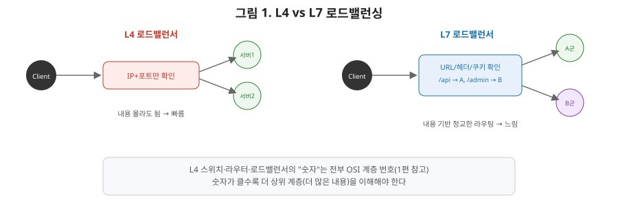
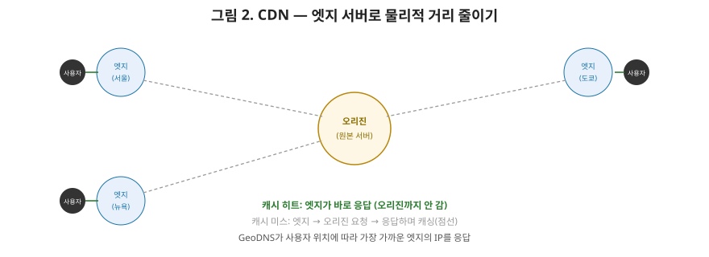

# [네트워크 9편] 서버가 여러 대일 때: 로드밸런싱과 CDN

지금까지 8편 동안 클라이언트 하나와 서버 하나 사이의 연결을 깊게 파봤습니다. 하지만 실제 서비스는 서버가 한 대가 아닙니다. 트래픽이 늘어나면 서버를 여러 대로 늘리는 **스케일아웃**을 하게 되는데, 그러면 새로운 질문이 생깁니다. 클라이언트는 어느 서버로 가야 할까요? 이번 편에서는 이 질문에 답하는 로드밸런싱과, 아예 서버까지 갈 필요 없이 사용자 근처에서 응답해주는 CDN을 다룹니다.

## 1. 포워드 프록시 vs 리버스 프록시

프록시는 "대신 요청을 전달해주는 중간자"인데, 누구를 대신하느냐에 따라 이름이 갈립니다.

- **포워드 프록시**: 클라이언트 편에 서서 클라이언트를 대신해 요청을 보냅니다. 회사에서 특정 사이트 접속을 통제하거나, VPN처럼 클라이언트의 IP를 숨길 때 씁니다.
- **리버스 프록시**: 서버 편에 서서 서버를 대신해 요청을 받습니다. 클라이언트는 리버스 프록시만 알고, 그 뒤에 실제 서버가 몇 대인지, 어떤 구조인지는 전혀 모릅니다.

**로드밸런서는 리버스 프록시의 대표적인 형태**입니다. 클라이언트 입장에서는 로드밸런서 하나에게 요청을 보내는 것처럼 보이지만, 실제로는 그 뒤에서 여러 서버 중 하나가 처리합니다.

## 2. L4 로드밸런싱 vs L7 로드밸런싱

1편에서 예고했던 그 L4, L7 숫자가 여기서 다시 나옵니다. 로드밸런서가 **어느 계층의 정보까지 열어보고 트래픽을 분산하는지**에 따라 성격이 완전히 달라집니다.

| 구분 | L4 로드밸런싱 | L7 로드밸런싱 |
|---|---|---|
| 판단 기준 | IP 주소, 포트(4계층까지) | **HTTP 헤더, URL, 쿠키 내용(7계층)** |
| 내용 이해 | 요청 내용을 몰라도 됨 | 요청 내용을 파싱해서 이해해야 함 |
| 처리 속도 | **빠름** | 상대적으로 느림(파싱 비용) |
| 라우팅 정교함 | 단순(포트 기준으로만 분산) | **정교함**(경로별·헤더별 분산 가능) |
| 대표 예시 | AWS NLB, L4 스위치 | Nginx, AWS ALB, Kubernetes Ingress |

L4는 패킷을 열어보지 않고 IP·포트만 보고 빠르게 넘기기 때문에 성능이 중요한 곳에 적합하고, L7은 `/api/`로 시작하는 요청은 A서버군으로, `/admin/`으로 시작하는 요청은 B서버군으로 보내는 것처럼 **요청 내용에 따른 정교한 라우팅**이 필요할 때 씁니다. 6편에서 다룬 스프링 MVC의 `DispatcherServlet`이 URL을 보고 컨트롤러를 찾아가는 것과 비슷한 역할을, L7 로드밸런서는 애플리케이션보다 한 단계 앞에서 미리 수행하는 셈입니다.

## 3. 로드밸런싱 알고리즘

여러 서버 중 "이번 요청은 누구에게 보낼지" 결정하는 방식도 여러 가지입니다.

| 알고리즘 | 방식 |
|---|---|
| 라운드 로빈 | 순서대로 돌아가며 균등하게 분배 |
| 최소 연결(Least Connection) | 현재 연결 수가 가장 적은 서버로 |
| IP 해시 | 클라이언트 IP를 해싱해 항상 같은 서버로(세션 유지에 유리) |
| 가중치 기반 | 서버 성능에 따라 트래픽 비율을 다르게 배분 |

이 중 **IP 해시(또는 쿠키 기반 스티키 세션)**를 상급자 관점에서 짚어볼 만합니다. 로그인 세션 정보를 서버 메모리에 저장하는 구조라면, 같은 사용자가 매번 다른 서버로 라우팅될 경우 로그인이 풀리는 것처럼 보일 수 있습니다. 이걸 막기 위해 같은 클라이언트는 항상 같은 서버로 보내는 스티키 세션을 쓰거나, 아예 세션 자체를 Redis 같은 외부 저장소로 빼서 어느 서버가 요청을 받아도 동일한 세션 정보에 접근할 수 있게 만드는 방식(세션 스토리지 분리)을 씁니다. 실무에서는 후자가 훨씬 더 널리 쓰이는 해법입니다.

## 4. 헬스체크 — 죽은 서버는 빼고 보낸다

로드밸런서는 주기적으로 각 서버에 "살아있니?"라고 확인하는 **헬스체크**를 수행합니다. 응답이 없거나 비정상이면 그 서버를 라우팅 대상에서 즉시 제외합니다. 이 개념, 어디서 많이 보셨죠? 스프링 시리즈 10편에서 다룬 쿠버네티스의 readiness probe가 정확히 이 역할을 합니다. 로드밸런서(또는 오케스트레이션 도구)가 각 인스턴스의 상태를 계속 확인하고, 준비되지 않았거나 죽은 인스턴스로는 트래픽을 보내지 않는 구조가 곧 무중단 배포의 기반이 됩니다.

## 5. CDN — 아예 물리적 거리를 줄여버리기

로드밸런싱이 "여러 서버 중 어디로 보낼지"의 문제라면, **CDN(Content Delivery Network)**은 조금 다른 각도로 접근합니다. 아무리 서버가 빨라도, 지구 반대편에 있는 서버라면 빛의 속도라는 물리적 한계 때문에 왕복 지연(RTT)이 커질 수밖에 없습니다. CDN은 전 세계 곳곳에 **엣지 서버**를 배치해두고, 사용자와 물리적으로 가장 가까운 엣지 서버가 대신 응답하게 만들어 이 지연을 줄입니다.

### 5-1. 어떻게 가장 가까운 서버로 연결되는가

여기서 6편에서 다룬 DNS가 다시 등장합니다. CDN은 흔히 **GeoDNS**(또는 Anycast)라는 기법을 씁니다. 같은 도메인을 조회해도 사용자의 위치(정확히는 사용자가 사용하는 리졸버의 위치)에 따라 DNS가 서로 다른 IP 주소를 응답으로 돌려줍니다. 한국에서 조회하면 서울 근처 엣지 서버의 IP가, 미국에서 조회하면 미국 엣지 서버의 IP가 돌아오는 식입니다. 6편에서 "DNS는 이름을 IP로 바꿔줄 뿐"이라고 배웠는데, CDN은 이 "바꿔주는 IP를 상황에 따라 다르게 준다"는 특성을 적극적으로 활용하는 겁니다.

### 5-2. 캐시 히트와 미스

엣지 서버에 요청한 콘텐츠가 이미 캐싱돼 있으면(**캐시 히트**) 원본 서버(**오리진**)까지 갈 필요 없이 엣지 서버가 바로 응답합니다. 캐싱돼 있지 않으면(**캐시 미스**) 엣지 서버가 오리진에 요청해서 받아온 뒤, 사용자에게 응답하는 동시에 자신도 캐싱해둡니다. 이 캐싱 동작 방식은 5편에서 다룬 HTTP 캐싱(`Cache-Control`, `ETag`)과 원리적으로 동일하며, CDN은 이 캐싱을 서버 하나가 아니라 전 세계 수백 개의 엣지 서버 단위로 확장한 것이라고 볼 수 있습니다.

### 5-3. CDN이 특히 유리한 콘텐츠

이미지, JS, CSS 같은 **정적 자산**은 자주 바뀌지 않아 캐싱 효율이 매우 높습니다. 반면 사용자마다 다른 결과가 나오는 동적 API 응답은 캐싱하기 까다로워, 여전히 오리진 서버까지 요청이 가야 하는 경우가 많습니다(물론 최근에는 짧은 TTL로 동적 콘텐츠 일부를 캐싱하는 기법도 쓰입니다). "정적인 건 CDN이, 동적인 건 오리진이" 정도로 역할을 나눠 이해하면 충분합니다.

## 6. 정리

- 로드밸런서는 리버스 프록시의 한 형태이며, 클라이언트는 그 뒤에 서버가 몇 대인지 알 필요가 없다.
- L4 로드밸런싱은 IP·포트만 보고 빠르게, L7 로드밸런싱은 HTTP 내용을 보고 정교하게 트래픽을 분산한다.
- 세션 문제는 스티키 세션 또는 세션 저장소 분리로 해결하며, 실무에서는 후자가 더 널리 쓰인다.
- 헬스체크로 죽은 서버를 자동으로 제외하는 구조가 무중단 배포의 기반이 된다.
- CDN은 GeoDNS로 가장 가까운 엣지 서버를 찾아주고, HTTP 캐싱 원리를 전 세계 단위로 확장해 물리적 지연을 줄인다.

다음 편에서는 이 시리즈의 마지막으로, curl·tcpdump·netstat 같은 도구로 실제 네트워크 문제를 진단하는 방법과, 실무에서 자주 마주치는 지연·패킷 손실 장애 사례를 다룹니다.
