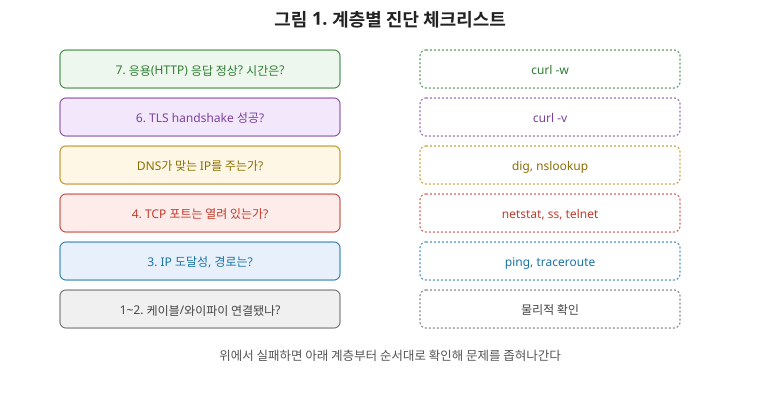
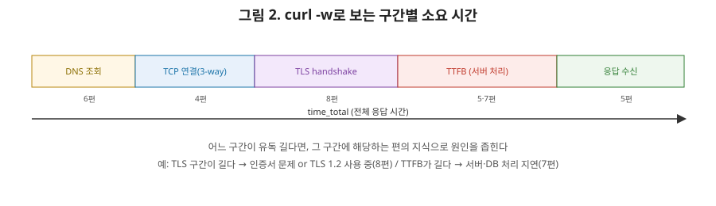

# [네트워크 10편] 실전 트러블슈팅, 그리고 시리즈를 마무리하며

1편부터 9편까지 계층을 하나씩 쌓아 올렸습니다. 이번 마지막 편은 그 지식을 거꾸로 활용합니다. 장애가 터졌을 때 "어느 계층에서 문제인지"를 좁혀나가는 사고법과, 각 계층을 진단하는 실전 도구들을 정리하며 시리즈를 마무리하겠습니다.

## 1. 문제를 계층별로 좁혀나가는 사고법

네트워크 장애 진단에서 가장 중요한 태도는 **"막연히 안 된다"에서 멈추지 않고, 어느 계층까지는 정상이고 어디서부터 문제인지 하향식으로 좁혀가는 것**입니다. 1편에서 배운 계층 모델이 이번 편에서는 진단 체크리스트로 다시 쓰입니다.



- 물리적으로 연결이 되긴 하는가? (케이블, 와이파이)
- IP 레벨에서 상대방에게 도달은 하는가? (`ping`)
- 경로상에 문제가 있는 구간은 없는가? (`traceroute`)
- TCP 연결(포트)까지는 열려 있는가? (`telnet`, `nc`, `netstat`)
- DNS가 올바른 IP를 돌려주는가? (`dig`, `nslookup`)
- TLS handshake까지는 성공하는가? (`curl -v`)
- HTTP 응답은 정상인가, 얼마나 걸리는가? (`curl -w`)

이 순서대로 확인하면 "안 된다"는 막연한 상태에서 "3계층까지는 되는데 4계층에서 막힌다"처럼 문제를 정확히 좁힐 수 있습니다.

## 2. ping — 3계층 도달성 확인

```bash
ping example.com
```

`ping`은 ICMP 프로토콜로 상대방에게 패킷을 보내고 응답이 오는지, 왕복 시간(RTT)이 얼마인지 확인합니다. 3편에서 다룬 네트워크 계층(IP)이 정상 동작하는지를 확인하는 가장 기본적인 도구입니다. 다만 최근에는 보안 정책으로 ICMP를 아예 차단하는 서버도 많아서, `ping`이 실패한다고 해서 무조건 서버가 죽었다고 단정할 수는 없습니다.

## 3. traceroute — 경로상의 각 홉을 확인

```bash
traceroute example.com   # 윈도우는 tracert
```

3편에서 "패킷이 라우터를 지날 때마다 MAC은 바뀌지만 IP는 유지된다"고 했습니다. `traceroute`는 이 경로에 있는 **각 라우터(홉)를 하나씩 찾아내는** 도구입니다. 원리가 꽤 영리한데, IP 패킷의 TTL(Time To Live) 값을 1부터 하나씩 늘려가며 보냅니다. TTL이 0이 되면 그 라우터는 패킷을 버리고 "TTL 초과"라는 ICMP 오류를 돌려보내는데, `traceroute`는 이 오류 메시지를 보낸 라우터의 주소를 기록하는 방식으로 한 홉씩 경로를 그려냅니다. 특정 구간에서 응답 시간이 갑자기 튀거나 아예 무응답이면, 그 구간에 병목이나 장애가 있다는 강력한 단서가 됩니다.

## 4. netstat / ss — 현재 연결 상태 확인

```bash
netstat -an | grep 8080
ss -tan
```

4편에서 배운 TCP 연결 상태들(`LISTEN`, `ESTABLISHED`, `TIME_WAIT` 등)을 직접 눈으로 확인할 수 있는 도구입니다. 특히 `TIME_WAIT` 상태의 연결이 비정상적으로 많이 쌓여 있다면, 4편에서 다룬 연결 종료 시 대기 상태가 과도하게 쌓이고 있다는 신호이고, 이는 뒤에서 다룰 "포트 고갈" 장애의 전형적인 전조 증상입니다.

## 5. curl — HTTP 요청을 직접 던지고, 각 구간의 시간을 재본다

`curl`은 단순히 요청을 보내는 도구가 아니라, `-w` 옵션을 쓰면 지금까지 이 시리즈에서 다룬 각 단계가 **각각 몇 밀리초 걸렸는지 실측**해줍니다.



```bash
curl -w "DNS: %{time_namelookup}s\nTCP: %{time_connect}s\nTLS: %{time_appconnect}s\nTTFB: %{time_starttransfer}s\nTotal: %{time_total}s\n" -o /dev/null -s https://example.com
```

이 그림이 사실 이번 시리즈 전체의 요약이라고 봐도 됩니다. `DNS`는 6편에서 다룬 도메인 조회 시간, `TCP`는 4편에서 다룬 3-way handshake 시간, `TLS`는 8편에서 다룬 handshake 시간, `TTFB`(Time To First Byte)는 서버가 요청을 받아 응답을 만들기 시작할 때까지 걸린 시간, 마지막 `Total`은 전체 응답을 다 받기까지의 시간입니다. 어느 구간이 유독 긴지를 보면, 문제가 DNS인지, 네트워크 연결인지, 서버 처리 속도인지를 바로 좁힐 수 있습니다.

## 6. tcpdump — 실제 오간 패킷을 직접 들여다보기

```bash
sudo tcpdump -i eth0 port 443 -w capture.pcap
```

`tcpdump`(또는 GUI 버전인 Wireshark)는 네트워크 인터페이스를 지나는 패킷을 그대로 캡처합니다. 이 시리즈에서 그림으로만 설명했던 3-way handshake의 `SYN`, `SYN-ACK`, `ACK`나 TLS handshake의 `ClientHello`, `ServerHello`를 실제 캡처 파일에서 눈으로 직접 확인할 수 있습니다. 다른 도구들이 "결과"만 보여준다면, `tcpdump`는 그 결과가 나오기까지 오간 **원본 데이터 자체**를 보여준다는 점에서 가장 로우레벨의 진단 도구입니다.

## 7. dig / nslookup — DNS 조회 직접 해보기

```bash
dig example.com
dig example.com +trace   # 6편에서 배운 반복적 질의 과정을 그대로 확인 가능
```

6편에서 다룬 TTL, 레코드 타입을 직접 확인할 수 있습니다. `dig +trace` 옵션을 쓰면 루트 → TLD → 권한 서버로 이어지는 반복적 질의 과정을 단계별로 그대로 볼 수 있어서, DNS 개념을 복습하기에도 좋은 도구입니다.

## 8. 도구 한눈에 정리

| 도구 | 확인하는 계층/내용 | 관련 편 |
|---|---|---|
| ping | 3계층 도달성, RTT | 3편 |
| traceroute | 경로상의 각 홉 | 3편 |
| dig / nslookup | DNS 조회, TTL | 6편 |
| netstat / ss | TCP 연결 상태 | 4편 |
| curl -w | 구간별 소요 시간(DNS·TCP·TLS·TTFB) | 4, 5, 6, 8편 |
| tcpdump / Wireshark | 실제 패킷 내용 | 전체 |

## 9. 실무 장애 사례로 복습하기

- **"배포 직후 504 Gateway Timeout이 쏟아진다"**: 9편에서 다룬 로드밸런서의 헬스체크 타이밍과 애플리케이션 기동 시간이 어긋난 경우가 흔한 원인입니다. 로드밸런서가 아직 준비되지 않은 인스턴스로 트래픽을 보내버리는 상황이죠.
- **"특정 지역 사용자만 유독 느리다"**: 9편에서 다룬 CDN의 GeoDNS가 엉뚱한(먼) 엣지 서버로 라우팅하고 있거나, 그 지역과의 경로에 문제가 있는 경우입니다. `traceroute`로 해당 지역 사용자의 경로를 재현해보는 게 첫걸음입니다.
- **"트래픽이 몰리면 DB 커넥션이 고갈된다"**: 7편에서 다룬 커넥션 풀 설정이 실제 트래픽에 비해 너무 작거나, 4편에서 다룬 `TIME_WAIT` 소켓이 쌓여 새 연결을 못 맺는 경우입니다. `netstat`으로 연결 상태 분포를 확인하는 게 진단의 시작입니다.
- **"어느 날 갑자기 HTTPS 접속이 전부 실패한다"**: 8편에서 다룬 TLS 인증서가 만료된 경우가 압도적으로 흔합니다. `curl -v`로 인증서 유효기간을 바로 확인할 수 있습니다.

## 10. 정리, 그리고 시리즈를 마치며

- 장애 진단은 계층을 하향식으로 좁혀가는 태도가 핵심이며, 1편의 계층 모델이 그대로 체크리스트가 된다.
- `ping`·`traceroute`는 3계층, `netstat`은 4계층 연결 상태, `dig`는 DNS, `curl -w`는 각 단계별 소요 시간, `tcpdump`는 실제 패킷 내용을 보여준다.
- `curl -w`로 확인하는 DNS→TCP→TLS→TTFB 구간은 이 시리즈에서 다룬 6, 4, 8, 5편의 내용이 실측 수치로 그대로 나타나는 지점이다.
- 실무 장애 대부분은 이 시리즈에서 다룬 개념(헬스체크, CDN 라우팅, 커넥션 풀, TLS 인증서) 중 하나로 설명된다.

1편에서 "왜 계층으로 나눴을까"라는 질문으로 시작해, 물리 계층의 비트에서 출발해 데이터링크·네트워크·전송 계층을 거쳐 HTTP와 DNS라는 우리에게 가장 익숙한 영역까지 올라갔고, 그 위에서 서버가 연결을 처리하는 방식(소켓과 I/O), 안전하게 만드는 방법(TLS), 여러 대로 확장하는 방법(로드밸런싱과 CDN)을 다뤘습니다. 마지막으로 이번 편에서는 그 모든 계층을 진단 도구로 다시 확인하는 방법을 봤습니다. 결국 네트워크를 안다는 건 "지금 이 요청이 어느 계층까지 통과했고, 어디서 막혔는가"를 스스로 좁혀갈 수 있다는 뜻입니다. 이 10편이 그 감각을 잡는 데 도움이 됐길 바랍니다.
