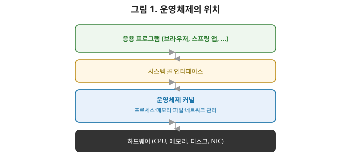
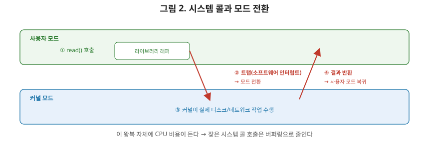

# [운영체제 1편] 커널 모드와 사용자 모드, 그리고 시스템 콜의 정체

스프링 시리즈에서는 애플리케이션 계층을, 네트워크 시리즈에서는 통신 계층을 다뤘습니다. 이 둘이 실제로 동작하려면 그 아래에서 CPU, 메모리, 디스크, 네트워크 카드 같은 하드웨어 자원을 관리해줄 존재가 필요한데, 그게 바로 **운영체제(OS)**입니다. 이번 편에서는 OS가 정확히 무슨 역할을 하는지, 그리고 응용 프로그램이 OS의 기능을 빌려 쓰는 통로인 **시스템 콜**이 실제로 어떻게 동작하는지 정리하겠습니다.

## 1. 운영체제가 하는 두 가지 일

OS의 역할을 한마디로 정의하면 어렵게 느껴지지만, 사실 크게 두 가지로 나눌 수 있습니다.

- **자원 관리자**: CPU, 메모리, 디스크, 네트워크 같은 한정된 하드웨어 자원을 여러 프로그램이 안전하고 공평하게 나눠 쓸 수 있도록 관리합니다. 지금 이 순간에도 여러분의 컴퓨터에서는 브라우저, IDE, 메신저가 동시에 실행되고 있지만, CPU 코어 수는 그보다 적습니다. 누가 언제 CPU를 쓸지 정해주는 게 OS입니다(2, 3편에서 다룰 프로세스와 스케줄링).
- **편리한 인터페이스 제공자**: 하드웨어를 직접 다루는 건 매우 복잡합니다. 디스크에 파일 하나를 저장하려면 물리적으로 어느 섹터에 어떻게 기록할지까지 알아야 한다면 응용 프로그램을 만들기 힘들겠죠. OS는 이 복잡함을 감추고 `open()`, `read()`, `write()` 같은 단순한 함수 호출로 하드웨어를 다룰 수 있게 해줍니다.

## 2. 왜 커널 모드와 사용자 모드를 나눴을까

CPU는 실행 권한이 다른 두 가지 모드를 지원합니다.

- **커널 모드(Kernel Mode)**: 하드웨어에 직접 접근하거나, 메모리 관리, 인터럽트 처리처럼 시스템 전체에 영향을 주는 **특권 명령어**를 실행할 수 있는 모드입니다. OS 커널 코드가 이 모드에서 실행됩니다.
- **사용자 모드(User Mode)**: 일반 응용 프로그램이 실행되는 모드입니다. 특권 명령어를 직접 실행할 수 없고, 자신에게 할당된 메모리 영역 밖은 건드릴 수 없습니다.

이 구분이 왜 필요할까요? 만약 모든 프로그램이 하드웨어에 아무 제약 없이 접근할 수 있다면, 버그가 있는 프로그램 하나가 실수로 다른 프로그램의 메모리를 덮어쓰거나, 디스크를 통째로 망가뜨릴 수 있습니다. **사용자 프로그램을 사용자 모드에 가둬두고, 위험한 작업은 반드시 커널을 거치도록 강제**함으로써 시스템 전체의 안정성과 보안을 지키는 겁니다. 네트워크 시리즈 8편에서 다룬 "권한 없는 요청을 걸러내는 방화벽"과 비슷한 발상입니다. 다만 여기서는 애플리케이션과 하드웨어 사이에 이 관문을 둔다는 차이가 있습니다.

## 3. 시스템 콜 — 사용자 모드가 커널의 힘을 빌리는 방법

그런데 사용자 프로그램도 결국 파일을 읽고, 네트워크로 데이터를 보내고, 메모리를 할당받아야 합니다. 이런 작업들은 전부 커널 모드의 권한이 필요합니다. 이 간극을 메우는 게 **시스템 콜(System Call)**입니다. 사용자 프로그램이 "이 작업을 대신 해달라"고 커널에게 요청하는 공식 통로입니다.

1. 사용자 프로그램이 `read()` 같은 함수를 호출한다. 이 함수는 사실 라이브러리가 제공하는 얇은 래퍼(wrapper)다.
2. 내부적으로 **트랩(trap, 소프트웨어 인터럽트)**을 발생시켜 CPU에게 "커널 모드로 전환해달라"고 신호를 보낸다.
3. CPU는 모드를 커널 모드로 바꾸고, 커널 안의 해당 시스템 콜을 처리하는 코드(핸들러)로 제어권을 넘긴다.
4. 커널이 실제 작업(디스크에서 데이터를 읽는 등)을 수행한다.
5. 작업이 끝나면 다시 사용자 모드로 전환하고, 결과를 사용자 프로그램에 돌려준다.

여기서 상급자가 짚어야 할 포인트는, **이 모드 전환 자체가 공짜가 아니라는 점**입니다. 트랩을 걸고, 컨텍스트를 저장하고, 커널 코드로 점프했다가 다시 돌아오는 과정에는 CPU 사이클이 소모됩니다. 그래서 시스템 콜을 너무 잦은 빈도로 호출하는 코드는(예: 파일을 한 바이트씩 read하는 코드) 이 전환 비용이 누적되어 성능이 나빠집니다. 네트워크 시리즈 7편에서 "커넥션 풀로 연결 비용을 아낀다"고 했던 것과 비슷하게, **시스템 콜 자체의 호출 비용을 아끼기 위해 버퍼링(모아서 한 번에 처리)을 하는 이유**가 여기 있습니다.

## 4. 익숙한 함수들이 사실 전부 시스템 콜이다

네트워크 시리즈 7편에서 다룬 소켓 함수들, `read()`, `write()`, `connect()`, `epoll_wait()` 같은 것들이 전부 시스템 콜입니다. 프로그래밍 언어나 프레임워크가 아무리 고수준 API(스프링의 `JdbcTemplate`이나 자바의 `InputStream` 등)로 감싸놓아도, 결국 맨 밑바닥에서는 이 시스템 콜을 통해 커널에게 "디스크에서 읽어줘", "네트워크로 보내줘"라고 요청하는 구조로 귀결됩니다.

| 분류 | 대표 시스템 콜 | 하는 일 |
|---|---|---|
| 프로세스 제어 | `fork()`, `exec()`, `exit()` | 프로세스 생성·실행·종료 |
| 파일 관리 | `open()`, `read()`, `write()`, `close()` | 파일 입출력 |
| 장치 관리 | `ioctl()` | 하드웨어 장치 제어 |
| 정보 유지 | `getpid()`, `time()` | 시스템 정보 조회 |
| 통신 | `socket()`, `connect()`, `send()` | 네트워크 통신 |

이 표를 보면 네트워크 시리즈 7편에서 다룬 `epoll` 역시 결국 `epoll_create()`, `epoll_ctl()`, `epoll_wait()`라는 시스템 콜의 조합이라는 걸 알 수 있습니다. 애플리케이션 개발자가 직접 이 시스템 콜을 부를 일은 드물지만, 그 위에 얹힌 모든 프레임워크와 라이브러리가 결국 이 표에 있는 함수들 위에서 동작한다는 사실을 알고 있으면, "내가 짠 코드가 최종적으로 하드웨어와 어떻게 맞닿는지"에 대한 감각이 생깁니다.

## 5. 커널의 구조: 모놀리식 vs 마이크로

| 구분 | 모놀리식 커널 | 마이크로 커널 |
|---|---|---|
| 구조 | 파일 시스템, 네트워크 스택 등 대부분이 커널 안에 통합 | 최소 기능(프로세스 관리, 통신 등)만 커널에, 나머지는 사용자 공간 서비스로 분리 |
| 성능 | 함수 호출로 처리해 빠름 | 프로세스 간 통신(IPC)이 필요해 상대적으로 느림 |
| 안정성 | 한 모듈의 버그가 전체 시스템에 영향 줄 수 있음 | 서비스가 독립적이라 장애 격리가 쉬움 |
| 대표 사례 | 리눅스, 윈도우 | QNX, (초기)Mach |

실무에서 서버 개발자가 마주치는 리눅스는 모놀리식 커널 구조를 기본으로 하며, 성능을 우선시하는 실용적인 선택으로 봐도 됩니다. 다만 리눅스도 커널 모듈을 동적으로 로드·언로드할 수 있게 하는 등, 두 구조의 장점을 절충하는 방향으로 계속 발전해왔습니다.

## 6. 정리

- OS는 하드웨어 자원을 관리하고, 응용 프로그램에게 단순한 인터페이스를 제공하는 두 가지 역할을 한다.
- CPU는 커널 모드와 사용자 모드를 구분해, 위험한 작업(특권 명령어)은 반드시 커널을 거치도록 강제해 시스템 안정성을 지킨다.
- 시스템 콜은 사용자 프로그램이 트랩을 통해 커널의 기능을 요청하는 공식 통로이며, 이 모드 전환에는 실제 비용이 든다.
- 네트워크 프로그래밍에서 쓰는 소켓 함수들도 결국 시스템 콜이며, 그 위에 모든 프레임워크가 얹혀 있다.
- 리눅스는 모놀리식 커널 구조를 기본으로 하며, 성능을 중시하는 실용적 선택이다.

다음 편에서는 프로세스와 스레드로 넘어가, PCB가 프로세스 정보를 어떻게 관리하는지, 컨텍스트 스위칭이 실제로 무슨 일을 하는지, 그리고 프로세스와 스레드가 메모리를 공유하는 방식의 차이를 다룹니다.
