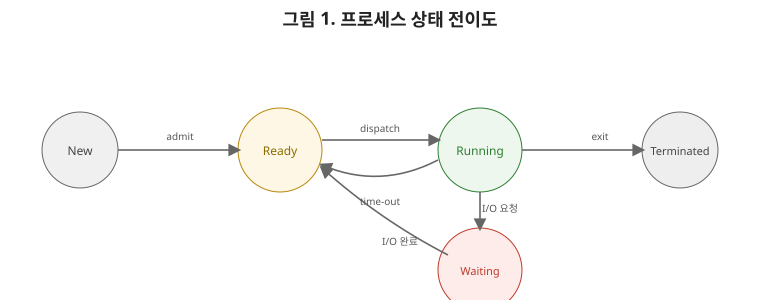
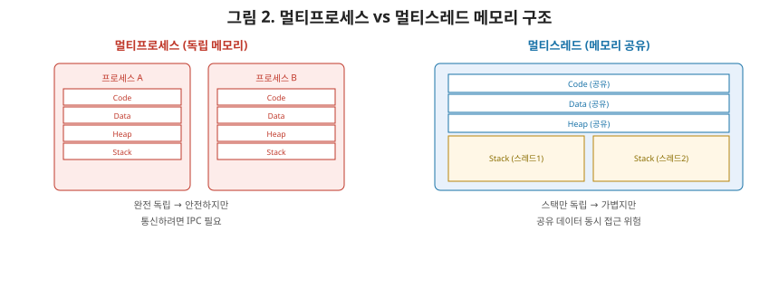

# [운영체제 2편] 프로세스와 스레드, 그리고 컨텍스트 스위칭의 실체

1편에서 시스템 콜을 호출하는 주체가 있다고 했는데, 그 주체가 바로 **프로세스**입니다. 이번 편에서는 프로세스가 커널 안에서 어떻게 관리되는지, 스레드와는 무엇이 다른지, 그리고 여러 프로세스가 CPU를 번갈아 쓰는 컨텍스트 스위칭이 실제로 무슨 일을 하는지 정리하겠습니다.

## 1. 프로그램과 프로세스는 다르다

디스크에 저장된 실행 파일(`.exe`, 컴파일된 바이너리)은 그냥 **프로그램**입니다. 정적인 데이터 덩어리일 뿐이죠. 이 프로그램을 실행하면 OS가 메모리에 올리고, CPU 시간을 배정하고, 필요한 자원을 할당해줍니다. 이렇게 **실행 중인 상태**가 된 것을 **프로세스**라고 부릅니다. 같은 프로그램을 여러 번 실행하면(브라우저 창을 두 개 띄우는 것처럼) 서로 다른 프로세스가 여러 개 생깁니다. 각 프로세스는 독립된 메모리 공간을 가지며, 서로의 존재를 직접 들여다볼 수 없습니다.

## 2. PCB — 커널이 프로세스를 기억하는 방법

커널은 현재 시스템에 존재하는 모든 프로세스의 정보를 **PCB(Process Control Block)**라는 자료구조로 관리합니다. 프로세스가 생성될 때마다 PCB 하나가 만들어지고, 종료되면 사라집니다.

| PCB에 담기는 정보 | 설명 |
|---|---|
| PID | 프로세스를 식별하는 고유 번호 |
| 프로세스 상태 | 실행 중인지, 대기 중인지 등(다음 절에서 다룸) |
| 프로그램 카운터(PC) | 다음에 실행할 명령어의 주소 |
| CPU 레지스터 값 | 현재 연산 중이던 레지스터들의 값 |
| 메모리 관리 정보 | 이 프로세스에 할당된 메모리 영역 정보 |
| 열린 파일 목록 | 이 프로세스가 열어둔 파일 디스크립터 목록(1편에서 다룬 소켓도 포함) |

이 표에서 프로그램 카운터와 CPU 레지스터 값이 특히 중요합니다. 다음 절에서 다룰 컨텍스트 스위칭이 바로 이 값들을 저장하고 복원하는 과정이기 때문입니다.

## 3. 프로세스의 상태 전이

프로세스는 태어나서 사라질 때까지 몇 가지 상태를 오갑니다.

- **New**: 프로세스가 생성되는 중.
- **Ready**: 실행될 준비는 됐지만, 아직 CPU를 배정받지 못해 대기 중.
- **Running**: 실제로 CPU를 배정받아 명령어를 실행 중.
- **Waiting(Blocked)**: 디스크 입출력이나 네트워크 응답처럼, 자신이 아닌 외부 요인이 끝나기를 기다리는 중. 이 상태에서는 CPU를 줘도 할 일이 없다.
- **Terminated**: 실행이 끝나고 자원이 정리되는 중.

여기서 상급자가 짚어야 할 포인트는 **Ready와 Waiting의 차이**입니다. Ready는 "CPU만 배정받으면 바로 실행 가능한" 상태고, Waiting은 "CPU를 줘도 지금 당장은 실행할 수 없는" 상태입니다. 예를 들어 디스크에서 파일을 읽어오는 시스템 콜을 호출한 프로세스는 데이터가 도착할 때까지 Waiting 상태로 전환되고, 그동안 CPU는 다른 Ready 상태 프로세스에게 넘어갑니다. 이 전환이 바로 CPU를 놀리지 않고 효율적으로 쓰기 위한 OS의 핵심 전략입니다.

## 4. 컨텍스트 스위칭 — CPU를 넘겨주는 순간 벌어지는 일

여러 프로세스가 CPU 하나(또는 코어 하나)를 번갈아 쓰려면, CPU를 다른 프로세스에게 넘길 때 지금까지의 진행 상황을 안전하게 보관해뒀다가, 나중에 다시 그 프로세스 차례가 왔을 때 정확히 그 지점부터 이어서 실행할 수 있어야 합니다. 이 과정이 **컨텍스트 스위칭**입니다.

1. 현재 실행 중인 프로세스의 PC, 레지스터 값 등을 그 프로세스의 PCB에 저장한다.
2. 다음으로 실행할 프로세스를 스케줄러가 선택한다(3편에서 다룰 내용).
3. 그 프로세스의 PCB에서 저장해뒀던 PC, 레지스터 값을 CPU에 복원한다.
4. 복원된 지점부터 실행을 재개한다.

1편에서 시스템 콜의 모드 전환에 비용이 든다고 했는데, 컨텍스트 스위칭에도 비슷한 이야기가 적용됩니다. **저장하고 복원하는 이 과정 자체가 순수한 오버헤드**입니다. 그동안 CPU는 실제 프로세스의 일은 전혀 하지 못하고 그저 상태를 옮기는 작업만 합니다. 그래서 컨텍스트 스위칭이 너무 자주 일어나면(프로세스나 스레드가 지나치게 많을 때), 실제 일하는 시간보다 전환하는 데 쓰는 시간이 더 커지는 역효과가 날 수 있습니다. 네트워크 시리즈 7편에서 다룬 "스레드 하나당 커넥션 하나" 모델이 대규모 트래픽에서 한계를 보이는 이유가 바로 이 컨텍스트 스위칭 비용 때문이었다는 걸 여기서 다시 확인할 수 있습니다.

## 5. 스레드 — 프로세스 안의 더 가벼운 실행 흐름

프로세스를 하나 만드는 건 상당히 무겁습니다. 독립된 메모리 공간을 새로 할당해야 하니까요. 동시에 여러 작업을 처리하고 싶은데 굳이 메모리까지 통째로 분리할 필요가 없다면, **스레드**를 씁니다.

스레드는 하나의 프로세스 안에서 독립적으로 실행되는 흐름의 단위입니다. 같은 프로세스에 속한 스레드들은 **코드, 데이터, 힙 영역을 공유**하지만, 각자 **독립된 스택**을 가집니다. 스택이 독립적이어야 하는 이유는 각 스레드가 서로 다른 함수 호출 흐름(지역 변수, 리턴 주소)을 가져야 하기 때문입니다. 반대로 코드와 힙을 공유한다는 건, 한 스레드가 힙에 할당한 객체를 다른 스레드가 아무 제약 없이 접근할 수 있다는 뜻이기도 합니다.

## 6. 멀티프로세스 vs 멀티스레드

| 구분 | 멀티프로세스 | 멀티스레드 |
|---|---|---|
| 메모리 | 완전히 독립 | 코드·데이터·힙 공유, 스택만 독립 |
| 생성 비용 | 무거움 | 가벼움 |
| 통신 방법 | IPC(파이프, 소켓 등) 필요 | 공유 메모리로 직접 접근 가능 |
| 안정성 | 하나가 죽어도 다른 프로세스는 안전 | 한 스레드의 오류가 프로세스 전체에 영향 가능 |
| 데이터 공유 위험 | 낮음(격리돼 있음) | **높음**(동시 접근 문제 발생 가능) |

이 표의 마지막 행이 다음 편의 예고편입니다. 스레드가 메모리를 공유한다는 건 편리하지만, 동시에 여러 스레드가 같은 데이터를 동시에 건드리면 예상치 못한 결과가 나올 수 있다는 뜻이기도 합니다. 예를 들어 두 스레드가 동시에 같은 변수를 1씩 증가시키면, 타이밍에 따라 값이 한 번만 증가하는 경우가 생길 수 있습니다. 이 문제와 그 해결책(뮤텍스, 세마포어)이 4편에서 다룰 프로세스 동기화의 핵심 주제입니다.

## 7. 정리

- 디스크의 정적인 프로그램이 실행되면 프로세스가 되며, 커널은 PCB로 각 프로세스의 상태와 실행 정보를 관리한다.
- 프로세스는 New → Ready → Running → Waiting → Terminated 상태를 오가며, Ready와 Waiting의 차이(CPU를 줘도 되는가)가 스케줄링의 핵심 판단 기준이 된다.
- 컨텍스트 스위칭은 PCB에 상태를 저장·복원하는 과정이며, 이 자체가 오버헤드이기 때문에 과도하게 잦으면 성능이 오히려 떨어진다.
- 스레드는 프로세스 안에서 코드·데이터·힙을 공유하고 스택만 독립적으로 갖는 가벼운 실행 단위다.
- 멀티스레드는 통신이 쉽지만 데이터 공유로 인한 동시성 문제를 안고 있으며, 이는 다음 편에서 다룰 동기화 문제로 이어진다.

다음 편에서는 CPU 스케줄링으로 넘어가, FCFS·SJF·라운드 로빈·우선순위 스케줄링 알고리즘이 각각 어떤 트레이드오프를 갖는지, 그리고 실제 운영체제가 어떤 방식을 조합해 쓰는지를 다룹니다.
