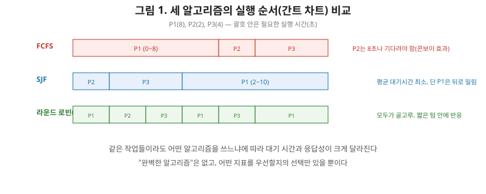
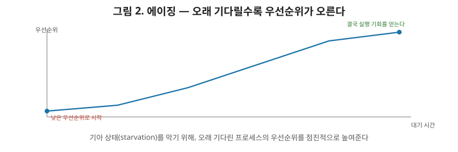

# [운영체제 3편] CPU 스케줄링, 누구를 먼저 실행할 것인가

2편에서 Ready 상태의 프로세스가 여러 개 쌓일 수 있다고 했습니다. CPU(코어)는 한정돼 있는데 실행 준비된 프로세스가 많다면, **누구를 먼저 실행할지** 정해야 합니다. 이 결정을 내리는 게 **스케줄러**이고, 그 결정 방식이 **스케줄링 알고리즘**입니다. 이번 편에서는 대표적인 알고리즘들이 각각 무엇을 얻고 무엇을 포기하는지 정리하겠습니다.

## 1. 스케줄링이 동시에 만족시킬 수 없는 목표들

좋은 스케줄러가 갖춰야 할 목표는 여러 가지인데, 문제는 이 목표들이 서로 상충한다는 겁니다.

- **CPU 활용률**: CPU를 최대한 놀리지 않고 계속 일하게 만드는 것.
- **처리량(Throughput)**: 단위 시간당 완료되는 프로세스의 수.
- **대기 시간(Waiting Time)**: 프로세스가 Ready 큐에서 기다리는 시간의 합.
- **응답 시간(Response Time)**: 요청 후 첫 반응이 오기까지 걸리는 시간.
- **공정성(Fairness)**: 특정 프로세스만 계속 기다리는 일이 없어야 함.

짧은 작업을 우선하면 평균 대기 시간은 줄어들지만 긴 작업은 하염없이 밀려날 수 있고(공정성 훼손), 순서대로 공평하게 처리하면 반대로 평균 대기 시간이 길어질 수 있습니다. **완벽한 알고리즘은 없고, 무엇을 우선할지에 따라 선택이 달라진다**는 게 이번 편 전체를 관통하는 주제입니다.

## 2. 선점 vs 비선점

- **비선점(Non-preemptive)**: 한 번 CPU를 잡은 프로세스는 스스로 끝내거나 대기 상태로 전환될 때까지 CPU를 놓지 않는다.
- **선점(Preemptive)**: 스케줄러가 필요하다고 판단하면, 실행 중인 프로세스에서 강제로 CPU를 뺏어 다른 프로세스에게 줄 수 있다.

선점 방식은 응답성이 좋지만, 2편에서 다룬 컨텍스트 스위칭이 더 자주 일어나 그만큼 오버헤드도 커집니다. 이 트레이드오프를 염두에 두고 아래 알고리즘들을 보겠습니다.

## 3. FCFS — 온 순서대로

가장 단순한 방식입니다. Ready 큐에 도착한 순서대로, 비선점으로 실행합니다.

문제는 **콘보이 효과(Convoy Effect)**입니다. 오래 걸리는 작업이 먼저 도착해 CPU를 붙잡고 있으면, 그 뒤에 도착한 짧은 작업들이 전부 그 뒤에서 하염없이 기다려야 합니다. 고속도로에서 느린 트럭 한 대 뒤로 차량 행렬이 길게 밀리는 모습과 똑같습니다.

## 4. SJF — 가장 짧은 작업부터

실행 시간이 가장 짧은 작업을 우선 실행합니다. 이론적으로 **평균 대기 시간을 최소화하는 최적의 알고리즘**으로 증명돼 있습니다. 짧은 작업을 먼저 끝내버리면 뒤따르는 작업들의 대기 시간 총합이 줄어들기 때문입니다.

문제는 두 가지입니다. 첫째, **미래의 실행 시간을 미리 알아야 한다는 비현실적인 전제**가 깔려 있습니다(실무에서는 과거 실행 이력으로 추정하는 정도가 최선입니다). 둘째, 짧은 작업이 계속 몰려들면 긴 작업은 영원히 순서가 오지 않는 **기아 상태(Starvation)**에 빠질 수 있습니다.

## 5. 라운드 로빈 — 돌아가면서 조금씩

각 프로세스에게 **타임 퀀텀(time quantum)**이라는 정해진 시간만큼만 CPU를 주고, 시간이 다 되면 강제로(선점) 다음 프로세스에게 순서를 넘깁니다. 대화형 시스템(사용자가 즉각적인 반응을 기대하는 환경)에서 응답 시간을 보장하기에 좋은 방식입니다.

여기서 상급자가 짚어야 할 포인트는 **퀀텀 크기의 트레이드오프**입니다.

- 퀀텀이 너무 작으면: 프로세스를 자주 바꿔야 하므로 2편에서 다룬 컨텍스트 스위칭이 빈번해져 오버헤드가 커진다.
- 퀀텀이 너무 크면: 사실상 FCFS와 다를 게 없어져, 응답성이라는 라운드 로빈의 장점이 사라진다.

그래서 실무에서 참고할 만한 경험칙으로, 전체 프로세스의 80% 정도가 자기 몫의 CPU 버스트(한 번 실행할 때 필요한 시간)를 퀀텀 하나 안에 끝낼 수 있는 정도의 크기가 적절하다고 알려져 있습니다.

## 6. 우선순위 스케줄링과 에이징

각 프로세스에 우선순위를 매기고, 높은 우선순위부터 실행합니다(SJF도 사실 "짧은 실행 시간 = 높은 우선순위"로 본 특수한 경우입니다). 문제는 SJF와 마찬가지로 **낮은 우선순위 프로세스가 기아 상태에 빠질 수 있다**는 겁니다.

이 문제의 해법이 **에이징(Aging)**입니다. 오래 대기한 프로세스일수록 우선순위를 점진적으로 높여주는 방식입니다. 아무리 우선순위가 낮게 시작해도, 시간이 지나면 결국 우선순위가 충분히 높아져 실행 기회를 얻게 됩니다. "오래 기다린 사람에게 새치기 권한을 조금씩 얹어준다"는 발상이라고 이해하면 됩니다.

## 7. 실제 OS는 이 알고리즘들을 그대로 쓰지 않는다

여기까지 다룬 알고리즘들은 각각의 개념을 이해하기 위한 순수 모델에 가깝습니다. 실제 리눅스는 **CFS(Completely Fair Scheduler)**라는, 각 프로세스가 CPU를 사용한 "가상 실행 시간"을 균형 있게 맞춰가는 방식을 씁니다. 대체로 실행 시간이 적은 프로세스에게 우선권을 줘서 결과적으로 라운드 로빈과 비슷하게 공정성을 지키면서도, 우선순위(nice 값)를 반영해 특정 프로세스를 더 우대할 수 있게 만든, 지금까지 본 개념들을 실용적으로 조합한 형태라고 볼 수 있습니다.

## 8. 알고리즘 한눈에 비교

| 알고리즘 | 선점 여부 | 장점 | 단점 |
|---|---|---|---|
| FCFS | 비선점 | 구현 단순 | 콘보이 효과 |
| SJF | 비선점(변형은 선점 가능) | 평균 대기 시간 이론적 최적 | 실행 시간 예측 어려움, 기아 가능 |
| 라운드 로빈 | 선점 | 응답 시간 보장, 공정함 | 퀀텀 크기에 성능이 민감 |
| 우선순위 | 둘 다 가능 | 중요한 작업 우선 처리 | 기아 가능(에이징으로 완화) |

## 9. 정리

- 스케줄링 목표(CPU 활용률, 처리량, 대기·응답 시간, 공정성)는 서로 상충하며, 완벽한 알고리즘은 없다.
- FCFS는 단순하지만 콘보이 효과가 있고, SJF는 이론적으로 최적이지만 실행 시간 예측이 어렵고 기아를 유발할 수 있다.
- 라운드 로빈은 타임 퀀텀으로 응답성을 보장하지만, 퀀텀 크기가 너무 작으면 컨텍스트 스위칭 오버헤드가, 너무 크면 FCFS화되는 트레이드오프가 있다.
- 우선순위 스케줄링의 기아 문제는 에이징(대기 시간에 비례해 우선순위를 높이는 방식)으로 완화한다.
- 실제 리눅스는 이런 순수 모델을 그대로 쓰지 않고, CFS처럼 여러 개념을 조합한 실용적인 스케줄러를 쓴다.

다음 편에서는 프로세스 동기화로 넘어가, 2편 끝에서 예고했던 스레드 간 데이터 공유 문제를 임계 구역·뮤텍스·세마포어로 어떻게 해결하는지, 그리고 데드락이 발생하는 조건과 회피 방법을 다룹니다.
