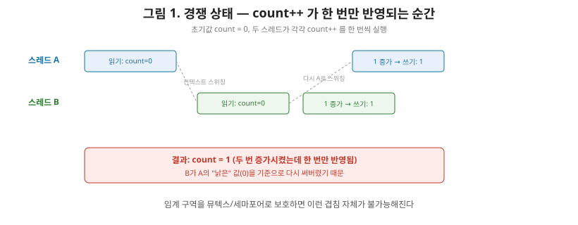
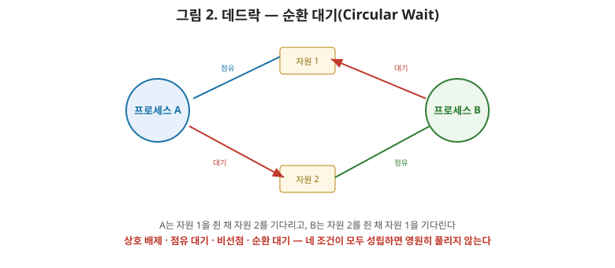

# [운영체제 4편] 프로세스 동기화 — 공유 자원을 안전하게 나눠 쓰는 법

2편 마지막에서 예고했던 문제로 돌아가 보겠습니다. 멀티스레드는 코드·데이터·힙을 공유한다고 배웠는데, 여러 스레드가 같은 데이터를 동시에 건드리면 무슨 일이 벌어질까요? 이번 편에서는 이 **경쟁 상태(Race Condition)**가 왜 생기는지, 이를 막기 위한 **임계 구역**과 **뮤텍스·세마포어**, 그리고 이 도구들을 잘못 쓰면 빠질 수 있는 **데드락**까지 정리하겠습니다.

## 1. 경쟁 상태 — count++ 는 한 줄이 아니다

`count++`라는 코드 한 줄은 사람 눈에는 원자적인 연산처럼 보이지만, CPU 입장에서는 최소 세 단계로 쪼개집니다.

1. 메모리에서 count 값을 레지스터로 읽어온다.
2. 레지스터 값을 1 증가시킨다.
3. 증가된 값을 다시 메모리에 써넣는다.

문제는 3편에서 다룬 컨텍스트 스위칭이 이 세 단계 사이 어디서든 끼어들 수 있다는 점입니다. 스레드 A가 값을 읽은 직후(1단계) 스레드 B로 전환되어 B가 읽기·증가·쓰기를 전부 마치고, 다시 A로 돌아와 A가 자기가 읽었던(이미 낡은) 값을 기준으로 증가시켜 써버리면 어떻게 될까요? 두 스레드가 각각 한 번씩 `count++`를 실행했는데도 count는 한 번만 증가한 것과 같은 결과가 나옵니다. 이렇게 **여러 스레드의 실행 순서(타이밍)에 따라 결과가 달라지는 상황**을 경쟁 상태라고 부릅니다. 실행할 때마다 결과가 다를 수 있어서, 디버깅이 특히 까다로운 버그로 악명이 높습니다.

## 2. 임계 구역 문제

공유 데이터를 접근·수정하는 코드 영역을 **임계 구역(Critical Section)**이라고 부릅니다. 위 예시에서는 `count++`가 실행되는 구간이 임계 구역입니다. 임계 구역 문제를 해결하는 방법은 다음 세 조건을 모두 만족해야 한다고 정의됩니다.

- **상호 배제(Mutual Exclusion)**: 한 프로세스(스레드)가 임계 구역에 있으면, 다른 프로세스는 그 구역에 들어올 수 없다.
- **진행(Progress)**: 임계 구역이 비어 있다면, 들어가려는 프로세스 중 하나는 무한정 대기하지 않고 들어갈 수 있어야 한다.
- **한정 대기(Bounded Waiting)**: 한 프로세스가 임계 구역에 들어가기를 요청한 뒤, 다른 프로세스들이 그 사이 임계 구역에 들어가는 횟수에는 상한이 있어야 한다(즉, 특정 프로세스가 영원히 못 들어가는 일이 없어야 한다 — 3편에서 다룬 기아 상태와 같은 문제입니다).



이 세 조건을 만족시키기 위해 실제로 사용하는 도구가 바로 **뮤텍스**와 **세마포어**입니다.

## 3. 뮤텍스 — 열쇠는 하나뿐인 방

**뮤텍스(Mutex, Mutual Exclusion)**는 가장 단순한 동기화 도구입니다. 임계 구역을 "잠금(lock)"과 "잠금 해제(unlock)"로 감싸서, 한 번에 딱 한 스레드만 그 구역에 들어갈 수 있게 만듭니다.

```
lock(mutex);
count++;          // 임계 구역
unlock(mutex);
```

동작 방식은 방에 열쇠가 하나뿐인 상황과 같습니다. 한 스레드가 열쇠를 가지고 들어가 있으면(lock), 다른 스레드는 열쇠가 반납될 때까지(unlock) 문 앞에서 기다립니다. 열쇠는 하나뿐이라 동시에 두 스레드가 방에 들어가는 일은 구조적으로 불가능합니다. 뮤텍스는 이렇게 **on/off, 잠김/열림 두 가지 상태만 가지는 이진(binary) 성격**의 도구입니다.

## 4. 세마포어 — 방이 여러 개일 때

뮤텍스가 방 하나짜리 열쇠라면, **세마포어(Semaphore)**는 방을 동시에 몇 명까지 쓸 수 있는지 세는 카운터입니다. 세마포어는 정수형 변수 하나와, 그 값을 안전하게 증감시키는 두 연산(보통 `wait`/`P`와 `signal`/`V`로 부릅니다)으로 이루어집니다.

- `wait(S)`: S를 1 감소시킨다. 만약 S가 음수가 되면, 그 프로세스는 대기 상태로 전환된다.
- `signal(S)`: S를 1 증가시킨다. 대기 중인 프로세스가 있다면 하나를 깨운다.

세마포어는 초기값에 따라 두 가지로 나뉩니다. 초기값을 1로 설정하면 뮤텍스와 똑같이 동작하는 **이진 세마포어(Binary Semaphore)**가 되고, 초기값을 N으로 설정하면 **동시에 N개까지 자원을 쓸 수 있게 허용하는 카운팅 세마포어(Counting Semaphore)**가 됩니다. 예를 들어 DB 커넥션 풀이 최대 10개의 연결을 허용한다면, 초기값 10짜리 세마포어로 "지금 몇 개의 연결이 쓰이고 있는지"를 관리하는 셈입니다.

| 구분 | 뮤텍스 | 세마포어 |
|---|---|---|
| 값의 범위 | 잠김 / 열림(이진) | 정수(카운팅 가능) |
| 동시 접근 허용 수 | 1개 | N개(초기값에 따라) |
| 소유 개념 | 잠근 스레드만 해제 가능 | 누구든 signal 가능 |
| 주 용도 | 하나의 공유 자원 보호 | 제한된 개수의 자원 풀 관리 |

여기서 상급자가 짚어야 할 차이는 **소유 개념**입니다. 뮤텍스는 열쇠를 가져간 스레드만 반납할 수 있다는 규칙이 있어서, 엉뚱한 스레드가 남의 잠금을 푸는 실수를 막아줍니다. 반면 세마포어는 누구든 signal을 호출할 수 있기 때문에, 생산자-소비자 문제처럼 "한쪽은 wait만, 다른 쪽은 signal만" 하는 비대칭적인 동기화 패턴에 훨씬 유연하게 쓰입니다.

## 5. 데드락 — 서로가 서로를 기다리는 교착 상태

동기화 도구는 경쟁 상태를 막아주지만, 잘못 쓰면 새로운 문제를 낳습니다. 스레드 A가 자원 1을 잠근 채 자원 2를 기다리고, 동시에 스레드 B가 자원 2를 잠근 채 자원 1을 기다린다면 어떻게 될까요? 두 스레드 모두 상대방이 자원을 놓아주기만을 영원히 기다리게 됩니다. 이 상태를 **데드락(Deadlock, 교착 상태)**이라고 합니다.

데드락은 다음 네 가지 조건이 **동시에** 성립할 때만 발생합니다.

- **상호 배제**: 자원을 한 번에 한 프로세스만 사용할 수 있다.
- **점유 대기(Hold and Wait)**: 자원을 이미 하나 이상 점유한 상태에서, 다른 자원을 추가로 기다린다.
- **비선점(No Preemption)**: 다른 프로세스가 점유 중인 자원을 강제로 뺏을 수 없다.
- **순환 대기(Circular Wait)**: 프로세스들이 원형으로 서로의 자원을 기다린다(A→B→C→A 형태).



## 6. 데드락에 대응하는 네 가지 전략

이 네 조건 중 **하나라도 성립하지 않게 만들면** 데드락은 원천적으로 발생하지 않습니다. 이 원리를 바탕으로 실제 시스템은 다음 네 가지 전략 중 하나를 선택합니다.

- **예방(Prevention)**: 네 조건 중 하나를 애초에 불가능하게 만든다. 예를 들어 모든 프로세스가 자원을 항상 정해진 순서로만 요청하게 강제하면 순환 대기 자체가 성립할 수 없다. 확실하지만, 자원 활용률이 떨어지는 대가를 치른다.
- **회피(Avoidance)**: 자원을 할당하기 전에 "이 할당이 데드락으로 이어지지는 않는가"를 미리 계산해서, 안전한 요청만 허가한다. 은행원 알고리즘(Banker's Algorithm)이 대표적이다. 다만 각 프로세스의 최대 자원 요구량을 미리 알아야 한다는 현실적 제약이 있다.
- **탐지 후 회복(Detection & Recovery)**: 데드락 발생을 막지는 않되, 주기적으로 시스템 상태를 점검해 데드락을 탐지하고, 발견되면 프로세스를 강제 종료하거나 자원을 선점해 회복한다.
- **무시(Ostrich Algorithm)**: 데드락 발생 확률이 낮고 대응 비용이 크다면, 그냥 무시하고 발생하면 재부팅으로 대응한다. 실제로 리눅스, 윈도우 같은 범용 운영체제 대부분이 이 방식을 택하고 있다 — 타조가 위협을 보면 모래에 머리를 파묻는다는 비유에서 이름이 붙었다.

| 전략 | 방식 | 장점 | 단점 |
|---|---|---|---|
| 예방 | 4대 조건 중 하나를 원천 차단 | 데드락 발생 불가능 | 자원 활용률 저하 |
| 회피 | 할당 전 안전성 미리 계산 | 활용률이 예방보다 나음 | 최대 요구량 사전 파악 필요 |
| 탐지 후 회복 | 주기적 점검 후 강제 종료/선점 | 평소엔 제약 없음 | 탐지·복구 비용, 작업 손실 가능 |
| 무시 | 아무 조치 없음 | 구현·운영 비용 없음 | 발생 시 재부팅 등 극단적 대응 |

실무에서는 대부분 예방에 가까운 규칙(예: "락은 항상 알파벳 순서로 획득한다" 같은 코딩 컨벤션)을 지키는 선에서 데드락을 막고, 시스템 차원에서는 무시 전략을 택하는 경우가 많습니다. 완벽한 회피·탐지 메커니즘은 비용이 커서, 실제로는 개발자의 락 사용 규율이 첫 번째 방어선인 셈입니다.

## 7. 정리

- 멀티스레드 환경에서 공유 데이터에 대한 접근 순서가 결과를 바꾸는 문제를 경쟁 상태라고 하며, 이를 막기 위한 조건(상호 배제·진행·한정 대기)을 만족시키는 코드 영역을 임계 구역이라 부른다.
- 뮤텍스는 하나의 자원을 한 스레드만 쓰게 만드는 이진 잠금이고, 세마포어는 정수 카운터로 N개까지의 동시 접근을 허용하는 더 일반화된 도구다.
- 데드락은 상호 배제·점유 대기·비선점·순환 대기 네 조건이 동시에 성립할 때만 발생하며, 이 중 하나만 깨뜨려도 막을 수 있다.
- 데드락 대응 전략은 예방·회피·탐지 후 회복·무시로 나뉘고, 실제 범용 OS는 대부분 무시 전략을 택하는 대신 개발자의 락 사용 규율에 의존한다.

다음 편에서는 메모리 관리로 넘어가, 프로세스마다 독립된 메모리 공간을 갖는다고 배웠던 그 공간이 실제로 물리 메모리에 어떻게 매핑되는지 — 가상 메모리와 페이징의 원리, 그리고 페이지 폴트가 발생했을 때 벌어지는 일을 다룹니다.
