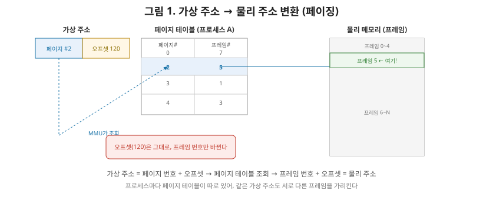
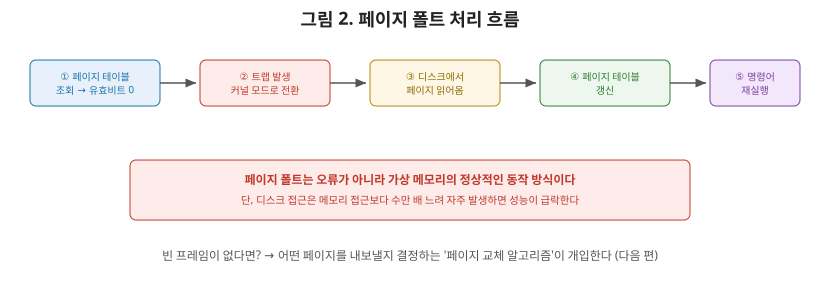

# [운영체제 5편] 가상 메모리 — 프로세스가 보는 메모리는 진짜가 아니다

2편에서 각 프로세스는 독립된 메모리 공간을 가진다고 배웠습니다. 그런데 물리 메모리(RAM)는 보통 8GB, 16GB처럼 한정돼 있는데, 실행 중인 프로세스 하나하나가 자기만의 널찍한 메모리 공간을 가진 것처럼 동작하는 게 어떻게 가능할까요? 답은 프로세스가 실제로 보는 주소가 **진짜 물리 주소가 아니라는 것**입니다. 이번 편에서는 이 속임수, 즉 **가상 메모리**가 어떻게 동작하는지 정리하겠습니다.

## 1. 가상 메모리가 필요한 이유

프로세스가 물리 메모리 주소를 직접 다루게 하면 세 가지 문제가 생깁니다.

- **격리 문제**: 프로세스 A가 실수로(혹은 악의적으로) 프로세스 B의 메모리 영역을 가리키는 주소에 접근하면, B의 데이터가 깨질 수 있다.
- **용량 문제**: 물리 메모리보다 큰 프로그램은 아예 실행할 수 없다.
- **배치 문제**: 프로그램을 실행할 때마다 물리 메모리의 어느 빈 공간에 올라갈지 알 수 없는데, 프로그램 코드 안의 주소들은 고정돼 있어야 한다.

이 세 문제를 한 번에 해결하는 방법이 **가상 메모리(Virtual Memory)**입니다. 각 프로세스에게 "0번지부터 시작하는, 마치 나 혼자만 쓰는 것 같은" 독립된 가상 주소 공간을 주고, 이 가상 주소를 실제 물리 주소로 변환하는 작업은 하드웨어와 OS가 알아서 처리합니다. 프로세스 입장에서는 다른 프로세스의 존재를 신경 쓸 필요도, 물리 메모리가 지금 얼마나 남아있는지 신경 쓸 필요도 없습니다.

## 2. 페이징 — 메모리를 일정한 크기로 잘라 쓴다

가상 주소를 물리 주소로 바꾸는 대표적인 방식이 **페이징(Paging)**입니다. 가상 메모리 공간과 물리 메모리 공간을 모두 **고정된 크기의 블록**으로 잘라서 관리합니다. 가상 메모리 쪽 블록을 **페이지(Page)**, 물리 메모리 쪽 블록을 **프레임(Frame)**이라고 부르며, 보통 하나의 크기는 4KB입니다.

프로세스가 사용하는 가상 주소는 사실 **페이지 번호 + 페이지 내 오프셋**의 조합입니다. 예를 들어 가상 주소 5000번지에 접근한다면, "몇 번째 페이지의, 그 페이지 안에서 몇 번째 위치인가"로 해석됩니다. 이 페이지 번호가 물리 메모리의 어느 프레임에 대응하는지 기록해둔 표가 **페이지 테이블(Page Table)**이며, 프로세스마다 하나씩 별도로 존재합니다.

이 변환 작업은 CPU 안의 **MMU(Memory Management Unit)**라는 하드웨어가 담당합니다. 매 메모리 접근마다 페이지 테이블을 뒤지면 느려지기 때문에, 최근 자주 쓰인 변환 결과를 캐싱해두는 **TLB(Translation Lookaside Buffer)**라는 작은 고속 캐시도 함께 씁니다. TLB에서 바로 찾으면(TLB Hit) 매우 빠르고, 못 찾으면(TLB Miss) 페이지 테이블까지 내려가서 조회해야 하므로 상대적으로 느려집니다.

## 3. 페이지 테이블이 주는 세 가지 이점

페이지 단위 간접 참조는 번거로워 보이지만, 정확히 이 간접 참조 덕분에 앞서 말한 세 문제가 모두 풀립니다.

- **격리**: 프로세스마다 페이지 테이블이 따로 있으므로, A의 가상 주소가 아무리 B의 가상 주소와 같은 숫자여도 서로 다른 물리 프레임을 가리켜 절대 겹치지 않는다.
- **용량**: 지금 당장 쓰지 않는 페이지는 물리 메모리에 올리지 않고 디스크에 남겨둘 수 있다(다음 절의 페이지 폴트로 이어짐). 그래서 프로세스가 "느끼는" 메모리 크기가 실제 RAM보다 커도 문제없다.
- **배치**: 프로세스마다 페이지 테이블만 다시 채우면 되므로, 프로그램이 물리 메모리의 어느 자리에 올라가든 상관없다.

## 4. 세그멘테이션 — 의미 단위로 자른다면

페이징이 "고정 크기로 기계적으로 자르는" 방식이라면, **세그멘테이션(Segmentation)**은 코드, 데이터, 스택처럼 **논리적 의미 단위(세그먼트)**로 메모리를 나누는 방식입니다. 각 세그먼트는 그 용도에 맞는 가변적인 크기를 가질 수 있습니다.

| 구분 | 페이징 | 세그멘테이션 |
|---|---|---|
| 분할 기준 | 고정 크기 블록 | 논리적 의미 단위(가변 크기) |
| 외부 단편화 | 없음 | 발생 가능(빈 공간이 조각조각 남음) |
| 내부 단편화 | 발생 가능(마지막 페이지가 덜 참) | 상대적으로 적음 |
| 프로그래머 관점 | 투명함(신경 쓸 필요 없음) | 코드/데이터/스택 구분이 자연스러움 |

현대 운영체제 대부분은 세그멘테이션의 장점(의미 단위 구분)과 페이징의 장점(단편화 관리 용이성)을 결합한 **세그멘테이션-페이징 혼합 방식**을 쓰거나, 사실상 페이징 위주로 단순화해서 운용합니다. 다만 세그먼트라는 개념 자체는 실행 파일의 구조(코드 영역, 데이터 영역 등)를 이해하는 데 여전히 유용한 사고 틀입니다.

## 5. 페이지 폴트 — 없는 페이지에 접근했을 때

앞서 "지금 당장 쓰지 않는 페이지는 디스크에 남겨둘 수 있다"고 했습니다. 그렇다면 프로세스가 디스크에만 있고 물리 메모리에는 없는 페이지에 접근하려 하면 어떻게 될까요? 이때 **페이지 폴트(Page Fault)**가 발생합니다.

1. CPU가 페이지 테이블을 조회했는데, 해당 페이지가 물리 메모리에 없다는 표시(유효 비트 0)를 발견한다.
2. 1편에서 다룬 트랩(trap)과 같은 방식으로 CPU 제어권이 커널로 넘어간다.
3. 커널이 해당 페이지가 디스크의 어디에 있는지 찾아 물리 메모리의 빈 프레임으로 읽어온다(빈 프레임이 없다면 다음 편에서 다룰 페이지 교체 알고리즘이 개입한다).
4. 페이지 테이블을 갱신해 이 페이지가 이제 어느 프레임에 있는지 기록한다.
5. 원래 실행하려던 명령어를 처음부터 다시 실행한다. 이번에는 페이지가 메모리에 있으므로 정상적으로 진행된다.

여기서 상급자가 짚어야 할 포인트는, **페이지 폴트는 오류가 아니라 정상적인 메커니즘**이라는 점입니다. "폴트"라는 이름 때문에 에러처럼 들리지만, 이는 가상 메모리가 의도한 대로 동작하는 과정의 일부입니다. 다만 디스크 접근은 메모리 접근보다 수만 배 느리기 때문에, 페이지 폴트가 자주 일어나면 성능이 급격히 떨어집니다. 이 현상이 심해지는 상황(스래싱)은 다음 편에서 다룹니다.

## 6. 정리

- 프로세스가 다루는 주소는 가상 주소이며, MMU가 페이지 테이블을 통해 이를 물리 주소로 변환한다. 이 간접 참조 덕분에 프로세스 간 격리, 물리 메모리보다 큰 실행, 자유로운 메모리 배치가 모두 가능해진다.
- 페이징은 고정 크기 블록(페이지/프레임) 단위로, 세그멘테이션은 코드·데이터·스택 같은 논리적 의미 단위로 메모리를 나눈다.
- TLB는 페이지 테이블 조회를 캐싱해 주소 변환 속도를 높인다.
- 페이지 폴트는 필요한 페이지가 물리 메모리에 없을 때 발생하는 정상적인 트랩이며, 디스크에서 페이지를 읽어와 페이지 테이블을 갱신한 뒤 명령어를 재실행한다.

다음 편에서는 메모리 관리 심화로 넘어가, 물리 메모리가 가득 찼을 때 어떤 페이지를 내보낼지 결정하는 페이지 교체 알고리즘(FIFO, LRU)과, 페이지 폴트가 지나치게 잦아져 시스템 전체가 멈춰버리는 스래싱 현상을 다룹니다.
