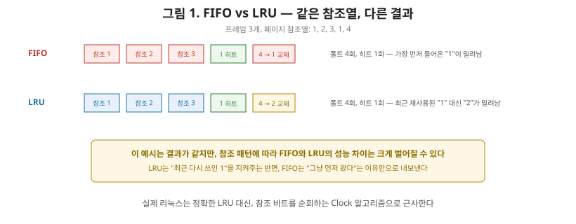
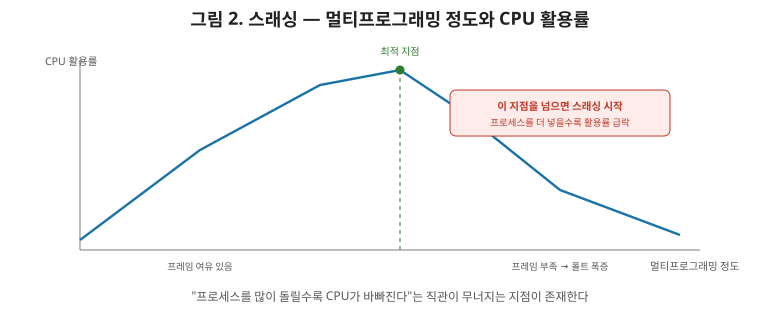

# [운영체제 6편] 페이지 교체와 스래싱 — 메모리가 꽉 찼을 때 벌어지는 일

5편 마지막에서 던졌던 질문으로 이어가겠습니다. 페이지 폴트가 발생했는데, 물리 메모리에 빈 프레임이 하나도 없다면 어떻게 해야 할까요? 누군가는 자리를 비워줘야 합니다. **어떤 페이지를 내보낼지** 정하는 것이 이번 편의 주제인 **페이지 교체 알고리즘**이고, 이 과정이 감당 안 될 정도로 잦아지면 시스템 전체가 멈춰버리는 **스래싱**까지 다루겠습니다.

## 1. 페이지 교체가 필요한 순간

물리 메모리의 모든 프레임이 이미 다른 페이지로 채워진 상태에서 새 페이지를 읽어와야 한다면, 기존 페이지 중 하나를 디스크로 내보내고 그 자리를 새 페이지에게 내줘야 합니다. 이때 내보낼 페이지가 그동안 수정된 적이 있다면(더티 페이지) 디스크에 다시 써줘야 하고, 읽기만 됐다면 그냥 버려도 됩니다. 핵심 질문은 **"어떤 페이지를 내보내야 앞으로의 페이지 폴트를 최소화할 수 있는가"**입니다. 이 선택 기준에 따라 몇 가지 대표적인 알고리즘이 있습니다.

## 2. FIFO — 가장 먼저 들어온 페이지부터

말 그대로 **가장 오래전에 메모리에 올라온 페이지**를 내보냅니다. 구현이 큐 하나로 끝날 만큼 단순합니다.

문제는 직관에 반하는 현상이 나타날 수 있다는 점입니다. **벨레이디의 이상현상(Belady's Anomaly)**이라고 부르는데, 물리 메모리 프레임 수를 늘렸는데도(더 넉넉해졌는데도) 오히려 페이지 폴트 횟수가 늘어나는 경우가 실제로 관찰됩니다. "자원을 더 주면 무조건 좋아진다"는 상식이 FIFO에서는 깨지는 셈이라, 실무에서 FIFO를 그대로 쓰는 경우는 많지 않습니다.

## 3. Optimal — 이론적으로는 완벽하지만

**앞으로 가장 오랫동안 사용되지 않을 페이지**를 내보내는 방식입니다. 이렇게 하면 이론적으로 페이지 폴트 횟수를 최소화할 수 있다는 것이 증명돼 있습니다.

눈치채셨겠지만, 이건 3편에서 다룬 **SJF 스케줄링과 정확히 같은 구조의 문제**입니다. "미래에 어떤 일이 일어날지 미리 알아야 한다"는 비현실적인 전제가 깔려 있어서, 실제 시스템에서 그대로 구현할 수는 없습니다. 대신 다른 알고리즘들의 성능을 비교하는 **이론적 기준선(baseline)**으로 주로 쓰입니다.

## 4. LRU — 최근에 안 쓰인 페이지부터

**가장 최근에 사용된 지 오래된 페이지(Least Recently Used)**를 내보내는 방식입니다. Optimal처럼 미래를 알 필요 없이, **과거의 사용 패턴으로 미래를 예측**한다는 실용적인 아이디어입니다. 최근에 쓰인 페이지는 곧 다시 쓰일 가능성이 높다는 **지역성(locality)** 원리에 기반합니다.

이론상으로는 각 페이지가 마지막으로 사용된 시각을 정확히 기록해야 하는데, 매번 메모리 접근마다 타임스탬프를 갱신하는 건 비용이 큽니다. 그래서 실제 운영체제는 **Clock 알고리즘**처럼, 각 페이지에 최근 참조 여부만 표시하는 비트 하나를 두고 원형으로 돌면서 근사적으로 LRU를 흉내 내는 방식을 씁니다. "완벽하게 정확한 LRU"보다 "충분히 LRU에 가까우면서 오버헤드는 작은" 절충안을 택하는 겁니다.

| 알고리즘 | 판단 기준 | 장점 | 단점 |
|---|---|---|---|
| FIFO | 가장 먼저 들어온 페이지 | 구현 단순 | 벨레이디 이상현상 발생 가능 |
| Optimal | 앞으로 가장 늦게 쓰일 페이지 | 이론적 최적 | 미래 예측 불가 → 실구현 불가 |
| LRU | 가장 오래 안 쓰인 페이지 | 지역성 활용, 실무에서 근사 구현 가능 | 정확한 구현은 오버헤드 큼 |

## 5. 스와핑 — 페이지가 아니라 프로세스 전체를 내보낸다

지금까지는 프로세스 하나가 쓰는 페이지 중 일부를 교체하는 이야기였습니다. 여기서 한 단계 더 나아가면, **프로세스 전체의 메모리 이미지를 통째로 디스크로 내보내는** 방식도 있는데, 이를 **스와핑(Swapping)**이라고 부릅니다. 오랫동안 Waiting 상태에 머무는 프로세스(2편에서 다룬 상태 전이를 떠올려 보면, 입출력을 기다리며 한참 대기하는 프로세스)를 통째로 디스크로 내보내 그 프로세스가 쓰던 메모리 전체를 다른 프로세스에게 내주는 식입니다. 나중에 그 프로세스가 다시 실행돼야 할 때는 디스크에서 메모리로 되돌려놓습니다(스왑 인).

## 6. 스래싱 — 일은 안 하고 페이지만 갈아치우는 상태

**스래싱(Thrashing)**은 페이지 교체가 감당할 수 없을 만큼 빈번하게 일어나, CPU가 실제 프로세스의 명령어를 실행하는 시간보다 페이지를 디스크에서 읽고 쓰는 데 더 많은 시간을 쓰는 상태를 말합니다.

원인은 보통 이렇습니다. 동시에 실행되는 프로세스 수(멀티프로그래밍 정도)가 늘어나면, 각 프로세스에 배정할 수 있는 물리 메모리 프레임 수는 상대적으로 줄어듭니다. 프레임이 부족해지면 프로세스가 실제로 필요로 하는 페이지들이 자주 교체돼 나가고, 곧이어 다시 그 페이지가 필요해져 또 페이지 폴트가 발생하는 악순환이 시작됩니다. 이 상황에서 OS는 "CPU 활용률이 떨어졌다"고 판단해 새 프로세스를 더 투입하기도 하는데, 이는 프레임 부족을 더 악화시켜 스래싱을 오히려 심화시킵니다.

3편에서 다뤘던 "무조건 많이 실행시키면 CPU 활용률이 오른다"는 직관이 여기서는 정반대로 뒤집힙니다. 어느 지점을 넘어서면 프로세스를 더 많이 동시에 돌릴수록 오히려 전체 성능이 급격히 무너지는 것이 스래싱의 본질입니다. 해법은 각 프로세스가 실제로 필요로 하는 최소한의 페이지 집합(Working Set)을 파악해, 그만큼의 프레임을 보장해주거나, 멀티프로그래밍 정도 자체를 낮춰(일부 프로세스를 스와핑으로 내보내) 각 프로세스가 숨 쉴 공간을 확보해주는 것입니다.

## 7. 정리

- 물리 메모리가 가득 찼을 때 어떤 페이지를 내보낼지 정하는 것이 페이지 교체 알고리즘이며, FIFO는 단순하지만 벨레이디 이상현상이 있고, Optimal은 이론적 기준선일 뿐 실구현이 불가능하다.
- LRU는 지역성 원리에 기반해 과거 사용 패턴으로 미래를 예측하며, 실제 OS는 Clock 알고리즘 같은 근사 방식으로 이를 구현한다.
- 스와핑은 페이지가 아니라 프로세스 전체의 메모리 이미지를 디스크로 내보내는 더 큰 단위의 교체다.
- 스래싱은 프레임 부족으로 페이지 교체가 지나치게 잦아져, CPU가 실제 작업보다 페이지 입출력에 더 많은 시간을 쓰는 상태이며, 멀티프로그래밍 정도를 무작정 높이면 오히려 발생하기 쉽다.

다음 편에서는 파일 시스템으로 넘어가, 디스크에 저장된 파일이 실제로 어떤 구조(inode)로 관리되는지, 그리고 디스크 헤드의 이동 순서를 정하는 디스크 스케줄링 알고리즘을 다룹니다.
